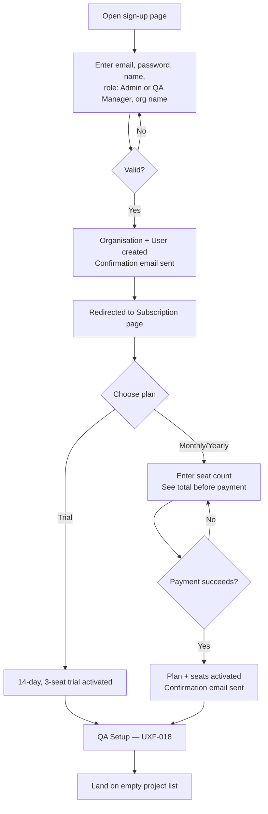
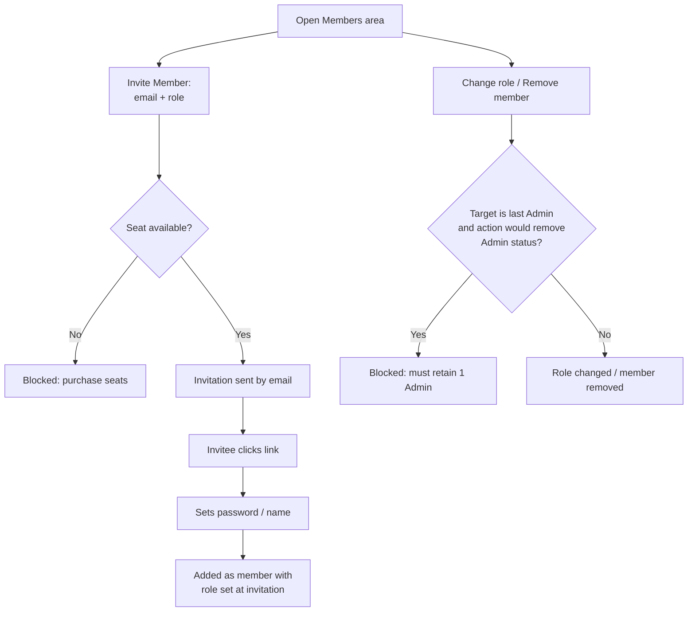

# User Flows — Onboarding & Team Setup

---

## UXF-001 — Sign Up & Subscription Activation

**Priority:** Critical MVP

**Actor:** Prospective customer (becomes Admin or QA Manager).

**Goal:** Create a new organisation and gain working access to TestFlow AI.

**Entry Point:** Public sign-up page (unauthenticated).

**Preconditions:** None — publicly accessible.

**Happy Path:**
1. User opens the sign-up page.
2. User enters email, password, name, chooses role (**Admin** or **QA Manager** only), and an organisation name.
3. User submits. A new Organisation and User are created; a confirmation email is sent.
4. User is redirected immediately to the subscription page — no other screen is reachable yet.
5. User selects a plan: **Trial** (14 days, free, 3-seat cap, one-time-ever) or a paid plan (**Monthly** or **Yearly**, choosing seat count).
6. For a paid plan, the total is shown before payment; user confirms and completes payment.
7. On success, a confirmation email is sent (paid plans) and the user lands on **QA Setup (UXF-018)** — not directly on the project list. Once QA Setup completes (as little as one click for the recommended preset), the user reaches the empty project list. *(CHANGE-001 — MODIFY: step 7's destination changed; see `13-qa-operating-model-and-governance.md#uxf-018`.)*

**Decision Points:**
- Role at sign-up: Admin vs. QA Manager (no other option is offered).
- Plan choice: Trial vs. Monthly vs. Yearly.
- Trial option is hidden/disabled entirely if this organisation somehow already used a trial (not reachable on a brand-new organisation, but the UI must never offer it to an already-trial-used org).

**Alternative Paths:**
- User already has a link to an invitation instead of signing up fresh — that's a different entry point (UXF-002).

**Error / Failure Paths:**
- Validation failure (missing/invalid field, disallowed role value) — inline field errors, form not submitted.
- Duplicate email — rejected with a conflict message (exact handling is a flagged open item, see `functional-requirements.md`).
- Payment failure on a paid plan — no plan/seats activated (all-or-nothing, NFR-REL-003); user sees a clear failure message and can retry.
- Every screen after sign-up, until a plan is active, shows the mandatory-subscription block state if the user somehow navigates elsewhere (FR-SUB-002) — there is no way to reach any project/requirement/test-case screen before this flow completes.

**Successful Outcome:** User is logged in, their organisation has an active trial or paid plan, and they land on an empty project list ready to create their first project.

**Related Requirements:** FR-AUTH-001, FR-AUTH-004, FR-AUTH-005, FR-AUTH-006, FR-ORG-001, FR-SUB-001–006.

**Related APIs:** `POST /auth/signup`, `POST /organisations/{orgId}/subscription/trial`, `POST /organisations/{orgId}/subscription/monthly`, `POST /organisations/{orgId}/subscription/yearly` (`authentication.md`, `subscription-billing.md`).

---

## UXF-002 — Organisation & Team Setup

**Priority:** Critical MVP

**Actor:** Admin, QA Manager (inviting); invitee (accepting).

**Goal:** Bring the rest of the team into the organisation with the correct roles.

**Entry Point:** Organisation members screen, reached after UXF-001 completes.

**Preconditions:** Organisation has an active trial or paid subscription.

**Happy Path:**
1. Admin or QA Manager opens the members area.
2. Selects "Invite member," enters the invitee's email and chooses their role (Admin, QA Manager, or QA Tester).
3. Invitation is sent by email.
4. Invitee clicks the emailed link, sets a password (and name, if new), and is added as an organisation member with the role chosen at invitation.
5. Admin can later change a member's role, or remove a member, from the same members area.

**Decision Points:**
- Role assigned at invitation (three options, vs. sign-up's two).
- Whether to change an existing member's role (Admin only) or remove them.

**Alternative Paths:**
- Inviter proactively purchases more seats before inviting, rather than waiting to hit the limit (see UXF-017).

**Error / Failure Paths:**
- Seat limit reached: invitation is blocked, with a clear message directing the inviter to purchase additional seats (FR-SUB-007) — this is not a silent failure, it's a specific, actionable state.
- Non-Admin attempts to change a role: permission denied.
- Attempt to remove or demote the organisation's last remaining Admin: blocked with a clear explanation (FR-ORG-006) — never silently ignored.
- Invitation link expired/already used: clear error, invitee directed back to requesting a new invite.

**Successful Outcome:** The invited person appears in the member list with the correct role and can log in.

**Related Requirements:** FR-ORG-004, FR-ORG-005, FR-ORG-006, FR-USR-003, FR-USR-005, FR-USR-006, FR-SUB-007.

**Related APIs:** `POST /organisations/{orgId}/invitations`, `GET /organisations/{orgId}/members`, `PATCH /organisations/{orgId}/members/{userId}`, `DELETE /organisations/{orgId}/members/{userId}`, `POST /invitations/{invitationId}/accept` (`users.md`, `authentication.md`).

