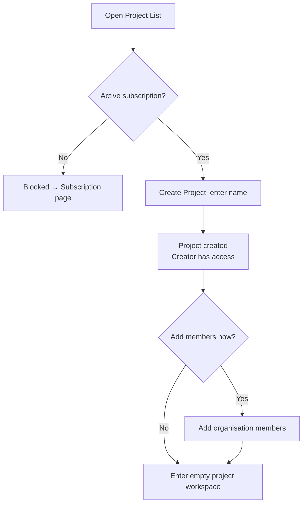

# User Flows — Project Setup

---

## UXF-003 — Project Setup

**Priority:** Critical MVP

**Actor:** Admin, QA Manager, QA Tester.

**Goal:** Create a project and get the right people access to it.

**Entry Point:** Project list, reached from the organisation's main navigation.

**Preconditions:** Organisation has an active trial or paid subscription (FR-SUB-002).

**Happy Path:**
1. User opens the project list (Admin/QA Manager see all organisation projects; QA Tester sees only projects they created or were added to — this filtering is automatic, not a toggle the user controls).
2. User selects "Create Project," enters a name.
3. Project is created; the creator automatically has access.
4. User (or Admin/QA Manager) adds other organisation members to the project as needed.
5. User enters the new, empty project workspace, ready to add requirements.

**Decision Points:**
- Whether to add members now or later (not required before using the project).

**Alternative Paths:**
- Admin/QA Manager browsing an existing project they didn't create, via their organisation-wide visibility.
- Archiving a project instead of continuing to use it (from the project's own settings, at any later point).

**Error / Failure Paths:**
- Mandatory-subscription block: attempting to create a project without an active trial/subscription is blocked entirely, redirecting to the subscription flow (FR-SUB-002).
- Adding a member who already has access: no-op / clear "already a member" message, not a silent duplicate.
- Removing the project's own creator: only their access is revoked — the project itself and everyone else's access continues unaffected (FR-PRJ-007) — the UI should make clear that this removal is scoped to one person, not "delete this project's team."

**Successful Outcome:** The project appears in the list, and the user (and any added members) can navigate into it and begin adding requirements/test cases.

**Related Requirements:** FR-PRJ-001–007, FR-SUB-002.

**Related APIs:** `POST /organisations/{orgId}/projects`, `GET /organisations/{orgId}/projects`, `POST /projects/{projectId}/members`, `DELETE /projects/{projectId}/members/{userId}`, `POST /projects/{projectId}/archive` (`projects.md`).

