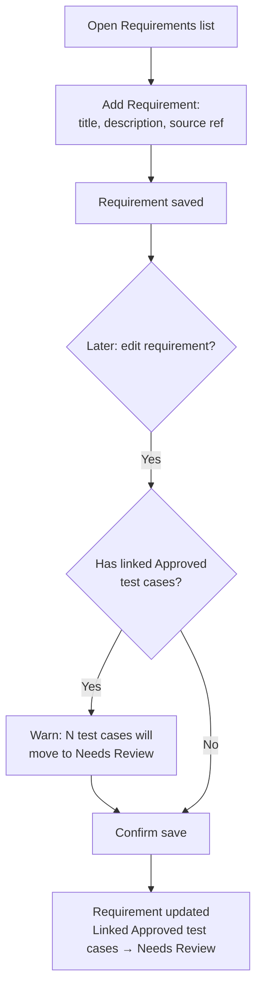
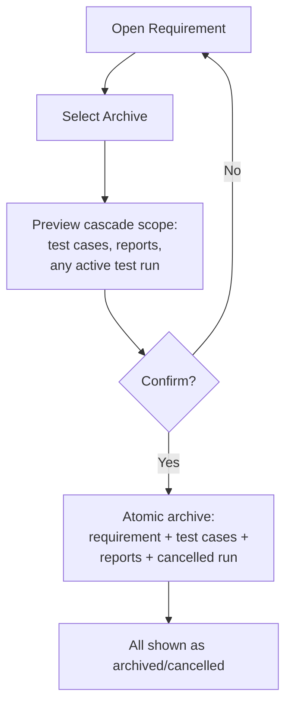

# User Flows — Requirements Management

---

## UXF-004 — Requirements Management

**Priority:** Critical MVP

**Actor:** QA Tester, QA Manager, Admin.

**Goal:** Capture a requirement as the basis for test case creation, and keep it current.

**Entry Point:** Requirements area within a project.

**Preconditions:** User has project access.

**Happy Path:**
1. User opens the Requirements list within a project.
2. Selects "Add Requirement," enters title, description, and optionally a source reference (e.g., a Jira ticket link).
3. Requirement is saved and appears in the list, ready to be linked from test cases (optionally) or used as the basis for AI generation (UXF-009).
4. User can later open a requirement to edit its content.

**Decision Points:**
- Whether to include a source reference (optional).
- Whether to edit a requirement that already has approved, linked test cases — this triggers a consequence the user should be warned about (see below).

**Alternative Paths:**
- Editing a requirement that has one or more linked test cases currently `approved`: those test cases are automatically moved to "Needs Review." The UI should surface this consequence clearly at the point of editing (e.g., "Saving this will mark N approved test case(s) as Needs Review") rather than silently changing state elsewhere with no warning.

**Error / Failure Paths:**
- Validation failure (missing title/description).
- Concurrent-edit conflict: another user edited this requirement since it was loaded — save is rejected, user must reload and reapply their change (APID-003).
- Editing an archived requirement: blocked, since archived is a read-only, terminal state at this stage.
- Permission denied: BA/PO cannot author requirements at all (PD-015) — not offered this action anywhere, even though BA/PO can view test results/reports elsewhere.

**Successful Outcome:** The requirement is saved and visible in the project's requirement list, with its traceability to any linked test cases visible.

**Related Requirements:** FR-REQ-001, FR-REQ-002, FR-REQ-003, FR-TRACE-001, FR-TRACE-002.

**Related APIs:** `POST /projects/{projectId}/requirements`, `GET /projects/{projectId}/requirements`, `GET /requirements/{requirementId}`, `PATCH /requirements/{requirementId}`, `GET /requirements/{requirementId}/test-cases` (`requirements.md`).

---

## UXF-005 — Requirement Archive & Cascade

**Priority:** Supporting MVP

**Actor:** QA Tester, QA Manager, Admin.

**Goal:** Retire a requirement that's no longer active, understanding what else that affects.

**Entry Point:** A requirement's detail view.

**Preconditions:** User has project access; requirement is currently active.

**Happy Path:**
1. User opens a requirement and selects "Archive."
2. System shows what will be archived as a consequence: linked test cases, linked reports, and — if applicable — any active test run that includes one of those test cases (which would be cancelled and archived too).
3. User confirms.
4. The requirement, its linked test cases, its linked reports, and any affected test run are archived/cancelled together, atomically.

**Decision Points:**
- Confirming the cascade (this is a consequential action — the UI must show the scope before committing, not just a generic "are you sure?").

**Alternative Paths:**
- Requirement has no linked test cases/reports/active runs: archiving is a simple, single-entity action with no cascade to show.

**Error / Failure Paths:**
- Already archived: action not offered / blocked.
- The cascade either fully succeeds or fully fails (one atomic transaction, AD-013) — there is no partial-cascade state the UI ever needs to represent as an error; if it fails, nothing changed.

**Successful Outcome:** The requirement and everything it cascaded to now show as archived/cancelled, consistently, with no orphaned active items left behind.

**Related Requirements:** FR-REQ-004, PD-016, PD-034.

**Related APIs:** `POST /requirements/{requirementId}/archive` (`requirements.md`).

