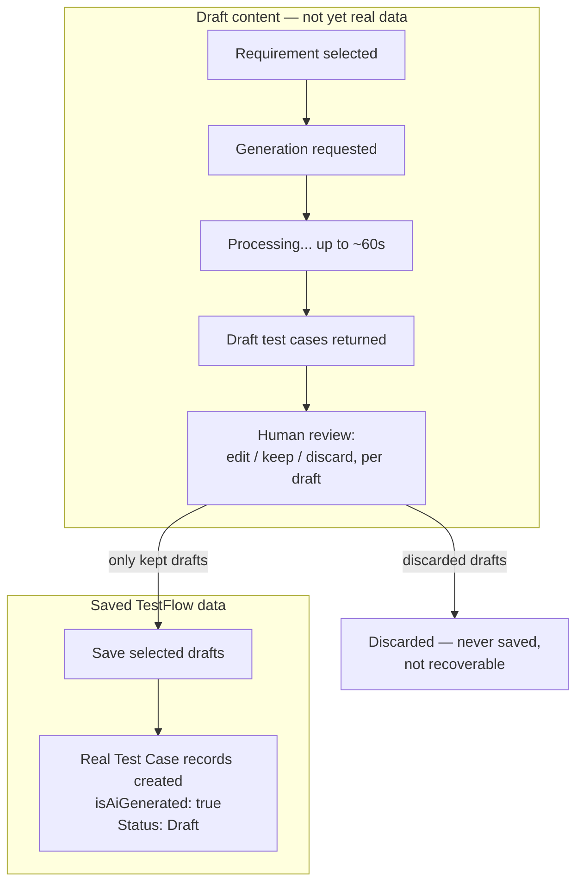
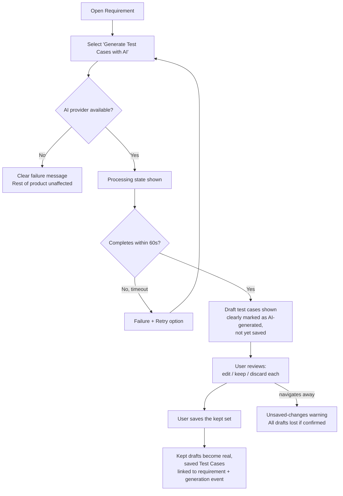

# User Flows — AI-Assisted Test Case Generation

---

## UXF-009 — AI-Assisted Test Case Generation

**Priority:** Critical MVP — this is the product's core differentiator (vision.md).

**Actor:** QA Tester, QA Manager, Admin.

**Goal:** Get a full set of draft test cases from a requirement quickly, then keep only the ones worth saving.

**Entry Point:** A requirement's detail screen — generation always starts from a selected requirement, never from a free-text task description (FR-AI-005, MVP scope boundary).

**Preconditions:** Requirement exists and is not archived; an AI provider is configured (platform-provided or project key).

**Happy Path:**
1. User opens a requirement and selects "Generate Test Cases with AI."
2. System immediately shows a **processing** state — generation is asynchronous and can take up to ~60 seconds; the user is not blocked from doing other things while it runs, but sees clear progress/waiting feedback.
3. Generation completes: a set of **draft** test cases is shown — visually and textually distinguishable from any saved test case (NFR-AI-005) — none of these exist as real Test Cases yet.
4. User reviews each draft: may edit its content, deselect it (discard), or leave it as-is.
5. User selects "Save" on the reviewed set — **only now** are the kept drafts created as real, saved Test Cases (`Draft` status, `isAiGenerated: true`, linked back to the requirement and the generation event for traceability).
6. Discarded drafts vanish — they were never saved anywhere and cannot be recovered.

**Decision Points:**
- Per draft: keep as-is, edit then keep, or discard.
- Whether to save the whole reviewed batch at once (there is no per-draft "save individually" step — review happens across the batch, then one save action commits the kept ones).

**Alternative Paths:**
- User navigates away mid-review without saving: the drafts are lost (they were never persisted) — the UI should warn about unsaved changes if the user tries to leave mid-review.
- User views past generation attempts for this requirement (generation history) — a read-only trail of when generation was run, by whom, and what it produced, for traceability.

**Error / Failure Paths:**
- **AI provider unavailable:** clear failure message; the rest of the product (manual test case creation, everything else) remains fully usable — an AI outage never degrades anything else (NFR-AI-003).
- **Generation times out (>60s):** surfaced as a failure with a retry option, not left hanging indefinitely (NFR-AI-002).
- **Generation succeeds but produces nothing usable:** the user simply discards all drafts — same mechanism as any other rejection, no special "empty result" error needed beyond an empty draft list.
- Attempting to save malformed/edited-into-invalid draft content: validation error, same as manual test case creation.

**Successful Outcome:** The kept test cases now exist as real, saved Test Cases in the project, each traceable back to the requirement and marked as AI-generated, ready for the same approval/suite/execution flows as any manually authored test case.

**Related Requirements:** FR-AI-001–005, FR-TC-010, NFR-AI-001–009.

**Related APIs:** `POST /requirements/{requirementId}/ai-generations`, `GET /ai-generations/{generationId}`, `POST /ai-generations/{generationId}/test-cases`, `GET /requirements/{requirementId}/ai-generations` (`ai.md`).

### The Critical Distinction

### Full Flow Including Failure Paths

