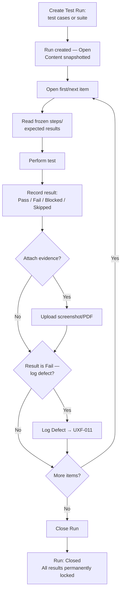

# User Flows — Test Run Creation & Execution

---

**CHANGE-001 — GENERALIZE.** UXF-010 is unchanged in its core execution semantics (Pass/Fail/Blocked/Skipped remain a fixed set, never replaced by configurable workflow status). It gains one addendum: **UXF-026 — Execution Eligibility at Test Run Time**, in `13-qa-operating-model-and-governance.md`, which governs the case where the organisation's workflow restricts execution of not-yet-approved Test Cases. Test Case **workflow state** (Draft/pending-review/pending-approval/Approved) and **execution result** (Pass/Fail/Blocked/Skipped) remain two distinct concepts and must never be presented as one status field.

---

## UXF-010 — Test Run Creation & Execution

**Priority:** Critical MVP

**Actor:** QA Tester, QA Manager, Admin.

**Goal:** Execute a defined set of test cases and record accurate, historically-reliable results.

**Entry Point:** Test Runs area within a project.

**Preconditions:** At least one Approved (or any-status, per approved requirements — no status restriction is specified for run inclusion) test case or suite exists.

**Happy Path:**
1. User selects "Create Test Run," chooses either individual test cases or a whole suite, and names the run.
2. The run is created **Open**; at this exact moment, the content of every included test case is frozen (a snapshot) — later edits to the live test case will never affect this run's copy.
3. User (or any tester with access) works through the run's items one at a time: reads the frozen steps/expected results, performs the test, and records a result — **Pass**, **Fail**, **Blocked**, or **Skipped**.
4. Optionally attaches evidence (a screenshot or PDF) to the result.
5. If the result is **Fail**, the user may log a defect directly from that result (UXF-011).
6. User moves to the next item; the run's progress counts update as they go.
7. Once all items are addressed, user closes the run.

**Decision Points:**
- Test cases vs. a whole suite, when creating the run.
- Per item: which result status applies; whether to attach evidence; whether to log a defect (only relevant for Fail).
- When to close the run (any time execution is considered complete — not gated on every item having a result).

**Alternative Paths:**
- Recording results out of order, or returning to a previously-skipped item before closing.
- A requirement one of this run's test cases traces to gets archived while the run is still open: the run is automatically cancelled-and-archived as part of that cascade (UXF-005) — the tester sees the run become read-only, with a clear indication of why (cascade from requirement archive, not a manual close).

**Error / Failure Paths:**
- Attempting to record a result, or attach/remove evidence, on a run that is no longer **Open** (Closed, or Cancelled-Archived via cascade): rejected outright, no exception — the UI must never let this look like it succeeded, since this is a hard, non-negotiable rule (PD-037).
- Evidence upload exceeding the size cap or wrong file type: validation error before upload completes.
- Attempting to close an already-closed or cancelled-archived run: blocked/not offered.

**Successful Outcome:** The run shows **Closed**, with every item's result permanently locked, feeding accurate historical data into dashboards and reports — regardless of anything that happens to the underlying test case afterward.

**Related Requirements:** FR-TR-001–004, FR-EXEC-001–003, FR-TC-004, PD-034, PD-037.

**Related APIs:** `POST /projects/{projectId}/test-runs`, `GET /test-runs/{runId}`, `POST /test-runs/{runId}/close`, `GET /test-runs/{runId}/items`, `PATCH /test-runs/{runId}/items/{itemId}/result`, `POST /test-runs/{runId}/items/{itemId}/evidence` (`test-runs.md`).

### Test Case → Version → Run → Execution → Result (Historical Accuracy)

```mermaid
flowchart LR
    TC[Live Test Case\n(current, editable)] -->|"significant edit"| TCV[Test Case Version\n(frozen historical record)]
    TC -->|"run created"| SNAP[Test Run Snapshot\n(frozen at this exact moment,\nregardless of TCV existing)]
    SNAP --> RUN[Test Run: this item]
    RUN --> RESULT[Execution Result:\nPass / Fail / Blocked / Skipped]
    RESULT --> EVID[Evidence]
    RESULT -->|"if Fail"| DEF[Defect]
    TC -.->|"later edits never reach"| SNAP
```

**Key point for wireframing:** once a run is created, the tester is always looking at the *frozen* content of the snapshot, never the live test case — even if someone edits the live test case moments later. This must be visually unambiguous later (e.g., a run's execution screen should never silently reflect a live edit).

### Full Execution Flow


