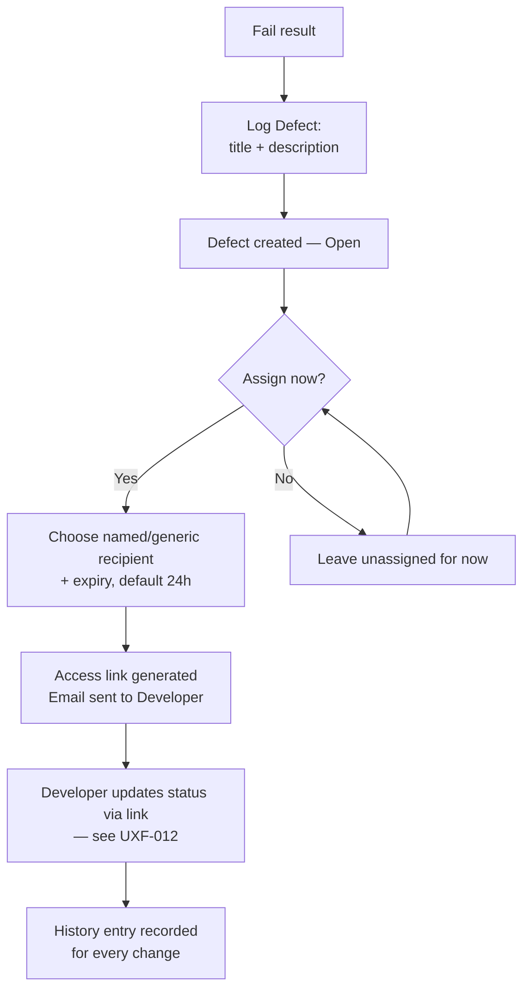

# User Flows — Defect Management

---

**CHANGE-001 — GENERALIZE.** The defect lifecycle/status set below is unchanged. What's new: **Severity** is a stable TestFlow semantic (e.g., Critical/High/Medium/Low) with an organisation-configurable **display label** layered on top for presentation only; **Priority** is a separate, fully organisation-configured field; and **release-blocking** is a separate boolean flag, not derived from Severity or Priority. The defect form and detail view must show these as three distinct fields/controls — never merged or implied to be the same thing (§24 constraint). Project Readiness's two defect-related gates (UXF-027) read Severity's stable semantic and the release-blocking flag respectively, never the organisation's display label or Priority.

---

## UXF-011 — Defect Logging & Developer Assignment

**Priority:** Critical MVP

**Actor:** QA Tester, QA Manager, Admin (logging/assigning); Developer (resolving, via link — see `08-link-based-access.md` for the Developer's side).

**Goal:** Capture an issue found during testing and route it to whoever needs to fix it, without requiring that person to have a TestFlow account.

**Entry Point:** A Fail execution result, within a test run.

**Preconditions:** A test result with status Fail exists.

**Happy Path:**
1. From a Fail result, user selects "Log Defect," enters a title and description (reproduction detail).
2. Defect is created, linked to that result and its test case, status **Open**.
3. User selects "Assign to Developer," optionally naming the recipient (or leaving it generic) and optionally adjusting the link's expiry (defaults to 24 hours).
4. An email is sent to the Developer containing their access link — this is the entirety of how the Developer gets in; there is no separate account for them.
5. Developer (via the link, no login) reviews the defect and updates its status as they work — see UXF-012.
6. QA Tester/Manager/Admin can view the defect's full history at any time (every status change, and who/what link performed it).

**Decision Points:**
- Whether to assign immediately or leave the defect unassigned for now.
- Named vs. generic link recipient.
- Custom expiry vs. the 24-hour default.

**Alternative Paths:**
- Re-assigning to a different Developer later (generates a new link).
- Revoking an assignment link early, before the Developer has finished (e.g., reassigning work) — the existing link stops working immediately.

**Error / Failure Paths:**
- Attempting to log a defect from a result that isn't Fail: not offered.
- Email delivery failure: automatically retried once within 5 minutes before being treated as a permanent failure and surfaced to the assigner (FR-NOT-005) — not a silent drop.

**Successful Outcome:** The defect is visible in the project with an accurate history, and the assigned Developer has a working, scoped link to update its status.

**Related Requirements:** FR-DEF-001–006, FR-LNK-001, FR-LNK-003, FR-NOT-003, FR-NOT-005.

**Related APIs:** `POST /execution-results/{resultId}/defects`, `GET /defects/{defectId}`, `POST /defects/{defectId}/assign`, `GET /defects/{defectId}/history` (`defects.md`).

