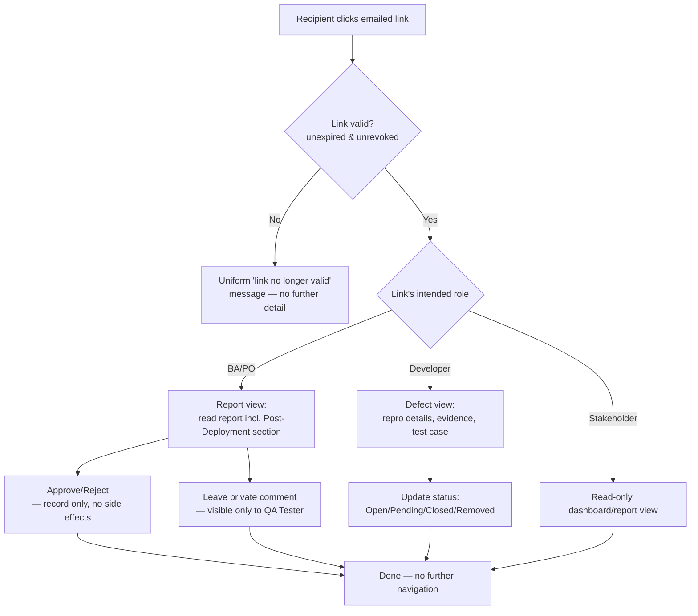

# User Flows — Link-Based External Access

---

## UXF-012 — Link-Based External Access (BA/PO, Developer, Stakeholder)

**Priority:** Critical MVP

**Actor:** Business Analyst/Product Owner, Developer, Stakeholder — none of whom have a TestFlow account, log in, or are identity-verified in any way (PD-018, PD-043).

**Goal:** Perform one specific, pre-scoped action without any account setup.

**Entry Point:** An emailed link — this is the *only* entry point for these roles. There is no login page, no organisation, no navigation menu available to them at all.

**Preconditions:** A QA Tester, QA Manager, or Admin has generated and sent the link (see UXF-011 for the defect-assignment case; report/dashboard sharing follows the same pattern from a report or project screen).

**Happy Path (three variants, sharing one shape):**

- **BA/PO — Report approval & comment:** clicks the emailed link, lands directly on that one report (read-only view, including its Post-Deployment section). Can record an **Approve** or **Reject** decision (a record-keeping action only — it never blocks or triggers anything else in the system), and/or leave a private comment visible only to the QA Tester (never shown in the report itself, never visible to QA Manager, Admin, Developer, or Stakeholder).
- **Developer — Defect status update:** clicks the emailed link, lands directly on that one defect. Reviews reproduction details/evidence/the linked test case, and updates the defect's status (Open/Pending/Closed/Removed).
- **Stakeholder — Dashboard/report viewing:** clicks the emailed link, lands directly on a read-only dashboard or report — no edit capability of any kind.

In every variant, the link can be used more than once (it's not consumed after first use) and can be freely forwarded by whoever holds it — there is no way to restrict this, by design (PD-045, PD-046).

**Decision Points:** None the recipient controls beyond the one action the link grants (approve/reject, comment, update status, or simply view).

**Alternative Paths:** None — this is intentionally the narrowest possible flow; there is no "explore further" path from any link-based screen.

**Error / Failure Paths:**
- **Link expired or revoked:** a single, uniform message ("this link is no longer valid") regardless of the actual reason — never distinguishing expired from revoked from never-existed, since disclosing the difference could help someone probe for valid links (security principle, `api-spec.md`).
- **Link used for the wrong action** (e.g., a report-approval link somehow reaching a defect-update screen): treated the same as an invalid link from the recipient's point of view — a clear "not available" state, not a confusing technical error.

**Successful Outcome:** The one scoped action (approval/comment, status update, or view) completes, with no further capability offered — the recipient's task is done, and they simply close the tab.

**Related Requirements:** FR-LNK-001–006, FR-DEF-003, FR-RPT-003, FR-RPT-004, FR-DASH-003, PD-039, PD-040, PD-042–046.

**Related APIs:** `GET /links/{linkToken}`, `PATCH /links/{linkToken}/defect-status`, `POST /links/{linkToken}/report-approval`, `POST /links/{linkToken}/report-comments`, `GET /links/{linkToken}/dashboard` (`links.md`).

**Note for later wireframing:** because this population never logs in and has no broader navigation, these screens should be designed as fully standalone, self-contained pages — not as a stripped-down version of the main authenticated app shell.
