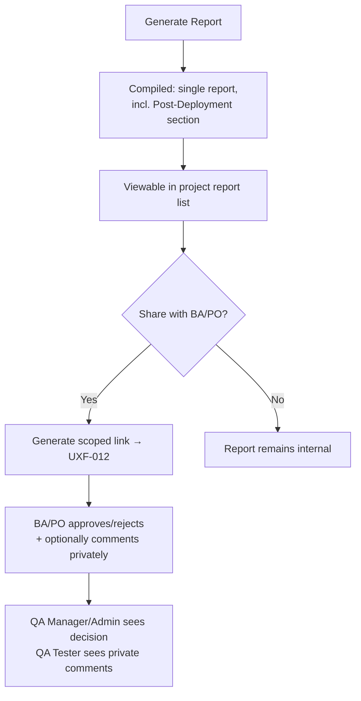

# User Flows — Reporting & Dashboards

---

**CHANGE-001 note on this file:** UXF-013 — GENERALIZE (now template-driven, shares its interaction pattern with the new UXF-030 Regression Report). UXF-014 — GENERALIZE (gains a Project Readiness summary). Both addenda below.

---

## UXF-013 — Report Generation & Review

**Priority:** Critical MVP

**Actor:** QA Manager, Admin (generation); BA/PO (review, via link — see UXF-012).

**Goal:** Produce a current snapshot of testing status, including production testing, and get sign-off/feedback from BA/PO.

**Entry Point:** Reports area within a project.

**Preconditions:** Project has execution data (though a report can still be generated with none — it will simply show as such).

**Happy Path:**
1. QA Manager/Admin selects "Generate Report" for the project.
2. Report compiles current data (target: within ~5 seconds) — one report, including a Post-Deployment section covering any production testing.
3. Report appears in the project's report list, viewable in full.
4. User shares it with a BA/PO via a scoped link (UXF-011/012's link-generation pattern) for approval/comment.
5. QA Manager/Admin can later view the BA/PO's approval/rejection decision and — separately, since it's private — their own QA Tester's team sees any BA/PO comments left on it.

**Decision Points:** Whether/when to share the report externally.

**Alternative Paths:** Generating a new report later produces a new, separate snapshot — never an edit to a prior one; both remain viewable.

**Error / Failure Paths:** Generating a report for a project with no data at all: succeeds, showing an appropriately empty/not-applicable state rather than an error.

**Successful Outcome:** A report exists, is reviewable in full by QA Manager/Admin, and (if shared) has recorded BA/PO feedback.

**Related Requirements:** FR-RPT-001–004, PD-038, PD-039, PD-040.

**Related APIs:** `POST /projects/{projectId}/reports`, `GET /projects/{projectId}/reports`, `GET /reports/{reportId}`, `GET /reports/{reportId}/comments` (`reports.md`).

**CHANGE-001 addendum:** step 2's compilation now fills the project's applicable, published **Test Report Template** (UXF-021/022) rather than a fixed structure — configurable fields render alongside the stable metrics. If a Test Report is one of the organisation's **required artifacts** (Project Policy, UXF-024) and/or feeds the "Required artifacts completed" quality gate, the report screen shows that relationship (e.g., "Required for Project Readiness") — but generating or approving a report never itself flips a readiness value; Project Readiness (UXF-027) always evaluates current facts on demand, independently.

**CHANGE-002 addendum (methodology-neutral QA Scope, PD-064):** step 1's "Generate Report" screen gains one optional field group:

```
QA Scope
[ Enter scope ]

Optional:
Start Date    End Date
```

If the organisation has set a preferred scope terminology (FR-QAOM-013, e.g. "Sprint"), that word may appear as supporting terminology (e.g., the field reads "Sprint" with "QA Scope" still the underlying concept) — otherwise the field uses the neutral label **"QA Scope"**, never "Sprint." The field and both dates are entirely optional; leaving them blank is the default, unremarkable case. Once set, the scope value/date range display on the report's list entry and detail view (read-only after generation, consistent with the report's existing immutable-snapshot behaviour — no scope-edit action). This never affects report content, workflow, or Quality Gate/Readiness evaluation.

---

## UXF-030 — Regression Report

**Priority:** Critical MVP.

**Actor:** QA Manager, Admin (generation); BA/PO (review, via link, same pattern as UXF-013).

**Goal:** Produce a regression-testing status snapshot, using the same interaction pattern as Test Report — deliberately not a redesigned experience.

**Entry Point:** Project → Reports → Regression Reports (a sibling surface, not a separate top-level area).

**Preconditions:** Same as UXF-013.

**Happy Path:** Identical in shape to UXF-013 steps 1–5, with two differences: (1) the applicable, published **Regression Report Template** is used instead of Test Report's; (2) content and applicable policy (e.g., whether Regression Report is a required artifact / feeds the "Required regression activity completed" gate) differ, per the organisation's configuration — the interaction itself does not.

**Decision Points / Alternative Paths / Error Paths:** Same as UXF-013.

**Successful Outcome:** Same as UXF-013, for the Regression Report document type.

**Related Requirements:** FR-RPT-* (generalized), FR-QG-*, FR-TPL-*.

**Related APIs:** `POST /projects/{projectId}/regression-reports`, `GET /projects/{projectId}/regression-reports`, `GET /regression-reports/{id}` — implemented server-side by the same underlying QA Document capability as `/reports`, never a duplicated parallel service (AD-025).

**Architecture/module dependency:** QA Documents module, one `QaDocumentService` parameterized by document type (AD-025).

**CHANGE-002 addendum:** identical optional QA Scope field group as UXF-013's addendum above — same interaction, same neutral "QA Scope" default label, same organisation preferred-terminology behavior.



---

## UXF-014 — Dashboard & Progress Monitoring

**Priority:** Supporting MVP

**Actor:** QA Tester, QA Manager, Admin (full view); Stakeholder (read-only, via link — UXF-012).

**Goal:** See testing progress at a glance, without generating a full report.

**Entry Point:** Project dashboard, reached from within any project.

**Preconditions:** User has project access.

**Happy Path:**
1. User opens the project dashboard.
2. Sees aggregate run progress (Pass/Fail/Blocked/Skipped counts), traceability summary (traced vs. untraced test cases), and defect status summary — all live, computed from current data, not a saved snapshot.
3. User can drill into any underlying area (a specific run, the requirement list) from here.

**Decision Points:** None — this is a read-only monitoring view.

**Alternative Paths:** Stakeholder viewing the same underlying data via a scoped, read-only link (UXF-012) — same information, no drill-down/navigation beyond it.

**Error / Failure Paths:** Project with no activity yet: empty state, not an error.

**Successful Outcome:** User has an accurate, current picture of project status.

**Related Requirements:** FR-DASH-001–003, FR-TR-004.

**Related APIs:** `GET /projects/{projectId}/dashboard` (`dashboards.md`).

**CHANGE-001 addendum:** the dashboard gains a **Project Readiness** summary tile, computed from the exact same on-demand gate evaluation as UXF-027 — never a second, separately-derived readiness model. Clicking it opens the full Project Readiness experience (UXF-027). All other dashboard metrics continue to use TestFlow's stable semantics (e.g., defect Severity, not organisation display labels), consistent with §29's constraint.
