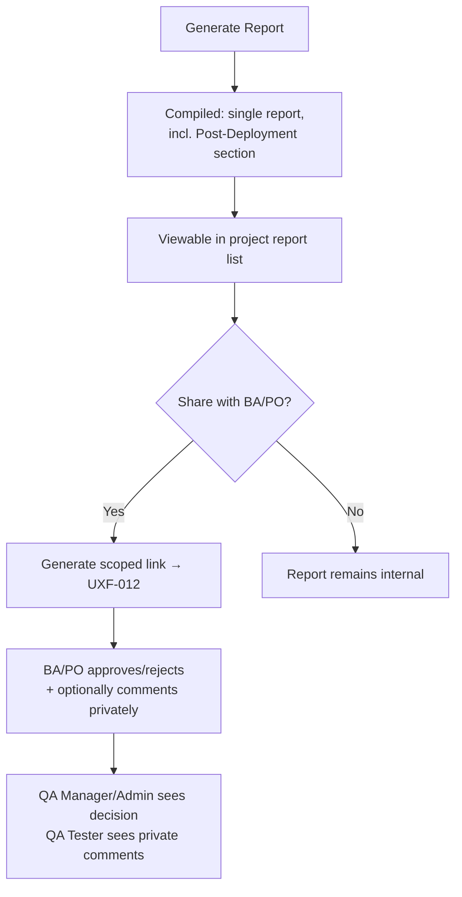

# User Flows — Reporting & Dashboards

---

## UXF-013 — Report Generation & Review

**Priority:** Critical MVP

**Actor:** QA Manager, Admin (generation); BA/PO (review, via link — see UXF-012).

**Goal:** Produce a current snapshot of testing status, including production testing, and get sign-off/feedback from BA/PO.

**Entry Point:** Reports area within a project.

**Preconditions:** Project has execution data (though a report can still be generated with none — it will simply show as such).

**Happy Path:**
1. QA Manager/Admin selects "Generate Report" for the project.
2. Report compiles current data (target: within ~5 seconds) — one report, including a Post-Deployment section covering any production testing.
3. Report appears in the project's report list, viewable in full.
4. User shares it with a BA/PO via a scoped link (UXF-011/012's link-generation pattern) for approval/comment.
5. QA Manager/Admin can later view the BA/PO's approval/rejection decision and — separately, since it's private — their own QA Tester's team sees any BA/PO comments left on it.

**Decision Points:** Whether/when to share the report externally.

**Alternative Paths:** Generating a new report later produces a new, separate snapshot — never an edit to a prior one; both remain viewable.

**Error / Failure Paths:** Generating a report for a project with no data at all: succeeds, showing an appropriately empty/not-applicable state rather than an error.

**Successful Outcome:** A report exists, is reviewable in full by QA Manager/Admin, and (if shared) has recorded BA/PO feedback.

**Related Requirements:** FR-RPT-001–004, PD-038, PD-039, PD-040.

**Related APIs:** `POST /projects/{projectId}/reports`, `GET /projects/{projectId}/reports`, `GET /reports/{reportId}`, `GET /reports/{reportId}/comments` (`reports.md`).

---

## UXF-014 — Dashboard & Progress Monitoring

**Priority:** Supporting MVP

**Actor:** QA Tester, QA Manager, Admin (full view); Stakeholder (read-only, via link — UXF-012).

**Goal:** See testing progress at a glance, without generating a full report.

**Entry Point:** Project dashboard, reached from within any project.

**Preconditions:** User has project access.

**Happy Path:**
1. User opens the project dashboard.
2. Sees aggregate run progress (Pass/Fail/Blocked/Skipped counts), traceability summary (traced vs. untraced test cases), and defect status summary — all live, computed from current data, not a saved snapshot.
3. User can drill into any underlying area (a specific run, the requirement list) from here.

**Decision Points:** None — this is a read-only monitoring view.

**Alternative Paths:** Stakeholder viewing the same underlying data via a scoped, read-only link (UXF-012) — same information, no drill-down/navigation beyond it.

**Error / Failure Paths:** Project with no activity yet: empty state, not an error.

**Successful Outcome:** User has an accurate, current picture of project status.

**Related Requirements:** FR-DASH-001–003, FR-TR-004.

**Related APIs:** `GET /projects/{projectId}/dashboard` (`dashboards.md`).
