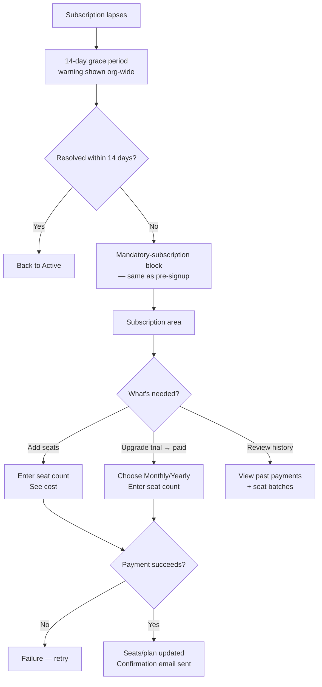

# User Flows — Ongoing Subscription & Seat Management

---

## UXF-017 — Subscription & Seat Management (Ongoing)

**Priority:** Critical MVP — the mandatory gating makes this unavoidable, not optional polish.

**Actor:** Admin, QA Manager.

**Goal:** Keep the organisation's subscription active and seats sufficient for the team, after initial sign-up (UXF-001 covers first activation).

**Entry Point:** Subscription/Billing area (organisation-level).

**Preconditions:** User is Admin or QA Manager.

**Happy Path (several related sub-journeys):**

- **Proactive seat purchase:** user opens the subscription area, selects "Add seats," enters a count, sees the cost (accounting for staggered yearly renewal if applicable), confirms payment.
- **Blocked-invitation recovery:** while inviting a member (UXF-002), the seat limit is hit — the user is directed straight into this same seat-purchase sub-journey from that point, rather than a dead end.
- **Trial-to-paid conversion:** user on trial selects a paid plan (Monthly or Yearly) before or after the 14-day trial ends, enters seat count, confirms payment.
- **Billing history review:** user opens billing/seat history, sees past payments and seat batches (each yearly batch showing its own independent renewal date, per PD-027's staggered renewal).

**Decision Points:** Monthly vs. Yearly; how many additional seats; whether to act now or wait for a blocked invitation to prompt it.

**Alternative Paths:** None beyond the above — this area has no other actions.

**Error / Failure Paths:**
- **Payment failure:** no seats/plan change is applied (all-or-nothing, NFR-REL-003); clear failure message, can retry.
- **Trial already used:** the trial option is never shown again to this organisation, under any circumstance (PD-021) — not an error state so much as an option that's simply absent.
- **Subscription lapse (failed renewal):** Admin/QA Manager see a clear grace-period warning (14 days remaining, PD-029) across the app during this period; after 14 days with no resolution, the mandatory-subscription block reappears exactly as it did pre-sign-up, with a direct path back into this flow to resolve payment.
- **Non-Admin/QA-Manager attempting to reach this area:** permission denied (QA Tester and all link-based roles have no access to billing at all, PD-047).

**Successful Outcome:** The organisation has enough active seats and an active plan; every member can continue working without interruption.

**Related Requirements:** FR-SUB-001–012, PD-047.

**Related APIs:** `GET /organisations/{orgId}/subscription`, `POST /organisations/{orgId}/subscription/trial`, `POST /organisations/{orgId}/subscription/monthly`, `POST /organisations/{orgId}/subscription/yearly`, `POST /organisations/{orgId}/seats`, `GET /organisations/{orgId}/billing-history` (`subscription-billing.md`).

