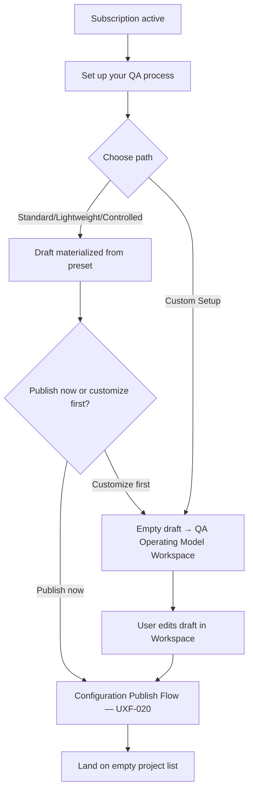
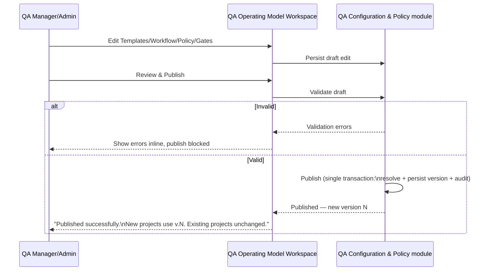
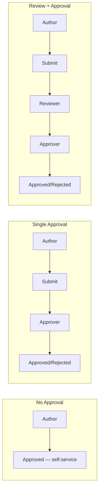
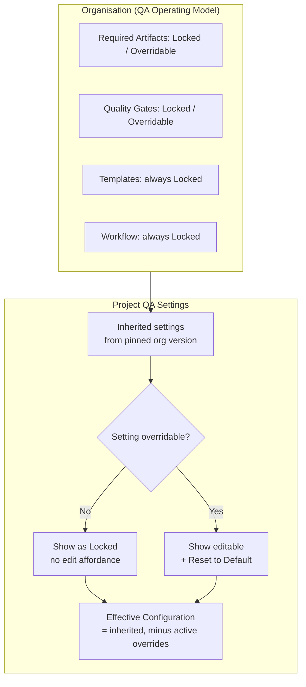
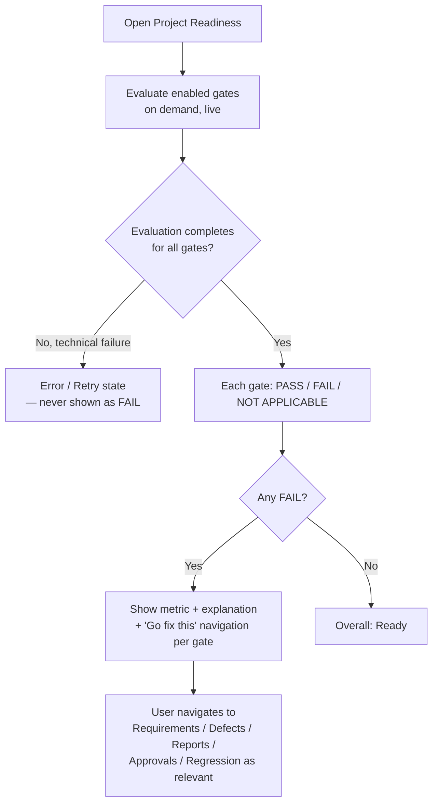
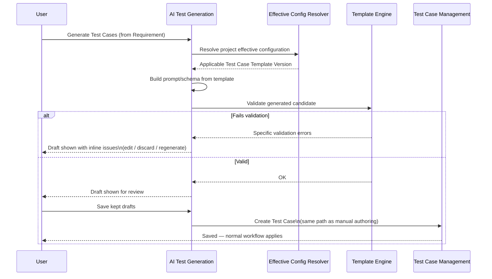

# User Flows — QA Operating Model & Governance (CHANGE-001)

**Status:** New companion file for CHANGE-001 (Organisation QA Operating Model). Adds the flows introduced by PD-049–063 / FR-QAOM-* / FR-TPL-* / FR-WF-* / FR-POL-* / FR-QG-* on top of the previously-approved flow catalogue. Does not redesign the visual system (`design-direction.md`, `design-system.md` unchanged) — see §23 Design Impact Inventory in the Final Report for what these flows imply for future visual design.

**Reading note:** these flows sit at organisation-level governance (A/C in the classification below) except where noted. They compose with, but do not replace, the day-to-day flows in `04-test-case-management.md`, `06-test-execution.md`, `07-defect-management.md`, and `09-reporting-and-dashboards.md`, which are updated in place with CHANGE-001 addenda (see those files).

---

## UXF-018 — QA Setup During Onboarding (extends UXF-001/UXF-002)

**Category:** A — Setup/Governance.

**Priority:** Critical MVP.

**Actor:** Admin or QA Manager (whoever completes onboarding — PD-049 makes this conceptually mandatory but low-friction).

**Goal:** Give the new organisation a working QA Operating Model without forcing manual configuration before the org can create its first project.

**Entry Point:** Automatically presented immediately after UXF-001's subscription step completes (replaces landing directly on an empty project list).

**Preconditions:** Organisation has an active trial or paid subscription; no QA Operating Model configuration exists yet for this organisation.

**Happy Path:**
1. User lands on "Set up your QA process" — a single-screen decision, not a multi-step wizard.
2. User is shown four choices: **Standard QA** (recommended, balanced default), **Lightweight QA** (minimal governance), **Controlled QA** (stronger review/approval/readiness controls), and **Custom Setup** (configure manually — see UXF-019).
3. User selects a preset (Standard is pre-highlighted as the recommended choice). The system materializes an organisation-owned **draft** configuration from that preset (PD-063, AD-019) — a private copy, not a live link back to the preset definition.
4. User is shown a summary of what the draft contains (template set, workflow shape, quality gates) and two actions: **Publish now** or **Review & customize first**.
5. Choosing **Publish now** runs the Configuration Publish Flow (UXF-020) immediately with no further input required.
6. User lands on the empty project list, ready to create their first project (UXF-003 continues unchanged from here).

**Decision Points:**
- Preset choice (Standard / Lightweight / Controlled / Custom Setup).
- Publish immediately vs. review/customize the draft first (routes into the QA Operating Model Workspace, UXF-019, still pre-project-creation).

**Alternative Paths:**
- User chooses **Custom Setup**: skips preset materialization, is dropped directly into an empty draft in the QA Operating Model Workspace (UXF-019) to build governance manually. This path is available but never the default focus of the screen.
- User has organisation-Admin permissions only (no QA Manager): same screen, same choices — QA Setup is not gated to a role beyond the general org-config permission already established in UXF-002.

**Error / Failure Paths:**
- Validation error on the materialized draft (should not normally occur straight from a preset, but is possible after customization) — see UXF-019's validation states.
- User attempts to reach the project list before completing this screen: blocked, same pattern as the existing mandatory-subscription block (FR-SUB-002) — QA Setup is a mandatory step in the sequence, consistent with PD-063's "conceptually mandatory" framing, but never demands more than one click (select preset → publish) to clear it.

**Successful Outcome:** The organisation has one published QA Operating Model version; the user reaches the project list having spent as little as a single click (or as much as a full custom build) depending on their own choice — never forced into the long path.

**Related Requirements:** PD-049, PD-063, FR-QAOM-001–00x (organisation QA configuration creation/publish), FR-ORG-001.

**Related APIs:** `POST /organisations/{orgId}/qa-configurations/drafts` (materialize from preset or blank), `GET /organisations/{orgId}/qa-configurations/drafts/current`, publish endpoint per UXF-020.

**Architecture/module dependency:** QA Configuration & Policy module (AD-015); preset materialization is application-owned static data copied into the draft (AD-019) — not a live reference.

**Notes for later visual design:** this screen must not resemble a pricing/plan-comparison page; it is a governance decision, and Standard should read as the safe, default action (primary button), not one of four equal options.

---

## UXF-019 — QA Operating Model Workspace & Preset Comparison

**Category:** A — Setup/Governance.

**Priority:** Critical MVP.

**Actor:** QA Manager, Admin.

**Goal:** Give governance owners one coherent place to understand and edit the organisation's current QA process.

**Entry Point:** Organisation-level "QA Operating Model" area (see §35 navigation decision below); also reachable from UXF-018's Custom Setup / review-and-customize paths.

**Preconditions:** User has organisation-config permission (Admin or QA Manager).

**Happy Path:**
1. User opens the QA Operating Model area. Sections, addressed as distinct sub-areas rather than one page (per PD-063's layered model, translated to plain language):
   - **Overview** — current published version summary, draft status if one exists.
   - **Templates** — Test Case / Test Report / Regression Report templates (UXF-021/022).
   - **Workflows & Approvals** — approval mode configuration (UXF-023).
   - **Project Policy** — which settings projects may override (UXF-024).
   - **Quality Gates** — the six bounded gate types (UXF-025).
   - **Versions** — publish history, read-only.
   - **Overview** also carries one small, non-versioned setting (CHANGE-002/FR-QAOM-013): an optional **preferred scope terminology** text field (e.g., "Sprint," "Phase," "Iteration"), used only to label the QA Scope field on Test Report/Regression Report creation (`09-reporting-and-dashboards.md`). Changing it is immediate and does not create or require a draft — it is descriptive only and never affects QA Operating Model versioning, gates, or workflow.
2. If comparing presets (first-time or reconsidering), the Overview offers a **Preset Comparison** view showing the three presets side-by-side using plain-language descriptors (governance level, whether review/approval is required, whether readiness gates are enforced) — not a settings-by-settings diff.
3. Any change the user makes in any sub-area edits the same underlying **draft** (UXF-020 governs its lifecycle) — there is exactly one draft at a time per organisation, never multiple concurrent drafts.
4. From any sub-area, the user can see whether unsaved/unpublished draft changes exist, and jump to Review & Publish (UXF-020).

**Decision Points:**
- Which sub-area to edit next (non-linear — not a wizard).
- Whether to apply a different preset as a reset-point for the draft (starts the draft over from that preset's materialized definition, discarding current draft edits — confirmed before applying).

**Alternative Paths:**
- User with no existing draft opens a sub-area to make their first edit since the last publish: system creates the draft transparently at that moment (UXF-020 "no draft" → "editing draft" transition).
- Viewing a historical published version (read-only, from Versions) — no edit affordance shown.

**Error / Failure Paths:**
- Concurrent edit: another Admin/QA Manager published while this user had a draft open — see UXF-020's stale-draft handling.
- Non-Admin/QA Manager (e.g., QA Tester) reaching this area via direct link: permission denied, area not shown in navigation at all for that role (§33).

**Successful Outcome:** The user understands, at a glance, what the organisation's QA process currently is (published) and what's pending (draft), and can navigate to change any part of it without needing to understand configuration versions or database structure.

**Related Requirements:** FR-QAOM-* (draft/publish/versioning), FR-TPL-*, FR-WF-*, FR-POL-*, FR-QG-*.

**Related APIs:** `GET /organisations/{orgId}/qa-configurations/published/current`, `GET /organisations/{orgId}/qa-configurations/drafts/current`, `GET /organisations/{orgId}/qa-configurations/versions`.

**Architecture/module dependency:** QA Configuration & Policy module owns Overview/Project Policy/Quality Gates/Versions; Template Engine owns Templates; Workflow module owns Workflows & Approvals — the Workspace is a UI composition over these, not a new backend module (AD-015).

**Notes for later visual design:** evaluate a left-hand sub-navigation within the workspace (Overview/Templates/Workflows/Policy/Gates/Versions) rather than a single scrolling page or top tabs, consistent with the product's existing dense, navigable-list conventions rather than a marketing-style settings page.

---

## UXF-020 — QA Configuration Draft, Validation & Publish

**Category:** A — Setup/Governance.

**Priority:** Critical MVP.

**Actor:** QA Manager, Admin.

**Goal:** Move a set of governance edits from private draft to the organisation's live, immutable QA process — safely and legibly.

**Entry Point:** Any edit made within the QA Operating Model Workspace (UXF-019); explicit "Review & Publish" action.

**Preconditions:** User has organisation-config permission.

**Happy Path:**
1. User makes one or more edits across Templates/Workflows/Policy/Gates. The workspace clearly labels the current state as **Draft changes — not yet live**, always shown distinctly from **Current published QA process**.
2. User opens "Review & Publish." System shows a plain-language summary of what will change (e.g., "Workflow: No Approval → Single Approval," "Minimum requirement coverage: 80% → 90%") — not a raw diff of internal fields.
3. System validates the draft server-side (template structural validity, workflow shape validity, gate parameter validity).
4. If valid: user confirms publish. System performs the publish in one transaction (validate → resolve → persist new immutable version → audit) and shows **Published successfully**, with the new version number and timestamp.
5. Workspace communicates explicitly: *new projects created from now on will use this version; existing projects continue on their current version and are not changed.*

**Decision Points:**
- Publish now vs. keep editing.
- If validation errors exist: fix now vs. leave draft as-is and return later (draft persists either way — nothing is lost).

**Alternative Paths:**
- User discards the draft entirely (reverts to matching the current published version) — confirmed before discarding, since it's destructive to unsaved governance work.
- User's draft is based on a preset/version that itself has since become stale in some way that no longer matches the current published baseline (rare, but handled): system flags **This draft was started from an older published version** and requires the user to review before publishing, rather than silently overwriting.

**Error / Failure Paths:**
- **Validation errors:** publish is blocked; each error is shown next to the sub-area/field it affects (e.g., "Quality Gates: Minimum requirement coverage requires a value between 1–100").
- **Stale draft / concurrent publish:** another Admin/QA Manager published a new version while this draft was open. The draft is preserved but the user is told the published baseline moved underneath them, and asked to review before publishing on top of it (optimistic-concurrency pattern, consistent with APID-003's `If-Match` semantics per AD-018's use of the draft/publish pattern — no silent last-write-wins).
- **Publish transaction failure (server error):** draft remains unpublished and unchanged; user sees a generic retry-safe error, per the existing error envelope conventions — publish is never partially applied (single transaction, AD-018).

**Successful Outcome:** Organisation has a new published, immutable QA Operating Model version. The draft is cleared (workspace returns to "no draft" until the next edit). Existing projects are provably unaffected; only new projects pick up the new version.

**Related Requirements:** FR-QAOM-* (publish lifecycle), PD-063.

**Related APIs:** `PATCH /organisations/{orgId}/qa-configurations/drafts/current` (edit), `POST /organisations/{orgId}/qa-configurations/drafts/current/validate`, `POST /organisations/{orgId}/qa-configurations/drafts/current/publish`.

**Architecture/module dependency:** QA Configuration & Policy module; single-transaction publish per AD-018; audit write reuses the existing append-only audit mechanism (AD-026 area / architecture.md Audit section).

---

## UXF-021 — Template Management (Test Case / Test Report / Regression Report)

**Category:** A — Setup/Governance.

**Priority:** Supporting MVP (Critical for organisations wanting non-default templates; Standard preset ships usable defaults).

**Actor:** QA Manager, Admin.

**Goal:** Manage the organisation's three document templates as one consistent pattern.

**Entry Point:** QA Operating Model Workspace → Templates.

**Preconditions:** User has organisation-config permission.

**Happy Path:**
1. User opens Templates, sees three fixed categories: **Test Case**, **Test Report**, **Regression Report** — no arbitrary custom document types are offered (§8 constraint).
2. Selecting a category shows its currently **published** template (read-only view: System Fields + configurable fields) and, if one exists, its **draft**.
3. User selects "Edit" (creates a draft if none exists) and enters the Template Builder (UXF-022) for that category.
4. After building, user can **Preview** the template as it will appear to an author, **Validate** it, and **Publish** it (folds into the same QA Configuration draft/publish lifecycle as UXF-020 — template publish and configuration publish are the same underlying pattern per AD-018, though a template can also be reviewed/published independently within that draft cycle).
5. **Version history** for the category shows prior published versions, read-only.

**Decision Points:** Which of the three categories to edit; whether to preview before publishing.

**Alternative Paths:** Test Report and Regression Report categories reuse the identical Template Builder interaction (UXF-022) — only the available System Fields and default field set differ, not the building experience (§26 consistency requirement).

**Error / Failure Paths:** Validation failure on publish — same pattern as UXF-020, errors surfaced inline in the builder.

**Successful Outcome:** Each of the three categories has a current published template that shapes the corresponding creation form (UXF-018 in `04-test-case-management.md`, and the Report/Regression Report flows in `09-reporting-and-dashboards.md`).

**Related Requirements:** FR-TPL-001–00x, FR-TC-008 (generalized).

**Related APIs:** `GET/PATCH /organisations/{orgId}/templates/{type}/drafts/current`, `POST .../publish`, `GET .../versions` (per `api/templates.md`).

**Architecture/module dependency:** Template Engine module (AD-015); shares the QA Configuration & Policy draft/publish transaction pattern (AD-018) but is a structurally separate module — Template Engine owns document-shape validation only, never workflow or gate semantics.

---

## UXF-022 — Template Builder (Field-Level Detail)

**Category:** A — Setup/Governance.

**Priority:** Supporting MVP.

**Actor:** QA Manager, Admin.

**Goal:** Compose a template's configurable fields on top of its protected System Fields, without needing to understand the underlying data model.

**Entry Point:** "Edit" from UXF-021, for a specific template category.

**Preconditions:** A template draft exists for the category (created on entry if none did).

**Happy Path:**
1. Builder shows the template as an ordered list of fields. **System Fields** (e.g., Title, Steps/Expected Result for Test Case; the fixed metadata fields for Reports) are visually marked as protected — shown with a lock indicator and a short explanation ("Required by TestFlow — cannot be removed") rather than being hidden or unexplained.
2. User selects "Add Field," which opens the common field-creation pattern:
   - **Select Type** — one of the 15 approved field types (text, number, date, dropdown, multi-select, checkbox, entity link, step table, etc. per `database-decisions.md`/`api-decisions.md`'s approved set).
   - **Configure Common Properties** — label, help text, required/optional.
   - **Configure Type-Specific Properties** — e.g., dropdown/multi-select option list; Entity Link's selectable target type(s), constrained to the approved linkable entities (never arbitrary); Step Table preserves TestFlow's structured action/expected-result step semantics rather than becoming a generic repeating-row builder.
   - **Add** — field appears at the end of the configurable-field list.
3. User reorders configurable fields via drag-or-equivalent (System Fields' position among them may be fixed or reorderable only among themselves, per the approved field-protection rule — never interleavable in a way that removes their protected status).
4. User removes a configurable field (System Fields have no remove affordance at all, not merely a disabled one — the protection is not something the user must discover by clicking a disabled button).
5. User selects **Preview** to see the template rendered as an authoring form would show it.
6. User selects **Save Draft** at any point (non-destructive, can leave and return), or **Validate** then **Publish** when ready (routes to UXF-020's publish confirmation, scoped to this template).

**Decision Points:** Field type per new field; required vs. optional; reorder position; which fields (if any) to remove.

**Alternative Paths:** Editing an existing configurable field's properties (same Configure steps, pre-filled) rather than adding a new one.

**Error / Failure Paths:**
- Attempting to remove/type-change a System Field: not offered (no error needed — the action doesn't exist for that field).
- Validation failure (e.g., dropdown with zero options, duplicate field label): inline error at the specific field, publish blocked.
- Entity Link configured with no valid target type available in this template category: blocked with explanation.

**Successful Outcome:** A valid draft template exists, previewable and ready to publish, with System Fields intact and configurable fields exactly as designed.

**Related Requirements:** FR-TPL-* (field composition, System Field protection), the approved 15-field-type list in `database-decisions.md`.

**Related APIs:** `PATCH /organisations/{orgId}/templates/{type}/drafts/current` (field add/edit/reorder/remove), template validation endpoint per `api/templates.md`.

**Architecture/module dependency:** Template Engine — the sole authoritative validation boundary for configurable field structure and values (AD-020); does not become a scripting/formula engine — no calculated fields, no cross-field expressions are offered anywhere in this builder.

**Notes for later visual design:** the "Add Field" pattern should read as one consistent modal/panel across all 15 types (common properties always first, type-specific second) rather than 15 distinct dialogs — this keeps the interaction learnable even though the type list is long.

---

## UXF-023 — Workflow Configuration (Approval Mode)

**Category:** A — Setup/Governance.

**Priority:** Critical MVP.

**Actor:** QA Manager, Admin.

**Goal:** Choose how much review/approval gate Test Case authoring in this organisation, without building a state machine.

**Entry Point:** QA Operating Model Workspace → Workflows & Approvals.

**Preconditions:** User has organisation-config permission.

**Happy Path:**
1. User sees the current workflow shape for Test Cases as one of three bounded options, presented as a simple selector with a visual preview of the resulting sequence, not a canvas:
   - **No Approval** — self-service, matches the pre-CHANGE-001 UXF-006 behavior.
   - **Single Approval** — Author → Submit → Approver decides (Approve/Reject).
   - **Review + Approval** — Author → Submit → Reviewer → Approver, sequential checkpoints.
2. Selecting an option updates the preview (e.g., a short left-to-right sequence of stages) so the user can see the resulting flow before committing.
3. If Single Approval or Review + Approval is chosen, user configures: which role(s) may act as Approver/Reviewer at each checkpoint (from existing project roles — no new custom roles), and the **unapproved Test Case execution policy** (whether a Test Case pending approval can still be included and executed in a Test Run, or must reach Approved first) — see UXF-026 (execution eligibility) for the resulting enforcement.
4. Change is saved to the draft (UXF-020 governs publish).

**Decision Points:** Workflow shape (3 options); reviewer/approver role per checkpoint (only if a checkpoint exists); unapproved-execution policy (only if any approval checkpoint exists).

**Alternative Paths:** Switching from Review + Approval back to No Approval — draft change only; does not retroactively alter Test Cases already at a given workflow state under a previously published version (published versions are immutable; existing projects on the old version are unaffected until they're on a project pinned to the new one).

**Error / Failure Paths:** No approver/reviewer role selected while an approval checkpoint is enabled: validation error at publish.

**Successful Outcome:** The organisation's Test Case workflow shape is set, previewed, and ready to publish; downstream flows (UXF-006 addendum, UXF-014-style approval flows) will reflect it once this configuration is published and a project is created/pinned against it.

**Related Requirements:** FR-WF-001–00x.

**Related APIs:** `PATCH /organisations/{orgId}/qa-configurations/drafts/current/workflow` (per `api/workflow.md` or equivalent).

**Architecture/module dependency:** Workflow module — thin, subject-agnostic, exactly 3 shapes, no generic state-machine/BPM language (AD-021).

---

## UXF-024 — Project Policy (Overrides)

**Terminology note (CHANGE-001 clarification):** a project override is a **Project Exception** — an explicit, bounded deviation from the inherited Organisation QA Process, not an independent project-level QA process. The **Effective Project QA Process** is always *inherited Organisation QA Process + permitted Project Exceptions*; see `product-decisions.md` PD-056.

**Category:** C — Project-Level Governance.

**Priority:** Supporting MVP.

**Actor:** QA Manager, Admin (setting override-eligible categories at org level); Project-level QA Manager/Admin (applying an override within a project).

**Goal:** Let specific projects diverge from the organisation default only in the two bounded, approved categories — required artifacts and enabled quality gates — nothing else.

**Entry Point A (org level):** QA Operating Model Workspace → Project Policy. **Entry Point B (project level):** Project → QA Settings / QA Policy (UXF-024b, below).

**Preconditions:** User has the relevant permission (organisation-config for A; project-config for B).

**Happy Path (org level, A):**
1. User sees the two override-eligible categories (**Required artifacts**, **Enabled quality gates**) and, for each underlying setting, marks it **Locked** (all projects must match the organisation default) or **Project may override**.
2. Template selection and Workflow selection are always shown as **Locked** with no toggle — the UX makes clear these are structurally non-overridable (§12 constraint), not merely defaulted to locked.
3. Saved to draft; publishes with UXF-020.

**Happy Path (project level, B — "Project QA Settings"):**
1. Project user opens QA Settings, sees the full **inherited** policy (from the organisation's published version this project is pinned to) alongside the **effective** settings (inherited, minus any active project overrides).
2. Each setting is labeled clearly as one of: **Organisation default (locked)**, **Organisation default (currently applied, override available)**, or **Project override active** — with the source of each effective value visible (e.g., "Inherited from org v.3" vs. "Overridden by this project").
3. For an overridable setting, user changes the value, reviews the resulting effective value, and saves.
4. User may **Reset to Organisation Default** on any active override, immediately reverting the effective value to inherited.

**Decision Points:** Which settings are override-eligible (org level); whether/how to override them (project level).

**Alternative Paths:** A project applies zero overrides — effective settings equal inherited settings entirely; this is the common case and should read as the default, unremarkable state, not an empty/incomplete one.

**Error / Failure Paths:**
- Project user attempts to override a Locked setting: control not shown as editable (hidden affordance, not a disabled-with-tooltip — per §12/§33, Locked settings are not actionable at all at project level).
- Project user without project-config permission viewing QA Settings: read-only view of effective settings, no edit affordance.

**Successful Outcome:** Org-level: the override boundary is clearly defined. Project-level: the project's effective QA configuration is fully transparent — what's inherited, what's overridden, and why — with no ambiguity about where a given effective value came from.

**Related Requirements:** FR-POL-001–00x.

**Related APIs:** `PATCH /organisations/{orgId}/qa-configurations/drafts/current/policy` (org level), `GET /projects/{projectId}/effective-configuration`, `PATCH /projects/{projectId}/policy-overrides` (project level).

**Architecture/module dependency:** QA Configuration & Policy module owns both the org-level override-eligibility settings and the project-level override values; the Effective Configuration Resolver (AD-017) computes the effective view shown in UXF-024b server-side — the UI never merges inherited + override values itself.

---

## UXF-025 — Quality Gate Configuration

**Category:** A — Setup/Governance (org level); C — Project-Level Governance (enabling/overriding at project level, per UXF-024).

**Priority:** Critical MVP.

**Actor:** QA Manager, Admin.

**Goal:** Enable and parameterize the six bounded, approved quality gate types — nothing else.

**Entry Point:** QA Operating Model Workspace → Quality Gates.

**Preconditions:** User has organisation-config permission.

**Happy Path:**
1. User sees exactly six gate types, each with an enable/disable toggle and, where applicable, one bounded parameter:
   - **Required artifacts completed** — no parameter (checks the required-artifacts list from Project Policy).
   - **Required approvals completed** — no parameter (checks workflow completion).
   - **Minimum requirement coverage** — parameter: percentage (e.g., `[90] %`).
   - **Required regression activity completed** — no parameter.
   - **No unresolved Critical defects** — no parameter (uses the stable Critical severity semantic, not an org label).
   - **No unresolved release-blocking defects** — no parameter (uses the release-blocking flag, distinct from severity/priority — §24).
2. For each enabled gate, user reviews a plain-language sentence describing exactly what it checks (e.g., "Fails if requirement coverage is below 90%.") before saving — no boolean-expression or AND/OR builder is ever shown.
3. Saved to draft; publishes with UXF-020.

**Decision Points:** Which of the six to enable; parameter value where applicable.

**Alternative Paths:** None beyond enable/disable/parameterize — deliberately, per §13's explicit "no rule builder" constraint.

**Error / Failure Paths:** Parameter out of bounds (e.g., coverage set to 150%): inline validation error, publish blocked.

**Successful Outcome:** The organisation's default gate set is defined; a project's Project Readiness (UXF-027) evaluates exactly these enabled gates (subject to any permitted project-level override per UXF-024).

**Related Requirements:** FR-QG-001–00x.

**Related APIs:** `PATCH /organisations/{orgId}/qa-configurations/drafts/current/quality-gates`.

**Architecture/module dependency:** Quality Gate/Readiness module — fixed six-entry evaluator registry, no plugin/extension mechanism (AD-023).

---

## UXF-026 — Execution Eligibility at Test Run Time (addendum to UXF-010)

**Category:** B — Day-to-Day QA Work.

**Priority:** Critical MVP.

**Actor:** QA Tester, QA Manager, Admin.

**Goal:** Avoid wasted testing effort on a Test Case that isn't yet allowed to be executed under the organisation's approval policy, while keeping the real enforcement server-side.

**Entry Point:** Within an open Test Run's execution screen (UXF-010), per item.

**Preconditions:** Organisation's workflow includes an approval checkpoint (Single Approval or Review + Approval) with an unapproved-execution policy that restricts execution (UXF-023).

**Happy Path:**
1. Tester opens a run item. If the underlying Test Case is not currently execution-eligible (server-reported `executionEligible: false`, with `executionBlockReason`), the result-recording controls are shown disabled with the reason surfaced inline (e.g., "Awaiting approval — cannot record a result until this Test Case is Approved.").
2. Tester can still read the frozen content and navigate away, but cannot submit a result for this item until it becomes eligible.
3. Once the Test Case is Approved (outside this flow, per UXF-023/UXF-006 addendum), the item's controls become enabled on next load/refresh.

**Decision Points:** None for the tester — this is enforcement, not a choice.

**Alternative Paths:** Organisation's policy permits execution of unapproved Test Cases (workflow configured that way) — no restriction shown at all; item behaves exactly as pre-CHANGE-001 UXF-010.

**Error / Failure Paths:**
- Tester attempts to force-submit a result despite the disabled state (e.g., a stale client, replayed request): server rejects authoritatively at result-recording time, re-checking eligibility fresh rather than trusting any cached value (§22 — the disabled UI is a courtesy, never the security boundary).
- `executionEligible`/`executionBlockReason` fields are stale relative to a very recent approval: UI reflects this until the next refresh; the authoritative check still happens server-side regardless of what the UI showed.

**Successful Outcome:** Testers are not misled into attempting work that will be rejected, without weakening the actual enforcement point (FR-WF-004), which remains exclusively at result-recording time.

**Related Requirements:** FR-WF-004, FR-TR-*, FR-EXEC-*.

**Related APIs:** `GET /test-runs/{runId}/items` (includes `executionEligible`/`executionBlockReason`), `PATCH /test-runs/{runId}/items/{itemId}/result` (authoritative re-check).

**Architecture/module dependency:** shared Execution Eligibility Policy / `canExecute()` function, called identically by the read path (item list) and the write path (result recording) — AD-022.

---

## UXF-027 — Project Readiness

**Category:** E — Readiness/Management Review.

**Priority:** Critical MVP.

**Actor:** QA Manager, Admin (primary); QA Tester (view).

**Goal:** See whether a project is ready, according to the organisation's configured quality gates, and get to the specific corrective work if not.

**Entry Point:** Project → Readiness (also reachable from the Dashboard's readiness summary — UXF-028 addendum).

**Preconditions:** Project exists with a resolved effective configuration (always true once a project is created — UXF-003 addendum).

**Happy Path:**
1. User opens Project Readiness. System evaluates each enabled gate (from the project's effective configuration — inherited + any permitted override) on demand, live — no stored Release entity, no persisted gate-result history is shown as authoritative.
2. Overall status and each individual gate's result are shown as one of exactly three states: **PASS**, **FAIL**, **NOT APPLICABLE** — never a fourth, ad hoc state.
3. For each gate, the user sees the relevant current metric/value (e.g., "Requirement coverage: 74% — needs 90%") and a short plain-language explanation.
4. For each **FAIL**, a **navigate to corrective work** action is offered, targeted to the specific place the user can act:
   - Coverage below threshold → filtered Requirements/Coverage view.
   - Unresolved Critical defects → Defects, pre-filtered to Critical + unresolved.
   - Required Test Report missing → Reports (create).
   - Approvals missing → the relevant pending-approval Test Case/QA Document list.
   - Regression incomplete → the appropriate Test Run/Regression Report surface.
5. No automatic fix is ever offered — only navigation to where the user does the actual work.

**Decision Points:** None — this is an evaluative, not editable, view. The only decision is which failing gate to act on first.

**Alternative Paths:** All gates PASS or NOT APPLICABLE (e.g., a gate is enabled but its precondition doesn't apply, such as "required regression activity" on a project with no regression cycle yet) — overall status reads as ready, with NOT APPLICABLE gates shown but visually de-emphasized relative to PASS/FAIL.

**Error / Failure Paths:**
- **Technical evaluation failure** (an evaluator throws / cannot complete, e.g., a transient data-access error): the page shows an explicit **error / retry** state for the affected evaluation — never displays FAIL for a gate that could not actually be evaluated (§27 constraint; matches architecture.md's resolution that the whole request surfaces the existing `500 internal_error` envelope rather than inventing a new business state).
- Readiness requested for a project with an org-configuration mismatch (should not occur given server-side resolution, but if the effective-configuration resolve itself fails): same error/retry treatment, not a false FAIL.

**Successful Outcome:** The user has an accurate, current, explainable readiness picture and a direct path to resolve every failing condition — no dead-end "FAIL" with no next step.

**Related Requirements:** FR-QG-*, NFR-PERF-005.

**Related APIs:** `GET /projects/{projectId}/readiness`.

**Architecture/module dependency:** Quality Gate/Readiness module, on-demand aggregation, no Release entity/table (AD-023).

---

## UXF-028 — AI Generation, Template-Aware (addendum to UXF-009)

**Category:** B — Day-to-Day QA Work.

**Priority:** Critical MVP.

**Actor:** QA Tester, QA Manager, Admin.

**Goal:** Same as UXF-009, updated so generated drafts follow the organisation's current Test Case template and workflow.

**What changes from UXF-009:** Step 3 ("Generation completes: a set of draft test cases is shown") now additionally: the system resolves the project's effective configuration and applicable Test Case Template Version *before* generating, shapes the AI request/response schema from that template, and validates the returned candidate against the same Template Engine validation used for manual authoring — *before* showing it to the reviewer. Step 5 ("Save") now explicitly saves through the exact same internal Test Case creation path manual authoring uses (workflow initialization, permissions, System Field protection all apply identically) — there is no separate AI-only save path.

**New error path — AI candidate fails template validation:** rather than a generic "Generation failed," the reviewer sees which required field is missing, which option is invalid, or which structural issue exists (e.g., "Missing required field: Priority," "Step Table: at least one step required") on the specific draft, with the option to edit the draft to fix it, discard it, or regenerate. Provider-level/internal errors (as opposed to template-validation issues) remain generic per NFR-AI's existing failure-message principle — never exposing raw provider error detail.

**Everything else (processing state, draft-vs-saved distinction, discard behavior, generation history) is unchanged from UXF-009.**

**Related Requirements:** FR-AI-001 (generalized), FR-AI-006, FR-TPL-*.

**Related APIs:** unchanged endpoints from `ai.md`, now template-aware server-side.

**Architecture/module dependency:** AI Test Generation resolves Effective Configuration → Template Version before prompting; save converges on Test Case Management's normal creation service (AD-024).

---

## Summary — New/Changed Flow IDs in This File

| Flow ID | Name | Category |
|---|---|---|
| UXF-018 | QA Setup During Onboarding | A |
| UXF-019 | QA Operating Model Workspace & Preset Comparison | A |
| UXF-020 | QA Configuration Draft, Validation & Publish | A |
| UXF-021 | Template Management | A |
| UXF-022 | Template Builder | A |
| UXF-023 | Workflow Configuration | A |
| UXF-024 | Project Policy (Overrides) | C |
| UXF-025 | Quality Gate Configuration | A |
| UXF-026 | Execution Eligibility at Test Run Time | B (addendum to UXF-010) |
| UXF-027 | Project Readiness | E |
| UXF-028 | AI Generation, Template-Aware | B (addendum to UXF-009) |

See `00-user-flow-index.md` for the updated master catalogue including these IDs, and `12-ux-gap-analysis-and-decisions.md`-style treatment of open items in the Final Report delivered alongside this file.
