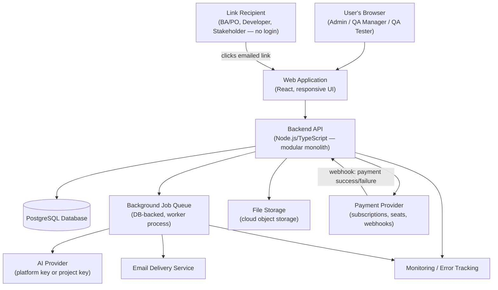

# TestFlow AI — System Architecture

**Source documents:** vision.md, prd.md, product-decisions.md, functional-requirements.md, non-functional-requirements.md, database.md, database-decisions.md (all approved)
**Status:** Approved — reflects the architecture and technology decisions explicitly approved by the product owner during the architecture review (see `architecture-decisions.md` for the individual decision records).
**Scope:** This document defines system components, technology choices, and how they communicate at a conceptual level. It does not define physical database schema/migrations, API contracts, UX/UI design, or implementation code.

---

## Architecture Overview

In plain terms: a customer's team works entirely through a website in their browser. That website talks to one central program (the "backend") which is the only thing allowed to read or write the database — nothing else touches the data directly. A few supporting pieces sit around that core: a place to store uploaded files (like screenshots attached to test results), a queue for jobs that take a while (like asking the AI to generate test cases, or sending an email), an external AI service the backend asks to draft test cases, and an external payment service that handles subscription billing. People without a TestFlow account (Business Analysts/Product Owners, Developers, Stakeholders) never log in at all — they get a special emailed link that lets them do one specific thing, and nothing more.

Everything is built as a **single, well-organized application** rather than many separate small services, because the product's rules (like "archiving a requirement must cleanly archive everything linked to it, all at once, or not at all") are much easier to get right when one program is in charge of the whole operation.

---

## Architecture Goals

These goals are drawn directly from approved product and technical documents, not invented for this document:

- **MVP simplicity:** avoid infrastructure and patterns not justified by approved requirements (CLAUDE.md; architecture review guidance to prefer the simplest architecture that meets approved requirements).
- **Maintainability by a small team:** the codebase should stay organized around the same functional modules already defined in `functional-requirements.md` (NFR-MAINT-001), so one person can reason about one module without needing to understand the whole system.
- **AI-assisted development fit:** technology choices favor consistency (one primary language across the stack) to keep the codebase easy for both humans and AI coding assistants to work in.
- **Multi-tenant security:** organisation data must never be reachable across tenant boundaries (NFR-SEC-003), and this must be a structural property of the architecture, not a per-query afterthought.
- **Reliability of AI integration:** AI-generated content must never bypass mandatory human review before being saved (FR-AI-002, NFR-AI-004), and AI or provider failures must not degrade the rest of the product (NFR-AI-003).
- **Data integrity under cascading operations:** cascade-archive operations must complete fully or not at all (NFR-DI-004); execution results must become permanently immutable once a test run closes (NFR-DI-003, PD-037).
- **Cost control appropriate to MVP:** avoid recurring infrastructure costs (e.g., managed microservice orchestration, dedicated search/caching layers) not justified by approved scope or usage volume.
- **A credible scaling path without premature complexity:** the system should be able to grow (e.g., extract a module into its own service later) without having been over-built for that scenario today.

---

## Major System Components

| Component | Responsibility |
|---|---|
| **Web application** | The single interface through which every role (Admin, QA Manager, QA Tester, and link-based BA/PO, Developer, Stakeholder) interacts with TestFlow AI. |
| **Backend/API service** | Enforces all business rules — roles/permissions, the test case approval state machine, cascade-archive logic, subscription/seat gating, link scoping — and is the sole component permitted to read/write the database. |
| **Database** | Persists the approved logical data model (see `database.md`); the single source of truth for all organisation, project, requirement, test case, execution, defect, report, billing, and audit data. |
| **Authentication (organisation members)** | Verifies identity and establishes a session for Admin/QA Manager/QA Tester logins. |
| **Access Link mechanism (link-based roles)** | A separate, custom mechanism granting BA/PO, Developer, and Stakeholder scoped, expiring, revocable access with no login and no identity verification (PD-018, PD-043) — architecturally distinct from authentication. |
| **File/attachment storage** | Stores evidence attachments (screenshots, PDFs) referenced by the database, not embedded in it. |
| **AI generation integration** | Sends the selected requirement's content to an AI provider (platform-provided or project-supplied key) and returns draft test cases for human review. |
| **Background job processing** | Handles work that shouldn't block a user's request: AI generation calls, email/notification delivery with retry, payment webhook processing. |
| **Notifications** | Delivers in-app notifications to organisation members and email notifications to all roles, the latter also being the sole access mechanism for link-based roles. |
| **Reporting** | Compiles the single, on-demand report type (including its Post-Deployment section) from current project data. |
| **Audit logging** | Records an immutable trail of key actions, visible only to QA Manager and Admin. |
| **Monitoring/observability** | Tracks system availability, errors, AI generation failures, and payment/subscription event anomalies. |

**Not included, because not approved:** a native or cross-platform mobile application, a dedicated search engine, a dedicated caching layer, external defect-tracker integration, and requirements import/sync tooling.

---

## Component Communication

In everyday terms: when someone clicks a button in the web app, the web app asks the backend to do something, and the backend is the only party that ever talks to the database. If the thing requested is slow — like asking the AI to draft test cases, or sending an email — the backend hands that off to a background queue instead of making the user wait on a spinning page; the queue does the slow work and updates the record when it's done. Uploaded files go to a separate file-storage service, not into the database itself. When a customer pays for a subscription or additional seats, the payment happens with an external payment service, which then tells the backend "this payment succeeded" or "this payment failed" — the backend never handles raw card details itself. People without an account never talk to the backend by logging in; they click a link from an email, and that link itself proves what they're allowed to do.

---

## High-Level Architecture Diagram

### AI Generation Flow (Detail)

```mermaid
flowchart LR
    User["User Request<br/>('Generate Test Cases')"]
    App["Application<br/>(Web App)"]
    Backend["Backend"]
    Job["Background Job"]
    Prompt["Prompt/Context Builder<br/>(only the selected requirement's<br/>content — NFR-AI-007)"]
    Provider["AI Service<br/>(provider, abstracted behind<br/>an internal interface)"]
    Result["Result: Draft Candidates<br/>(not saved as Test Cases yet)"]
    Review["Human Review / Application Workflow<br/>(mandatory — FR-AI-002)"]
    Save["Saved Test Case records<br/>(only after explicit save)"]

    User --> App --> Backend --> Job --> Prompt --> Provider --> Result --> Review --> Save
```

---

## Web Architecture

The web application is a **React** application (using a metaframework such as Next.js for routing conveniences). This is the single interface for every role — including link-based roles, who reach it by clicking an emailed link rather than logging in. The web application contains no independent business logic of consequence; it calls the backend API for all data and enforcement of rules, and renders responsively down to tablet width for link-based approval/viewing flows (NFR-MOB-001).

---

## Mobile Architecture

**Mobile has been postponed.** No native or cross-platform mobile application is part of approved scope. The only mobile-adjacent requirement (NFR-MOB-001) is a responsive *web* layout down to tablet width for link-based flows, which is satisfied by the Web Architecture above. No mobile framework, mobile codebase, or mobile-specific design work has been started or is planned at this stage.

---

## Backend Architecture

The backend is a **modular monolith**: one deployable Node.js/TypeScript application, internally organized around the same functional modules already defined in `functional-requirements.md` (Organisation & Project Management, Requirements, Test Case Management, AI Test Generation, Template Management, Test Suite Management, Test Run/Execution, Defect Management, Traceability, Reporting & Dashboards, User & Access Management, Link-Based Access, Audit/History, Notifications, Subscription & Billing). Each module has clear internal boundaries, but all modules run within a single application and share a single database, which keeps operations like the atomic cascade-archive rule (NFR-DI-004) straightforward to guarantee within one transaction.

This is not a microservices architecture, and none is planned — nothing in the approved requirements demands independent scaling or independent deployment of any one module.

---

## Database Architecture

The backend uses **PostgreSQL** as its database technology, chosen because the approved logical data model (`database.md`) is strictly relational: 29 entities, three explicit many-to-many relationship entities, hard requirements for atomic multi-table cascades (requirement → test cases → reports → active test runs) and immutable audit/history records. PostgreSQL's transactional guarantees, relational integrity, and native structured-data (JSON) column support directly fit this model without needing a second data store.

This document does not restate the entity catalogue, attributes, relationships, or lifecycle rules — see `docs/technical/database.md` for the full logical design, and `docs/technical/database-decisions.md` for the specific database-level decisions (DBD-001 through DBD-006) already approved.

---

## Authentication and Authorization

Two architecturally distinct mechanisms exist, matching the approved product model:

- **Organisation members** (Admin, QA Manager, QA Tester) authenticate through a conventional login mechanism **built internally**, using standard, well-established libraries for credential handling (not custom cryptography). This choice reflects that TestFlow's organisation-scoped, single-role-per-user model (PD-017, DBD-001) is specific enough that an off-the-shelf authentication platform's generic model would need to be worked around rather than used directly, and avoids a recurring per-user vendor cost.
- **Link-based roles** (BA/PO, Developer, Stakeholder) never authenticate in the conventional sense. They are granted access through the Access Link mechanism — a first-class, custom-built feature (not a variant of the login system) providing scoped, expiring, revocable access with no identity verification, per PD-018/PD-043.

This document describes only the architectural split between these two mechanisms. The detailed permission rules for each role (who can do what) are defined in `functional-requirements.md` and are not restated here.

---

## File and Attachment Architecture

Evidence attachments (screenshots, PDFs — images and PDF only at MVP, per NFR-FILE-002) are stored in **cloud object storage** (an S3-compatible service), not inside the database. The database holds only a reference (pointer) to each stored file, consistent with the Evidence entity design in `database.md`. This keeps the database lean and avoids the well-known anti-pattern of storing binary content in a relational database.

---

## AI Architecture

The approved AI flow follows this conceptual path:

**User Request → Application → Backend → AI Service → Result → Human Review / Application Workflow**

Specifically:

- **Provider abstraction:** the backend calls the configured AI provider (platform-provided key or project-supplied key, per FR-AI-003/FR-AI-004) behind an internal interface, so the specific provider is not woven throughout the codebase. No specific AI provider or model has been selected — that remains an open, separate decision.
- **Generation history:** each generation attempt is recorded (source requirement, triggered-by user, provider used, status, timestamps), matching the AI Generation Request entity in `database.md`.
- **Human review:** AI-generated candidates are never persisted as real, saved Test Case records until a human explicitly completes the mandatory review step and saves them (FR-AI-002, NFR-AI-004). This is enforced structurally — there is no "draft AI output" table that could be mistaken for saved product data.
- **Failures:** the backend must detect AI provider unavailability or timeout and inform the user clearly, without degrading any non-AI part of the product (NFR-AI-003); generation exceeding the approved timeout is treated as failed with a retry option (NFR-AI-002).
- **Usage monitoring:** the AI Generation Request record's provider, status, and timestamps are the basis for the AI failure/usage monitoring already required (NFR-OBS-002); the exact usage/rate-limit model remains an open, deferred decision (carried from `non-functional-requirements.md`).
- **Source traceability:** a saved test case retains its AI-generated flag and its originating requirement permanently, surviving later edits (NFR-AI-006).

Because generation can take up to the approved 30–60 second window (NFR-AI-001/NFR-AI-002), the call to the AI provider is made from a **background job**, not held open on the user's request — see Background Processing below.

---

## Background Processing

Background/asynchronous processing is required for three approved workloads:

1. **AI generation calls** — too slow for a held-open request (NFR-AI-001/002).
2. **Email and notification delivery**, including the approved retry behaviour (FR-NOT-005 — at least one retry within 5 minutes before treating a send as permanently failed).
3. **Payment/subscription webhook processing** — reacting to the payment provider's asynchronous confirmation of success or failure.

Background jobs run through a **simple, database-backed job queue** processed by a lightweight worker process, rather than a separate managed queue service — appropriate to MVP volume and consistent with keeping the system to "one database, one application, one small worker."

**Important exception:** the cascade-archive operation (a requirement archive cascading to its linked test cases, reports, and any active/unclosed test run — PD-016, PD-034, NFR-DI-004) is executed as a **single atomic database transaction**, not as a background job. Atomicity here is a transactional guarantee ("all changes commit, or none do"), which a background job would not strengthen and could actually put at risk.

---

## Reporting Architecture

Reporting is **on-demand only** — there is no scheduling, distribution pipeline, or reporting-specific infrastructure, consistent with scheduled/automated report distribution being postponed (PRD Non-Goals). When a QA Manager or Admin requests a report, the backend compiles current project data (including the Post-Deployment section, PD-038) directly, within the normal request/response path — no background job or separate reporting service is required at this stage, given the approved 5-second generation target (NFR-PERF-003) for typical project data volumes.

---

## Observability

At a conceptual level, the architecture includes:

- **Structured application logging** across the backend and background workers.
- **A standard error-tracking tool** to capture and surface application errors (supporting NFR-OBS-001).
- **Basic uptime/availability monitoring**, supporting the approved 99.5% monthly uptime target (NFR-AVAIL-001).
- **AI generation failure/performance logging**, supporting NFR-OBS-002.
- **Payment/subscription event monitoring**, alerting on mismatches such as a payment marked successful without corresponding seat activation (NFR-OBS-003, NFR-REL-003).

No specific monitoring/error-tracking vendor has been selected; this remains an implementation-time choice (see Decisions Deferred).

---

## Deployment Architecture

The approved hosting approach for MVP is a **single Platform-as-a-Service (PaaS)** hosting the backend application, the background worker process, and a managed PostgreSQL database together, rather than a self-assembled multi-service cloud deployment. This matches the approved goal of an architecture that is affordable and operable by a small team at MVP scale. No specific PaaS vendor has been selected; this document does not perform any deployment and defines the approach only, not the execution.

---

## Security Boundaries

- **Tenant/organisation isolation:** every entity in the logical data model resolves, directly or indirectly, to exactly one Organisation (see `database.md` §6). The backend is architecturally the sole component with database access, meaning tenant isolation can be enforced consistently at one layer rather than scattered across multiple services. No entity or relationship in the approved model spans two organisations.
- **Link-based access boundary:** the Access Link mechanism is a distinct, narrower security boundary than organisation-member authentication — a link grants access only to the specific action/item it was scoped to (NFR-SEC-005), and access attempts through an expired or revoked link are denied with no grace window (NFR-SEC-006). Because links carry no identity verification (PD-043), expiry and revocation are the primary controls, not identity.
- **Payment data:** the backend does not store raw payment card data (NFR-SEC-012); this is handled by the external payment provider, consistent with routing all payment handling through that external component rather than the backend itself.
- **Data in transit and at rest:** encrypted, per NFR-SEC-007/008 — a cross-cutting requirement applying to all components, not specific to any one of them.

This document does not define detailed permission rules (who can perform which action) — those belong to `functional-requirements.md` and are not restated here.

---

## Scaling Strategy

The modular monolith's internal module boundaries (already aligned with the approved functional modules) mean that if a specific area of the product experiences disproportionate load — most plausibly AI generation, given its external-provider dependency and per-request cost, or reporting, if scheduled/bulk reporting is approved in the future — that module can be extracted into its own service later without redesigning the rest of the system, because it was never entangled with unrelated code to begin with. The database can scale vertically (a larger managed instance) for a considerable period before any read-replica or sharding conversation becomes necessary, given the product's likely MVP usage volume. No such extraction or database-scaling work is being done now; this section describes a credible future path, not current work.

---

## Known Architecture Risks

- **Overengineering:** avoided by explicitly not adopting microservices, a managed job/queue platform, a dedicated search engine, or a dedicated caching layer — none justified by approved requirements at this stage.
- **Vendor lock-in:** hosting (PaaS) and the AI provider both carry some lock-in; mitigated by keeping the AI-provider call behind an internal interface and by relying on standard, portable technology (Postgres, Node.js) that is not tied to one specific host.
- **AI cost growth:** a real, currently unresolved risk — no usage/rate-limit model has been approved yet (carried forward from `non-functional-requirements.md`, NFR-AI-008); this should be resolved before launch.
- **Multi-tenant security:** the highest-priority risk area given NFR-SEC-003's strictness; because the backend is the sole data-access point, consistent and disciplined organisation-scoping must be applied on every access path from day one — retrofitting this later would be costly.
- **Background job failures:** a failed AI generation, email send, or payment webhook must never leave the system in an inconsistent state (e.g., a payment recorded without corresponding seat activation); this requires deliberate retry/idempotency handling, not an afterthought.
- **Report-generation workload:** low risk at MVP given on-demand-only scope; would need reassessment only if scheduled/bulk reporting is approved later.
- **Attachment storage growth:** low risk at MVP (images/PDF only, 10MB cap); would need reassessment only if video support (already deferred) is approved later.
- **Database scaling:** low near-term risk; test-case/test-run volume thresholds remain an explicitly deferred NFR decision (NFR-SCALE-002), consistent with not over-solving this now.

---

## Decisions Deferred

The following are intentionally not decided at this stage and do not block proceeding past architecture design:

- Specific AI provider/model selection.
- Specific PaaS/hosting vendor.
- Specific cloud object storage vendor.
- Specific error-tracking/monitoring vendor.
- Whether the background job queue should later move to a managed queue service (to be revisited once real usage volume exists).
- AI usage/rate-limit model and associated cost cap (carried forward from `non-functional-requirements.md` as an open decision — should be resolved before launch).
- Data retention/deletion policy after subscription cancellation (carried forward from `non-functional-requirements.md`, NFR-PRIV-002).
- The precise definition of a "significant" test case edit for versioning purposes (carried forward from `database-decisions.md`, DBD-003).
- The Test Run status-value tension flagged in `database-decisions.md` (DBD-006) — whether a strictly literal two-value active/archived pattern is required, or the three-value (Open/Closed/Cancelled-Archived) approach used in the logical design stands as-is.

---

**This document defines architecture only. Physical database schema/migrations, API design, UX/UI design, and implementation have not been started.**
