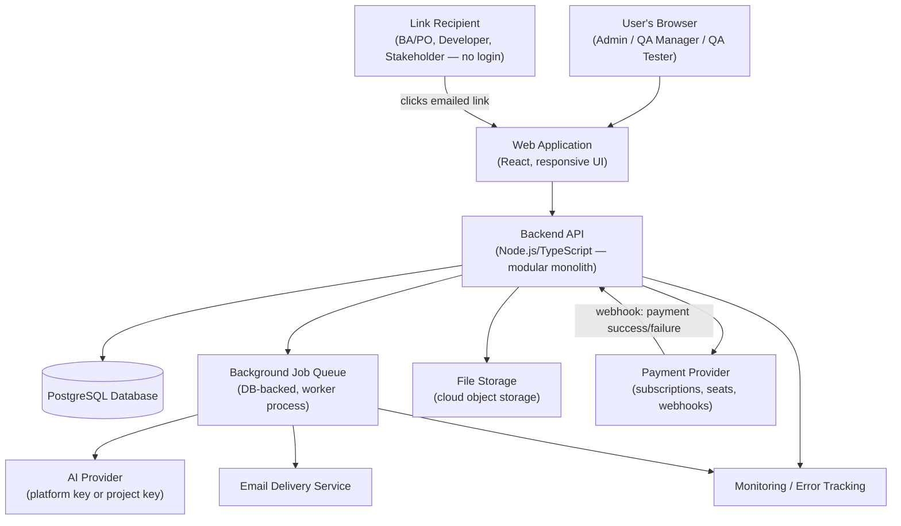
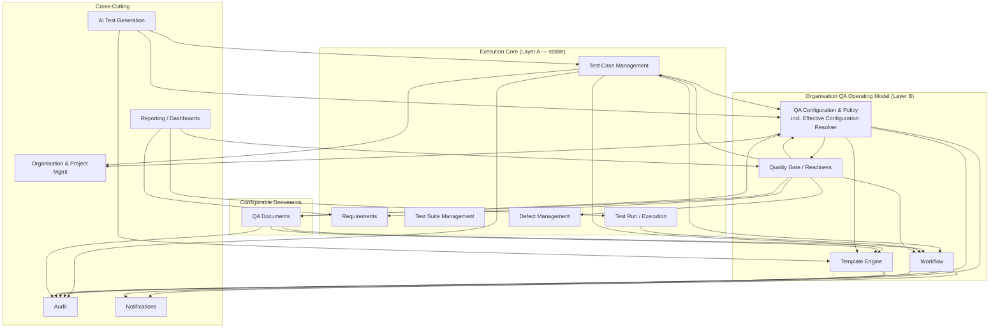
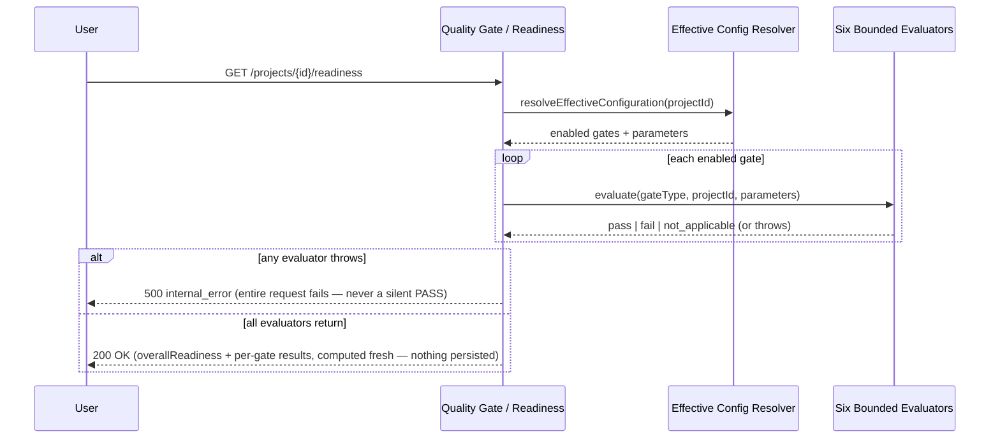
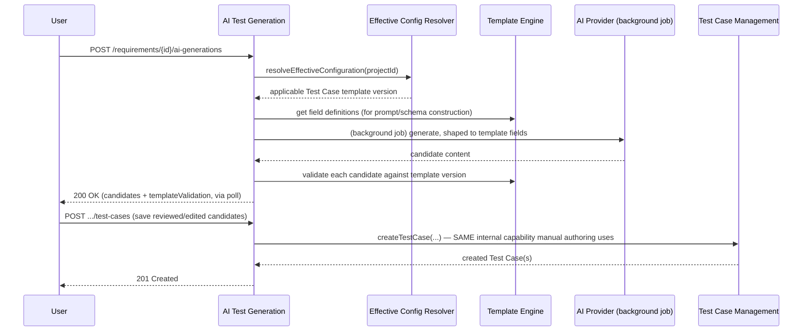

# TestFlow AI — System Architecture

**Source documents:** vision.md, prd.md, product-decisions.md, functional-requirements.md, non-functional-requirements.md, database.md, database-decisions.md (all approved)
**Status:** Approved — reflects the architecture and technology decisions explicitly approved by the product owner during the architecture review (see `architecture-decisions.md` for the individual decision records). **Re-baselined for CHANGE-001 (Organisation QA Operating Model) — see the new "CHANGE-001 — Organisation QA Operating Model" section below and `architecture-decisions.md` AD-014 through AD-026.** The modular monolith is retained; no new deployable, database, or infrastructure component is introduced. **CHANGE-002 (Methodology-Neutral QA Scope) was reviewed and found to require no architectural change** — `scopeValue`/`scopeStartDate`/`scopeEndDate` are inert metadata fields on the existing QA Documents module (AD-025), carrying no new module, service, dependency, or transaction boundary; no decision record was added.
**Scope:** This document defines system components, technology choices, and how they communicate at a conceptual level. It does not define physical database schema/migrations, API contracts, UX/UI design, or implementation code.

---

## Architecture Overview

In plain terms: a customer's team works entirely through a website in their browser. That website talks to one central program (the "backend") which is the only thing allowed to read or write the database — nothing else touches the data directly. A few supporting pieces sit around that core: a place to store uploaded files (like screenshots attached to test results), a queue for jobs that take a while (like asking the AI to generate test cases, or sending an email), an external AI service the backend asks to draft test cases, and an external payment service that handles subscription billing. People without a TestFlow account (Business Analysts/Product Owners, Developers, Stakeholders) never log in at all — they get a special emailed link that lets them do one specific thing, and nothing more.

Everything is built as a **single, well-organized application** rather than many separate small services, because the product's rules (like "archiving a requirement must cleanly archive everything linked to it, all at once, or not at all") are much easier to get right when one program is in charge of the whole operation.

---

## Architecture Goals

These goals are drawn directly from approved product and technical documents, not invented for this document:

- **MVP simplicity:** avoid infrastructure and patterns not justified by approved requirements (CLAUDE.md; architecture review guidance to prefer the simplest architecture that meets approved requirements).
- **Maintainability by a small team:** the codebase should stay organized around the same functional modules already defined in `functional-requirements.md` (NFR-MAINT-001), so one person can reason about one module without needing to understand the whole system.
- **AI-assisted development fit:** technology choices favor consistency (one primary language across the stack) to keep the codebase easy for both humans and AI coding assistants to work in.
- **Multi-tenant security:** organisation data must never be reachable across tenant boundaries (NFR-SEC-003), and this must be a structural property of the architecture, not a per-query afterthought.
- **Reliability of AI integration:** AI-generated content must never bypass mandatory human review before being saved (FR-AI-002, NFR-AI-004), and AI or provider failures must not degrade the rest of the product (NFR-AI-003).
- **Data integrity under cascading operations:** cascade-archive operations must complete fully or not at all (NFR-DI-004); execution results must become permanently immutable once a test run closes (NFR-DI-003, PD-037).
- **Cost control appropriate to MVP:** avoid recurring infrastructure costs (e.g., managed microservice orchestration, dedicated search/caching layers) not justified by approved scope or usage volume.
- **A credible scaling path without premature complexity:** the system should be able to grow (e.g., extract a module into its own service later) without having been over-built for that scenario today.

---

## Major System Components

| Component | Responsibility |
|---|---|
| **Web application** | The single interface through which every role (Admin, QA Manager, QA Tester, and link-based BA/PO, Developer, Stakeholder) interacts with TestFlow AI. |
| **Backend/API service** | Enforces all business rules — roles/permissions, the test case approval state machine, cascade-archive logic, subscription/seat gating, link scoping — and is the sole component permitted to read/write the database. |
| **Database** | Persists the approved logical data model (see `database.md`); the single source of truth for all organisation, project, requirement, test case, execution, defect, report, billing, and audit data. |
| **Authentication (organisation members)** | Verifies identity and establishes a session for Admin/QA Manager/QA Tester logins. |
| **Access Link mechanism (link-based roles)** | A separate, custom mechanism granting BA/PO, Developer, and Stakeholder scoped, expiring, revocable access with no login and no identity verification (PD-018, PD-043) — architecturally distinct from authentication. |
| **File/attachment storage** | Stores evidence attachments (screenshots, PDFs) referenced by the database, not embedded in it. |
| **AI generation integration** | Sends the selected requirement's content to an AI provider (platform-provided or project-supplied key) and returns draft test cases for human review. |
| **Background job processing** | Handles work that shouldn't block a user's request: AI generation calls, email/notification delivery with retry, payment webhook processing. |
| **Notifications** | Delivers in-app notifications to organisation members and email notifications to all roles, the latter also being the sole access mechanism for link-based roles. |
| **Reporting** | Compiles the single, on-demand report type (including its Post-Deployment section) from current project data. |
| **Audit logging** | Records an immutable trail of key actions, visible only to QA Manager and Admin. |
| **Monitoring/observability** | Tracks system availability, errors, AI generation failures, and payment/subscription event anomalies. |

**Not included, because not approved:** a native or cross-platform mobile application, a dedicated search engine, a dedicated caching layer, external defect-tracker integration, and requirements import/sync tooling.

---

## Component Communication

In everyday terms: when someone clicks a button in the web app, the web app asks the backend to do something, and the backend is the only party that ever talks to the database. If the thing requested is slow — like asking the AI to draft test cases, or sending an email — the backend hands that off to a background queue instead of making the user wait on a spinning page; the queue does the slow work and updates the record when it's done. Uploaded files go to a separate file-storage service, not into the database itself. When a customer pays for a subscription or additional seats, the payment happens with an external payment service, which then tells the backend "this payment succeeded" or "this payment failed" — the backend never handles raw card details itself. People without an account never talk to the backend by logging in; they click a link from an email, and that link itself proves what they're allowed to do.

---

## High-Level Architecture Diagram



### AI Generation Flow (Detail)

```mermaid
flowchart LR
    User["User Request<br/>('Generate Test Cases')"]
    App["Application<br/>(Web App)"]
    Backend["Backend"]
    Job["Background Job"]
    Prompt["Prompt/Context Builder<br/>(only the selected requirement's<br/>content — NFR-AI-007)"]
    Provider["AI Service<br/>(provider, abstracted behind<br/>an internal interface)"]
    Result["Result: Draft Candidates<br/>(not saved as Test Cases yet)"]
    Review["Human Review / Application Workflow<br/>(mandatory — FR-AI-002)"]
    Save["Saved Test Case records<br/>(only after explicit save)"]

    User --> App --> Backend --> Job --> Prompt --> Provider --> Result --> Review --> Save
```



---

## Web Architecture

The web application is a **React** application (using a metaframework such as Next.js for routing conveniences). This is the single interface for every role — including link-based roles, who reach it by clicking an emailed link rather than logging in. The web application contains no independent business logic of consequence; it calls the backend API for all data and enforcement of rules, and renders responsively down to tablet width for link-based approval/viewing flows (NFR-MOB-001).

---

## Mobile Architecture

**Mobile has been postponed.** No native or cross-platform mobile application is part of approved scope. The only mobile-adjacent requirement (NFR-MOB-001) is a responsive *web* layout down to tablet width for link-based flows, which is satisfied by the Web Architecture above. No mobile framework, mobile codebase, or mobile-specific design work has been started or is planned at this stage.

---

## Backend Architecture

The backend is a **modular monolith**: one deployable Node.js/TypeScript application, internally organized around functional modules. **CHANGE-001 re-baselines this module list** — see the dedicated section below for the full current module map, module responsibilities, and dependency rules; this section is retained for continuity but the module list is no longer restated here to avoid two sources of truth. Each module has clear internal boundaries, but all modules run within a single application and share a single database, which keeps operations like the atomic cascade-archive rule (NFR-DI-004) and QA Configuration publish (new under CHANGE-001) straightforward to guarantee within one transaction.

This is not a microservices architecture, and none is planned — nothing in the approved requirements, including CHANGE-001, demands independent scaling or independent deployment of any one module. See the CHANGE-001 section's explicit confirmation of this.

---

## Database Architecture

The backend uses **PostgreSQL** as its database technology, chosen because the approved logical data model (`database.md`) is strictly relational: 29 entities, three explicit many-to-many relationship entities, hard requirements for atomic multi-table cascades (requirement → test cases → reports → active test runs) and immutable audit/history records. PostgreSQL's transactional guarantees, relational integrity, and native structured-data (JSON) column support directly fit this model without needing a second data store.

This document does not restate the entity catalogue, attributes, relationships, or lifecycle rules — see `docs/technical/database.md` for the full logical design, and `docs/technical/database-decisions.md` for the specific database-level decisions (DBD-001 through DBD-006) already approved.

---

## Authentication and Authorization

Two architecturally distinct mechanisms exist, matching the approved product model:

- **Organisation members** (Admin, QA Manager, QA Tester) authenticate through a conventional login mechanism **built internally**, using standard, well-established libraries for credential handling (not custom cryptography). This choice reflects that TestFlow's organisation-scoped, single-role-per-user model (PD-017, DBD-001) is specific enough that an off-the-shelf authentication platform's generic model would need to be worked around rather than used directly, and avoids a recurring per-user vendor cost.
- **Link-based roles** (BA/PO, Developer, Stakeholder) never authenticate in the conventional sense. They are granted access through the Access Link mechanism — a first-class, custom-built feature (not a variant of the login system) providing scoped, expiring, revocable access with no identity verification, per PD-018/PD-043.

This document describes only the architectural split between these two mechanisms. The detailed permission rules for each role (who can do what) are defined in `functional-requirements.md` and are not restated here.

---

## File and Attachment Architecture

Evidence attachments (screenshots, PDFs — images and PDF only at MVP, per NFR-FILE-002) are stored in **cloud object storage** (an S3-compatible service), not inside the database. The database holds only a reference (pointer) to each stored file, consistent with the Evidence entity design in `database.md`. This keeps the database lean and avoids the well-known anti-pattern of storing binary content in a relational database.

---

## AI Architecture

The approved AI flow follows this conceptual path:

**User Request → Application → Backend → AI Service → Result → Human Review / Application Workflow**

Specifically:

- **Provider abstraction:** the backend calls the configured AI provider (platform-provided key or project-supplied key, per FR-AI-003/FR-AI-004) behind an internal interface, so the specific provider is not woven throughout the codebase. No specific AI provider or model has been selected — that remains an open, separate decision.
- **Generation history:** each generation attempt is recorded (source requirement, triggered-by user, provider used, status, timestamps), matching the AI Generation Request entity in `database.md`.
- **Human review:** AI-generated candidates are never persisted as real, saved Test Case records until a human explicitly completes the mandatory review step and saves them (FR-AI-002, NFR-AI-004). This is enforced structurally — there is no "draft AI output" table that could be mistaken for saved product data.
- **Failures:** the backend must detect AI provider unavailability or timeout and inform the user clearly, without degrading any non-AI part of the product (NFR-AI-003); generation exceeding the approved timeout is treated as failed with a retry option (NFR-AI-002).
- **Usage monitoring:** the AI Generation Request record's provider, status, and timestamps are the basis for the AI failure/usage monitoring already required (NFR-OBS-002); the exact usage/rate-limit model remains an open, deferred decision (carried from `non-functional-requirements.md`).
- **Source traceability:** a saved test case retains its AI-generated flag and its originating requirement permanently, surviving later edits (NFR-AI-006).

Because generation can take up to the approved 30–60 second window (NFR-AI-001/NFR-AI-002), the call to the AI provider is made from a **background job**, not held open on the user's request — see Background Processing below.

**CHANGE-001 addition — template-aware generation and save convergence:** the prompt/schema construction step (inside the background job, before the provider call) now resolves the project's effective configuration and applicable Test Case Template Version (via the QA Configuration & Policy module's Effective Configuration Resolver and the Template Engine module — see the CHANGE-001 section below) and shapes the request/response schema sent to the provider around that template's fields. The returned candidates are validated against the same Template Engine validation used for manual authoring **before** being shown to the reviewer (FR-AI-006). Saving reviewed candidates converges on the **exact same internal Test Case creation capability** manual authoring uses (see AI ↔ Test Case Convergence below) — there is no separate "AI save" code path with its own persistence/validation logic.

---

## Background Processing

Background/asynchronous processing is required for three approved workloads:

1. **AI generation calls** — too slow for a held-open request (NFR-AI-001/002).
2. **Email and notification delivery**, including the approved retry behaviour (FR-NOT-005 — at least one retry within 5 minutes before treating a send as permanently failed).
3. **Payment/subscription webhook processing** — reacting to the payment provider's asynchronous confirmation of success or failure.

Background jobs run through a **simple, database-backed job queue** processed by a lightweight worker process, rather than a separate managed queue service — appropriate to MVP volume and consistent with keeping the system to "one database, one application, one small worker."

**Important exception:** the cascade-archive operation (a requirement archive cascading to its linked test cases, reports, and any active/unclosed test run — PD-016, PD-034, NFR-DI-004) is executed as a **single atomic database transaction**, not as a background job. Atomicity here is a transactional guarantee ("all changes commit, or none do"), which a background job would not strengthen and could actually put at risk.

---

## Reporting Architecture

Reporting is **on-demand only** — there is no scheduling, distribution pipeline, or reporting-specific infrastructure, consistent with scheduled/automated report distribution being postponed (PRD Non-Goals). When a QA Manager or Admin requests a report, the backend compiles current project data (including the Post-Deployment section, PD-038) directly, within the normal request/response path — no background job or separate reporting service is required at this stage, given the approved 5-second generation target (NFR-PERF-003) for typical project data volumes.

---

## Observability

At a conceptual level, the architecture includes:

- **Structured application logging** across the backend and background workers.
- **A standard error-tracking tool** to capture and surface application errors (supporting NFR-OBS-001).
- **Basic uptime/availability monitoring**, supporting the approved 99.5% monthly uptime target (NFR-AVAIL-001).
- **AI generation failure/performance logging**, supporting NFR-OBS-002.
- **Payment/subscription event monitoring**, alerting on mismatches such as a payment marked successful without corresponding seat activation (NFR-OBS-003, NFR-REL-003).

No specific monitoring/error-tracking vendor has been selected; this remains an implementation-time choice (see Decisions Deferred).

---

## Deployment Architecture

The approved hosting approach for MVP is a **single Platform-as-a-Service (PaaS)** hosting the backend application, the background worker process, and a managed PostgreSQL database together, rather than a self-assembled multi-service cloud deployment. This matches the approved goal of an architecture that is affordable and operable by a small team at MVP scale. No specific PaaS vendor has been selected; this document does not perform any deployment and defines the approach only, not the execution.

---

## Security Boundaries

- **Tenant/organisation isolation:** every entity in the logical data model resolves, directly or indirectly, to exactly one Organisation (see `database.md` §6). The backend is architecturally the sole component with database access, meaning tenant isolation can be enforced consistently at one layer rather than scattered across multiple services. No entity or relationship in the approved model spans two organisations.
- **Link-based access boundary:** the Access Link mechanism is a distinct, narrower security boundary than organisation-member authentication — a link grants access only to the specific action/item it was scoped to (NFR-SEC-005), and access attempts through an expired or revoked link are denied with no grace window (NFR-SEC-006). Because links carry no identity verification (PD-043), expiry and revocation are the primary controls, not identity.
- **Payment data:** the backend does not store raw payment card data (NFR-SEC-012); this is handled by the external payment provider, consistent with routing all payment handling through that external component rather than the backend itself.
- **Data in transit and at rest:** encrypted, per NFR-SEC-007/008 — a cross-cutting requirement applying to all components, not specific to any one of them.

This document does not define detailed permission rules (who can perform which action) — those belong to `functional-requirements.md` and are not restated here.

---

## Scaling Strategy

The modular monolith's internal module boundaries (already aligned with the approved functional modules) mean that if a specific area of the product experiences disproportionate load — most plausibly AI generation, given its external-provider dependency and per-request cost, or reporting, if scheduled/bulk reporting is approved in the future — that module can be extracted into its own service later without redesigning the rest of the system, because it was never entangled with unrelated code to begin with. The database can scale vertically (a larger managed instance) for a considerable period before any read-replica or sharding conversation becomes necessary, given the product's likely MVP usage volume. No such extraction or database-scaling work is being done now; this section describes a credible future path, not current work.

---

## Known Architecture Risks

- **Overengineering:** avoided by explicitly not adopting microservices, a managed job/queue platform, a dedicated search engine, or a dedicated caching layer — none justified by approved requirements at this stage.
- **Vendor lock-in:** hosting (PaaS) and the AI provider both carry some lock-in; mitigated by keeping the AI-provider call behind an internal interface and by relying on standard, portable technology (Postgres, Node.js) that is not tied to one specific host.
- **AI cost growth:** a real, currently unresolved risk — no usage/rate-limit model has been approved yet (carried forward from `non-functional-requirements.md`, NFR-AI-008); this should be resolved before launch.
- **Multi-tenant security:** the highest-priority risk area given NFR-SEC-003's strictness; because the backend is the sole data-access point, consistent and disciplined organisation-scoping must be applied on every access path from day one — retrofitting this later would be costly.
- **Background job failures:** a failed AI generation, email send, or payment webhook must never leave the system in an inconsistent state (e.g., a payment recorded without corresponding seat activation); this requires deliberate retry/idempotency handling, not an afterthought.
- **Report-generation workload:** low risk at MVP given on-demand-only scope; would need reassessment only if scheduled/bulk reporting is approved later.
- **Attachment storage growth:** low risk at MVP (images/PDF only, 10MB cap); would need reassessment only if video support (already deferred) is approved later.
- **Database scaling:** low near-term risk; test-case/test-run volume thresholds remain an explicitly deferred NFR decision (NFR-SCALE-002), consistent with not over-solving this now.

---

## CHANGE-001 — Organisation QA Operating Model

**Status:** Re-baselines the backend's internal module map and cross-cutting flows against PD-049–PD-063, DBD-009–023, and APID-010–020. **The architectural baseline (§1) is unchanged: modular monolith, one deployable, one PostgreSQL database, no new infrastructure.** Nothing below introduces a second deployable, a second database, distributed transactions, event streaming, Kubernetes, a service mesh, an external workflow/rules/form-builder engine, or any other infrastructure not already approved. Where the task's prompt asked whether any of these are "necessary," the answer in every case is no — see §"Explicitly Not Introduced" at the end of this section.

### Design Principle

The module map below is organized to make the approved hierarchy a structural property of the code, not just documentation:

```
TestFlow System Semantics        →  Requirements, Test Cases, Test Suites, Test Runs/Execution,
                                     Defects (execution semantics only) — stable, non-configurable
Organisation QA Operating Model  →  QA Configuration & Policy, Template Engine, Workflow,
                                     Quality Gate/Readiness — organisation-governed, bounded
Project Effective QA Config      →  Effective Configuration Resolver (owned by QA Configuration
                                     & Policy) — the one place this merge happens
Document/Execution Instance      →  Test Case / QA Document records, each pinned to the
                                     resolved template/workflow/config version at creation
```

Configuration influences behaviour only through this resolver and the Template/Workflow/Quality-Gate modules' bounded contracts — no module reaches into raw configuration tables itself, and no module's core logic branches on organisation-specific *values* (a label, a threshold) outside these bounded contracts. This is what "configuration must not leak uncontrolled dynamic behaviour throughout the codebase" means architecturally: dynamic behaviour is contained to a small number of modules with narrow, typed ports, not scattered as `if (org.settings.x)` checks across the codebase.

### Final Module Map

| Module | Status | Responsibility |
|---|---|---|
| Organisation & Project Management | Unchanged | Tenant/project identity, membership, roles. |
| **QA Configuration & Policy** | **New (merged)** | Organisation QA Operating Model: drafts, validation, publish, immutable versions, preset materialization, required-artifact policy, project overrides (artifacts + gates), workflow *shape* configuration (which shape applies to which document type), and the **Effective Configuration Resolver**. |
| **Template Engine** | **New** | Template/field/option definitions, draft/publish/versioning, field-type validation, dynamic (`configurableFieldValues`) value validation, template rendering metadata (system vs. configurable field ordering). |
| **Workflow** | **New** | The three bounded shapes' instance state, transitions, `availableActions` computation, meta-state/display-label mapping. Operates on a generic "workflow subject" (type + ID) — has no dependency on Test Case or QA Document internals. |
| **Quality Gate / Readiness** | **New** | The six bounded gate evaluators, on-demand aggregation into project readiness, human-readable failure reasons. Read-only aggregator over other modules' data. |
| Requirements | Unchanged | Requirement authoring, archive cascade, re-review trigger. |
| Test Case Management | Extended | Adds calls to Effective Configuration Resolver, Template Engine, Workflow, Priority. Still the sole owner of Test Case/Test Case Version persistence. |
| Test Suite Management | Unchanged | |
| Test Run / Execution | Extended | Adds the shared **Execution Eligibility Policy** check before recording a result (FR-WF-004). |
| Defect Management | Extended | Adds Severity (stable semantic + org label) and Priority (org-configurable options) as its own bounded classification capability — **not** centralized in QA Configuration & Policy (see reasoning below). |
| **QA Documents** | **New** | Test Report + Regression Report shared lifecycle: creation, Template Engine integration, Workflow integration, content snapshot, comments/approval-record (BA/PO link-based), archive. |
| Traceability | Unchanged, extended consumer | Feeds the `min_requirement_coverage` gate evaluator. |
| Reporting & Dashboards | Extended | Embeds Quality Gate/Readiness's response; no independent readiness calculation. |
| AI Test Generation | Extended | Adds Effective Configuration Resolver + Template Engine calls for prompt/schema construction and pre-review validation; save path converges on Test Case Management's normal creation capability. |
| User & Access Management | Unchanged | |
| Link-Based Access | Unchanged | Never gains access to any configuration/governance endpoint (NFR-SEC-014). |
| Audit/History | Extended | Event coverage only — no new mechanism. |
| Notifications | Extended | Event coverage only — no new mechanism. |
| Subscription & Billing | Unchanged | |

### Why These Boundaries (§3/§4 of the task)

- **QA Configuration + Project Policy are merged into one module**, not two. Reasoning: they share the same core invariant (immutable published version, DBD-012), the same transaction (publish), and Project Policy's overrides are structurally just bounded exceptions layered onto QA Configuration's own artifact/gate settings (FR-POL-003/004) — there is no independent business capability "Project Policy" performs that isn't a direct extension of "what does this organisation's published configuration say." Splitting them would create two modules that must agree on every publish and every override, for no domain benefit — exactly the "module per table" anti-pattern §4 warns against, since the split would track `qa_artifact_policies` vs. `project_artifact_policy_overrides` as if they were different capabilities when they're one (required-artifact policy, resolved).
- **Template Engine and QA Documents remain separate**, not merged. Reasoning: Template Engine is a genuinely reusable, self-contained capability (field definitions, validation, versioning) consumed by *two* different owners — Test Case Management (a stable system entity) and QA Documents (a configurable document lifecycle) — that otherwise share nothing. Merging Template Engine into QA Documents would wrongly make Test Case Management depend on "the QA Documents module" just to validate a field value, coupling an execution-core module to a configurable-document-lifecycle module for no reason. Keeping them separate means Template Engine has exactly one job and two independent consumers, which is the textbook case for a shared module rather than either owning it.
- **Workflow is separate and deliberately thin** — a shared instance-state/transition tracker consumed by both Test Case and QA Documents, with no knowledge of either's domain content (§14). This is what avoids the cycle explicitly called out in §5 (Test Case → Workflow → Test Case): Workflow never calls back into Test Case or QA Document; it only ever receives a subject type + ID and returns/records state.
- **Quality Gate/Readiness is separate from QA Configuration & Policy** despite reading `quality_gate_definitions`, which QA Configuration & Policy's publish transaction writes. Reasoning: *evaluating* a gate (querying Defects/Requirements/QA Documents/Workflow state and comparing against a threshold) is a fundamentally different capability from *configuring* one (validating a parameter shape, persisting it as part of a publish). Domain ownership follows the verb, not the table — QA Configuration & Policy owns the gate *definition* row as part of its aggregate publish, but delegates "does this project pass" entirely to Quality Gate/Readiness, which owns no configuration data of its own.
- **Defect Severity/Priority stay in Defect Management**, not QA Configuration & Policy (§19). Reasoning: these are Defect-specific classification concepts with no meaning outside a defect, unlike templates/workflow/gates which govern *documents in general*. Centralizing them in QA Configuration & Policy would start that module down the path of becoming a generic "classification engine" — explicitly warned against — for no cohesion benefit, since nothing outside Defect Management (other than Quality Gate/Readiness, which reads via a narrow port, not raw tables) ever needs Severity/Priority data.

### Dependency Direction



**Rules:**
1. **Layer A (execution core) never depends on Layer B for its own identity/persistence** — Test Case Management owns its own table and creation logic; it *calls out* to QA Configuration & Policy/Template Engine/Workflow as ports, but those modules never construct or own a Test Case row.
2. **Workflow and Template Engine depend on nothing above them** — both are near-leaf modules. Workflow depends only on QA Configuration & Policy (to resolve which shape/role applies); Template Engine depends on nothing else in the module graph (a pure validation/definition service).
3. **Quality Gate/Readiness is a pure read-side aggregator** — many modules feed it, nothing depends on it except Reporting/Dashboards. It never writes to any other module's data.
4. **No module calls back "up" into a module that called it** — this is the explicit rule that prevents the Test Case → Workflow → Test Case cycle: Workflow's contract is `recordTransition(subjectType, subjectId, action, actor) → newState`; it has no `getTestCase()` capability and never needs one.
5. **Audit and Notifications are always leaves** — every module may emit to them; neither ever calls back into a business module synchronously (consistent with the existing background-job-based notification delivery, AD-010).

### Effective Configuration Resolver (§6)

**Owner:** QA Configuration & Policy module, as an internal application service — not a separate module (avoiding both a "God service" spanning module boundaries and duplicated merge logic across callers, per §6's explicit caution).

**Contract (conceptual):** `resolveEffectiveConfiguration(projectId) → { qaConfigurationVersionId, templates: {...}, workflows: {...}, artifactPolicies: {...}, qualityGates: {...} }` — exactly the shape `APID-011`'s `GET /projects/{id}/effective-configuration` returns; the API endpoint is a thin adapter over this same internal service, so there is exactly one implementation of the merge logic, called both by the API layer directly and internally by Test Case Management, QA Documents, AI Test Generation, and Quality Gate/Readiness whenever they need effective configuration — never re-derived per-caller.

**How it resolves (§6):** reads the project's pinned `qaConfigurationVersionId` (a single indexed FK read, never a "latest" lookup — DBD-014), then reads that version's referenced template versions (`qa_configuration_version_templates`), workflow definitions, artifact policies, and gate definitions (all simple indexed reads on immutable rows — cheap, cacheable-if-needed-later, never requiring a join across mutable state), then overlays any `project_artifact_policy_overrides`/`project_quality_gate_overrides` rows for that project. This is a bounded, coordinating read — not a "God service" — because it does no business logic itself beyond the override-precedence merge; evaluation/validation logic stays in Quality Gate/Readiness and Template Engine respectively.

### Configuration Publication Architecture (§7)

Owned by QA Configuration & Policy. Conceptual flow, entirely within **one PostgreSQL transaction** (no distributed/orchestrated workflow):

```mermaid
sequenceDiagram
    participant Caller as QA Manager (via API)
    participant QAC as QA Configuration & Policy
    participant TPL as Template Engine (port)
    participant WF as Workflow (port)
    participant QG as Quality Gate (port)
    participant DB as PostgreSQL
    participant AUD as Audit
    participant NOT as Notifications (job)

    Caller->>QAC: POST .../draft/publish (If-Match, Idempotency-Key)
    QAC->>QAC: check Idempotency-Key (return prior result if replayed)
    QAC->>TPL: validate referenced template versions exist/published
    QAC->>WF: validate workflow shape/role assignment
    QAC->>QG: validate gate parameter shapes
    alt validation fails
        QAC-->>Caller: 422 CONFIGURATION_INVALID (structured errors)
    else validation passes
        QAC->>DB: BEGIN; mark draft published, freeze all referenced rows; COMMIT
        QAC->>AUD: write audit entry (synchronous, same transaction)
        QAC-->>Caller: 200 OK (published version)
        QAC->>NOT: enqueue FR-NOT-006 notification (background job, AFTER commit)
    end
```

Validation happens **before** the transaction (read-only checks against already-persisted draft rows); the transaction itself is a single, short, authoritative write (flip `status`, set `published_by`/`published_at`) plus the audit entry — both committed together, since audit-of-publish must never be lost even if a notification later fails. The notification is enqueued only *after* commit succeeds, via the existing background job mechanism (AD-010) — publish success is never contingent on notification delivery.

### Preset Materialization (§8)

TestFlow's four preset definitions (Standard/Lightweight/Controlled/Custom's "nothing to materialize" case) are **application-owned static configuration** — a small, versioned-with-the-codebase data structure inside the QA Configuration & Policy module (not a database reference table, not a remote service). `POST .../draft` (from a preset) reads this static definition and **writes** the corresponding rows into the new draft's tables (`workflow_definitions`, `qa_artifact_policies`, `quality_gate_definitions`, `qa_configuration_version_templates` pointing at TestFlow's default template versions). After that write, the preset definition is never consulted again for that organisation — DBD-013's "provenance only" rule is enforced simply by the fact that materialization is a one-time copy, not a live reference. If TestFlow later changes what "Standard QA" means in the codebase, only *newly created* drafts see the new definition; every already-published organisation configuration is already-persisted data, unaffected by a code deploy.

### Template Validation Architecture (§9/§10)

**Template Engine's bounded responsibilities:** resolve an immutable template version's field definitions; expose them for rendering (system + configurable, ordered); validate a submitted value set against those definitions (required-field presence, type/shape match, dropdown/multi-select option validity, entity-link target existence-and-same-organisation, Step Table pass-through to the owning resource's real columns rather than validating it as dynamic content). It is explicitly **not**: a scripting/formula runtime, a generic schema engine accepting organisation-defined types, or a forms-SaaS subsystem — its input is always one of the 15 bounded field types (FR-TPL-003), never an organisation-supplied type definition.

**Where validation happens (§10) — layered, server-side authoritative:**
```
API input shape check (malformed JSON, wrong top-level types)
  → Template Engine semantic validation (required/type/option/entity-link/active-field checks
     against the resolved template version) — AUTHORITATIVE
  → domain invariant checks (e.g., Test Case content rules unrelated to template fields)
  → database persistence (typed columns + validated configurableFieldValues JSONB)
```
The frontend may mirror these checks for responsiveness, but a request reaching the backend is **always** re-validated by Template Engine regardless of what the client already checked — matching the existing "never rely on frontend validation alone" principle already implicit in the rest of the architecture. PostgreSQL's JSONB column has no shape constraint of its own (DBD-010) — it is intentionally not the validation boundary; Template Engine is.

### System Field Protection (§11)

Template Engine's field-definition rows for `isSystemField: true` fields (DBD-011) carry **display/ordering metadata only** — label positioning, display order. Template Engine has no write path to `organisation_id`, `project_id`, Test Case identity, execution/traceability relationships, or version relationships on any owning resource; those remain exclusively owned and written by their respective modules (Test Case Management, QA Documents, Organisation & Project Management). This is enforced at the module-boundary level: Template Engine's port surface simply has no operation that could write to another module's core columns — there is no shared mutable state to protect via runtime checks, because the capability doesn't exist in the first place.

### Test Case Integration (§12/§13)

A Test Case create, conceptually:

```mermaid
sequenceDiagram
    participant User
    participant TC as Test Case Management
    participant QAC as Effective Config Resolver (QAC module)
    participant TPL as Template Engine
    participant WF as Workflow
    participant DB as PostgreSQL
    participant AUD as Audit

    User->>TC: POST /projects/{id}/test-cases
    TC->>TC: authorize actor (role + project access)
    TC->>QAC: resolveEffectiveConfiguration(projectId)
    QAC-->>TC: applicable Test Case template version, workflow shape
    TC->>TPL: validate(systemFields + configurableFieldValues + priorityOptionId, templateVersionId)
    TPL-->>TC: valid | validation errors
    alt invalid
        TC-->>User: 422 validation_error
    else valid
        TC->>DB: BEGIN; INSERT test_cases; INSERT test_case_versions (v1); COMMIT
        TC->>WF: initialize workflow instance (subject=test_case, definitionId)
        TC->>AUD: audit entry
        TC-->>User: 201 Created
    end
```

Template Engine never persists the Test Case — it only validates and is called *by* Test Case Management, preserving the rule that Template Engine cannot own Test Case persistence (§12's explicit instruction). Steps 3–6 (resolve, validate, persist, initialize workflow) execute within Test Case Management's own transaction boundary for the persist step; resolution and validation are read-only and happen before the transaction opens.

**Edit after approval (§13):** editing an `approved` Test Case's content reverts its Workflow instance to `needs_review` (FR-TC-005, unchanged principle from PD-048/PD-049) via the same Workflow port used for any transition; if the edit is "significant" (full content replacement, DBD-003), Test Case Management creates a new `test_case_versions` row *before* recording the workflow reversion, freezing `documentTemplateVersionId`/`priorityOptionId`/`configurableFieldValues` alongside `steps`/`expectedResults` at that moment (per `database.md` §12.3). **Historical Test Run snapshots (`test_run_test_cases`) are never touched by this flow** — they were already frozen independently at run-creation time (FR-TC-004/NFR-DI-001) and have no reference back to the live Test Case's current state; editing an approved test case has zero effect on any run, open or closed. No requirements ambiguity was found here — the existing versioning/snapshot separation already fully answers this interaction.

### Workflow Architecture (§14/§15)

Workflow's internal shape:
- **Definition resolution:** given `(qaConfigurationVersionId, documentType)`, return the bounded shape (`no_approval`/`single_approval`/`review_approval`) and role assignment — a simple indexed lookup on immutable `workflow_definitions` rows.
- **Instance state:** one `workflow_instances` row per subject (`subjectType`, `subjectId`), holding `currentMetaState` — read/written exclusively by Workflow.
- **`availableActions` computation (§15):** a single, pure function — `computeAvailableActions(shape, currentMetaState, actorRole) → Action[]` — used identically by (a) the `GET` representation embedded in a Test Case/QA Document response, and (b) the authorization check inside the `POST .../workflow/{action}` handler before it applies a transition. **This is the same function call in both places, not two implementations that must be kept in sync** — directly satisfying §15's explicit "avoid duplicating transition logic" instruction. A client-supplied `action` is always re-validated by calling this same function server-side; a stale client-side `availableActions` read can never bypass it.
- **Transition persistence + audit:** a transition updates `workflow_instances.current_meta_state`, denormalizes onto the subject's own `current_meta_state` column (Test Case Management / QA Documents perform this denormalizing write themselves, in the same transaction as their own state change, since Workflow doesn't own those tables — Workflow returns the new state, the calling module writes its own denormalized copy), appends a `workflow_transitions` row, and writes an audit entry — all in one transaction owned by the calling module (Test Case Management or QA Documents), with Workflow's port calls happening inside that transaction, not as a separate commit.

### Workflow Approval Flow (§37.C)

```mermaid
sequenceDiagram
    participant Approver
    participant WF as Workflow
    participant TC as Test Case Management
    participant DB as PostgreSQL
    participant AUD as Audit
    participant NOT as Notifications (job)

    Approver->>TC: POST /test-cases/{id}/workflow/approve
    TC->>WF: computeAvailableActions(shape, currentState, actor.role)
    alt "approve" not available
        WF-->>TC: []
        TC-->>Approver: 409 WORKFLOW_ACTION_NOT_ALLOWED
    else "approve" available
        WF-->>TC: ["approve", ...]
        TC->>DB: BEGIN; UPDATE workflow_instances (conditional on expected current state);<br/>UPDATE test_cases.current_meta_state; INSERT workflow_transitions; COMMIT
        TC->>AUD: audit entry (same transaction)
        TC-->>Approver: 200 OK (new workflowState/availableActions)
        TC->>NOT: enqueue FR-NOT-007 notification, after commit
    end
```

### Execution Eligibility Architecture (§16)

A single, shared **Execution Eligibility Policy** — `canExecute(testRunTestCaseSnapshot, effectiveConfiguration) → { allowed: boolean, reason?: string }` — owned conceptually alongside Workflow (it reads the organisation's `no_approval_test_case_execution` setting and the snapshot's frozen approval state, both already-resolved inputs, no new data ownership required). **Both consumers call this exact function:**
1. **Test Run read** (`test-runs.md`) calls it to populate `executionEligible`/`executionBlockReason` for UI display — informational only.
2. **Record Execution Result** (`test-runs.md`/`execution.md`) calls it again, authoritatively, immediately before persisting the result, inside the same transaction as the insert.

Consumer (2) **never trusts** a previously computed `executionEligible` value from consumer (1) — every result-recording request re-evaluates from current data, exactly per §16's explicit anti-stale-bypass instruction. This is the same "compute once, call from two places, never cache the authorization decision itself" pattern as `availableActions` above.

### Record Execution Result with Eligibility Check (§37.D)

```mermaid
sequenceDiagram
    participant Tester
    participant TR as Test Run / Execution
    participant Elig as Execution Eligibility Policy
    participant DB as PostgreSQL

    Tester->>TR: POST /execution-results
    TR->>Elig: canExecute(snapshot, effectiveConfiguration)  — re-evaluated NOW, not cached
    alt blocked
        Elig-->>TR: { allowed: false, reason: "TEST_CASE_NOT_APPROVED" }
        TR-->>Tester: 409 APPROVAL_REQUIRED_FOR_EXECUTION
    else allowed
        Elig-->>TR: { allowed: true }
        TR->>DB: BEGIN; INSERT execution_results; COMMIT
        TR-->>Tester: 201 Created
    end
```

### Project Readiness Evaluation (§37.E)



### QA Document Architecture (§17/§18)

QA Documents is one module handling both Test Report and Regression Report, parameterized by `documentType` — mirroring the database's `qa_documents` table and the API's `reports.md`/`regression-reports` compatibility decision (APID-016). **Both API paths (`/reports`, `/regression-reports`) delegate to the same internal `QaDocumentService`** (create/retrieve/list/workflow), passing `documentType` as a parameter — there are not two parallel `TestReportService`/`RegressionReportService` implementations, since no approved requirement describes a meaningful behavioural difference between them beyond Test Report's Post-Deployment section (which is simply conditional content within the shared creation flow, not a reason to fork the service). Requirement/Test Case/Defect are **not** absorbed into this module — they remain first-class, non-templated system entities (PD-051), and QA Documents has no capability that could redefine them.

### Defect Severity/Priority Architecture (§19)

Defect Management owns `defect_severity_labels` and `defect_priority_options` as its own bounded, organisation-scoped configuration sub-capability — small CRUD operations (`severity-priority.md`) that live alongside Defect's existing logic, not inside QA Configuration & Policy. Quality Gate/Readiness reads Defect Severity through a narrow port (`getUnresolvedDefectsBySeverity(projectId, severities[])`), never raw table access — this is the "avoid a generic classification engine" boundary: there is no shared "Classification" module: Severity/Priority are Defect concepts, Priority (Test Case) is a Template Engine concept (an ordinary Dropdown field), and neither is centralized into a third, artificial module.

### Project Policy Architecture (§20)

Folded into QA Configuration & Policy (see "Why These Boundaries" above). The bounded override model (only `requiredArtifacts` and `enabledQualityGates`, FR-POL-003) is enforced structurally: the module exposes exactly two override operations (`applyArtifactOverride`, `applyGateOverride`), each validating against that category's `overridable` flag before writing — there is no generic `applyOverride(settingName, value)` capability that could accidentally be extended to Template/Workflow (matching APID-018's bounded-endpoint decision one layer down in the API).

### Quality Gate Evaluation Architecture (§21/§22/§23)

**Evaluator strategy:** a small, fixed registry — `Record<GateType, GateEvaluator>` — with exactly six entries, each a plain function `(projectId, effectiveConfiguration, parameters) → GateResult`. Adding a gate type requires adding a registry entry and an FR/API/database approval first (CLAUDE.md rule 3) — the registry itself has no plugin/extension mechanism, deliberately (§21: no expression parser, no rules DSL, no plugin runtime).

**Aggregation (§22):** `evaluateReadiness(projectId)` resolves effective configuration once, calls each *enabled* evaluator, and aggregates: `overallReadiness = "ready"` iff every non-`not_applicable` result is `pass` (matching `quality-gates.md`/APID-019). This runs entirely on demand — no `quality_gate_results` table, no Release entity, no historical readiness tracking, per DBD-021/APID-019.

**Performance (§23):** the six evaluators' underlying queries are already covered by indexes introduced in the database re-baseline (`idx_test_cases_current_meta_state`, `idx_qa_documents_current_meta_state`, `idx_defects_severity_semantic`, existing traceability indexes) — no new caching or materialization layer is added now. **Scaling path, if ever needed:** a non-authoritative, invalidatable read-through cache (e.g., a short TTL on the aggregated response) could be added later purely as a performance optimization, never as a source of truth — this is documented as a future option, not built now, consistent with §22's explicit "optional, invalidatable, non-authoritative" constraint and §23's "prefer optimized queries over Redis prematurely."

**Technical evaluator failure vs. business FAIL (§40/§41 — resolved, not a gap):** if a gate evaluator throws (e.g., a database error mid-query), `evaluateReadiness` does **not** catch it and map it to `fail` for that gate — the entire `GET /projects/{id}/readiness` request fails with the existing `500 internal_error` envelope (`api-spec.md`, unchanged shape), exactly as any other unexpected server-side failure already does. This requires **no** change to the approved `pass`/`fail`/`not_applicable` business-result enum and **no** new `not_evaluable` state (per §41's explicit instruction not to add one without genuine need) — the existing error envelope already fully and correctly represents "the evaluation itself could not be completed," which is categorically different from "the evaluation completed and the answer is fail." This is resolved by applying an existing convention consistently, not a gap requiring escalation.

### AI ↔ Test Case Convergence (§24/§25)



**The critical property:** AI Test Generation has no persistence capability of its own for Test Cases — the save step is a direct call into Test Case Management's normal creation service (the same one diagrammed under Test Case Integration above), which independently re-validates against Template Engine, initializes Workflow state normally, and enforces permissions normally. This structurally guarantees AI cannot bypass Template Engine, workflow initialization, or permissions (§24's explicit requirement) — not by convention, but because there is no other code path into `test_cases`/`test_case_versions` for AI Test Generation to use.

**Provider boundary (§25):** the existing internal AI-provider interface (AD-009) is unchanged — template-awareness changes what's built into the *request payload* (field labels/types/required-ness passed as generation-schema context) and how the *response* is parsed/validated, not the transport/provider-abstraction layer itself. Organisation-sensitive configuration exposed to the provider is limited to what generation structurally needs (field labels, types, allowed option labels) — never the organisation's full configuration, template version history, or unrelated project data (extending NFR-AI-007/NFR-PRIV-001's existing minimization principle to the new template context).

### Transaction Boundaries (§28)

| Operation | Authoritative writes (one transaction) | Audit | Async side effect |
|---|---|---|---|
| A. Publish QA Configuration | Flip draft → published on `qa_configuration_versions` (validation happens before, read-only) | Same transaction | Notification (FR-NOT-006), after commit |
| B. Publish Template | Flip draft → published on `document_template_versions` | Same transaction | Notification, after commit |
| C. Create Test Case | Insert `test_cases` + `test_case_versions` (v1) + initialize `workflow_instances` | Same transaction | None required |
| D. Workflow Transition | Update `workflow_instances` + denormalized `current_meta_state` on subject + insert `workflow_transitions` | Same transaction | Notification (FR-NOT-007), after commit |
| E. Apply Project Override | Insert/replace `project_artifact_policy_overrides` or `project_quality_gate_overrides` | Same transaction | None required |
| F. Create/Update QA Document | Insert/update `qa_documents` (+ workflow initialize, same pattern as C) | Same transaction | None required |
| G. Record Execution Result | Execution Eligibility Policy check (read-only, immediately before) + insert `execution_results` | Same transaction | None required |
| H. Save AI-Generated Test Case | Identical to C (converged path) | Same transaction | None required |

**No long transaction ever wraps an external AI call** (§28's explicit instruction) — the AI provider call happens entirely within the background job (AD-009/AD-010), outside any database transaction; only the final save (H) opens a transaction, and only after the provider call and validation have already completed.

### Concurrency and Idempotency (§29/§30)

Reuses APID-013's `If-Match` optimistic-concurrency pattern for QA Configuration/Template drafts (backend enforces the version check inside the same transaction as the write — a `SELECT ... FOR UPDATE`-free approach, relying on a `WHERE version = :expected` conditional update that affects zero rows on mismatch, returning `409 conflict`). Workflow transitions protect against stale state/double-approval the same way: the transition's `UPDATE workflow_instances SET current_meta_state = :new WHERE id = :id AND current_meta_state = :expectedCurrent` pattern — a concurrent double-approval attempt has its second request affect zero rows and receives `WORKFLOW_ACTION_NOT_ALLOWED`, without needing a separate locking mechanism. No pessimistic locking or live-collaborative-editing infrastructure is introduced (§29's explicit exclusion). Idempotency keys (APID-006 extended) for publish/regression-report-generation are handled by the existing idempotency-key storage pattern already implied by AD-010's job architecture — a request's key + result is recorded and replayed within the existing window, preventing duplicate configuration versions or duplicate reports from a retried request.

### Authorization and Tenant Isolation (§31/§32)

**No custom role engine is introduced.** New capabilities (configure QA model, publish, configure templates, approve/reject, project override, severity/priority configuration) are checked via the same central authorization mechanism already governing every existing endpoint (`api-spec.md`'s three-layer check: role → project/object access → link scope) — FR-WF-006's role mapping is data (which role each action requires), evaluated by that one existing mechanism, not a new bespoke check scattered per-controller. **Tenant isolation** for every new table follows the existing rule: an authenticated request's organisation is always derived server-side from the resource itself (e.g., a Template's `organisation_id`, a QA Configuration Version's `organisation_id`), never trusted from a client-supplied ID; a cross-organisation reference attempt (e.g., a Project in Org A referencing a Template Version from Org B) is structurally impossible to construct, because every resolution path (Effective Configuration Resolver, Template Engine lookups, Priority/Severity option lookups) is always scoped by the caller's own resolved organisation first, and the underlying foreign keys (`database.md` §12.9) never permit a cross-organisation row to exist in the first place.

### Security (§33)

- **Rich Text, URL, configurable-field input:** validated by Template Engine's per-type contract (`templates.md`) before persistence; rendered with standard output encoding at the web layer (no new sanitization mechanism — reuses whatever the existing free-text input handling already does for requirements/test case content, NFR-SEC-010, extended to configurable fields).
- **Attachments (via the `attachment` field type):** reuse the existing brokered-upload architecture (AD-008, NFR-FILE-001/002) unchanged — a configurable Attachment field is not a new upload mechanism, just a new place in the UI that can trigger the existing one.
- **Entity Link fields:** validated same-organisation and same-target-type by Template Engine before acceptance — this is a tenant-isolation control, not just a data-quality one (an Entity Link must not become a way to reference another organisation's record).
- **AI prompt construction from organisation-controlled labels/content:** field labels and option labels are organisation-authored free text sent to an external AI provider as generation context — this is a real, if narrow, data-exposure surface. Mitigation: only the field's label/type/required-ness is sent, never other organisations' data, and never the full template's internal metadata (row IDs, validation internals) — consistent with NFR-AI-007's existing minimization principle, now explicitly extended to cover template context. **This document does not claim prompt-injection immunity** — an organisation could theoretically craft a field label designed to manipulate the AI provider's behaviour; this is a known, generally-accepted risk category for any LLM integration accepting user-influenced context, not something CHANGE-001 introduces new exposure to beyond what free-text requirement content already carried, and no stronger guarantee is claimed than the existing architecture already provided.
- **Template/configuration publishing authorization:** covered under Authorization above — publish is gated the same way as any other QA-Manager/Admin-only action.

### Observability and Failure Handling (§39/§40)

Extends the existing logging/error-tracking/uptime stack (AD-012) — no new observability stack. New signals: configuration publish failures (validation vs. concurrency vs. unexpected), template validation failure rates (useful for spotting a confusing template), workflow transition rejections, readiness-evaluation latency (against NFR-PERF-005's 3-second target), AI template-validation failure rates (a leading indicator the provider is struggling with a particular template shape). Configurable field *values* are not logged in full by default — only field *keys* and validation outcomes — avoiding incidental capture of potentially sensitive organisation content in logs, extending the existing "avoid logging sensitive configurable field values" principle from NFR-SEC-011's spirit (provider keys) to this new surface. Failure handling for each new operation (invalid publish, stale draft, template validation failure, invalid workflow transition, gate evaluator failure, AI provider failure, AI output failing template validation, notification job failure) all map onto the **existing** error envelope and existing job-retry mechanism (FR-NOT-005) — no new failure-handling mechanism is introduced; see the Quality Gate section above for the one failure case (evaluator exception) that needed explicit reasoning, resolved without an API/architecture change.

### Deployment Impact (§38)

**No fundamental deployment change.** CHANGE-001 adds internal modules to the existing single deployable — it does not add a second application, a second database, a new message broker, or any new hosting requirement. The single-PaaS hosting approach (AD-011) and the database-backed job queue (AD-010) are unchanged and sufficient for every new async need (publish notifications, template-aware AI generation, regression-report generation) — all of which fit the same "background job, not a held-open request" pattern already established for AI generation and email delivery.

### Explicitly Not Introduced

Per §1's explicit list — none of the following are introduced by CHANGE-001, and none are judged necessary given the approved bounded scope (workflow: 3 shapes; gates: 6 types; templates: 15 field types; documents: 2 configurable types): microservices, a second deployable, a second database, distributed transactions, event streaming infrastructure, Kubernetes, a service mesh, an external workflow engine, an external rules engine, an external form-builder engine. No `ARCHITECTURE-BLOCKING DECISION REQUIRED` was identified — every capability CHANGE-001 requires fits cleanly within the existing modular monolith using ordinary application-service composition and one database transaction per authoritative write.

---

## Decisions Deferred

The following are intentionally not decided at this stage and do not block proceeding past architecture design:

- Specific AI provider/model selection.
- Specific PaaS/hosting vendor.
- Specific cloud object storage vendor.
- Specific error-tracking/monitoring vendor.
- Whether the background job queue should later move to a managed queue service (to be revisited once real usage volume exists).
- AI usage/rate-limit model and associated cost cap (carried forward from `non-functional-requirements.md` as an open decision — should be resolved before launch).
- Data retention/deletion policy after subscription cancellation (carried forward from `non-functional-requirements.md`, NFR-PRIV-002).
- The precise definition of a "significant" test case edit for versioning purposes (carried forward from `database-decisions.md`, DBD-003).
- The Test Run status-value tension flagged in `database-decisions.md` (DBD-006) — whether a strictly literal two-value active/archived pattern is required, or the three-value (Open/Closed/Cancelled-Archived) approach used in the logical design stands as-is.

---

**This document defines architecture only. Physical database schema/migrations, API design, UX/UI design, and implementation have not been started.**
