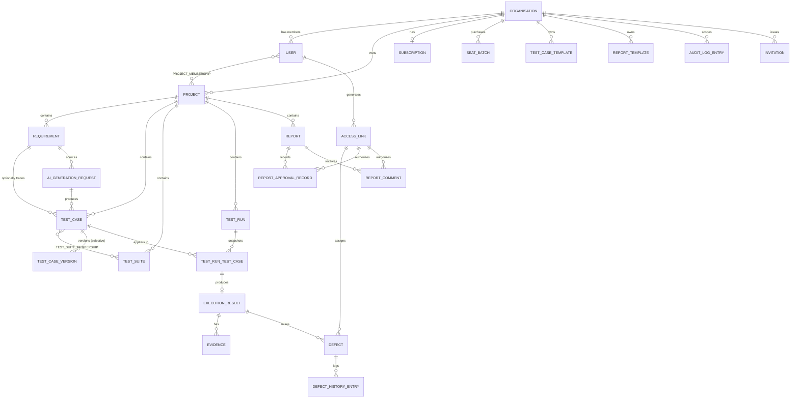
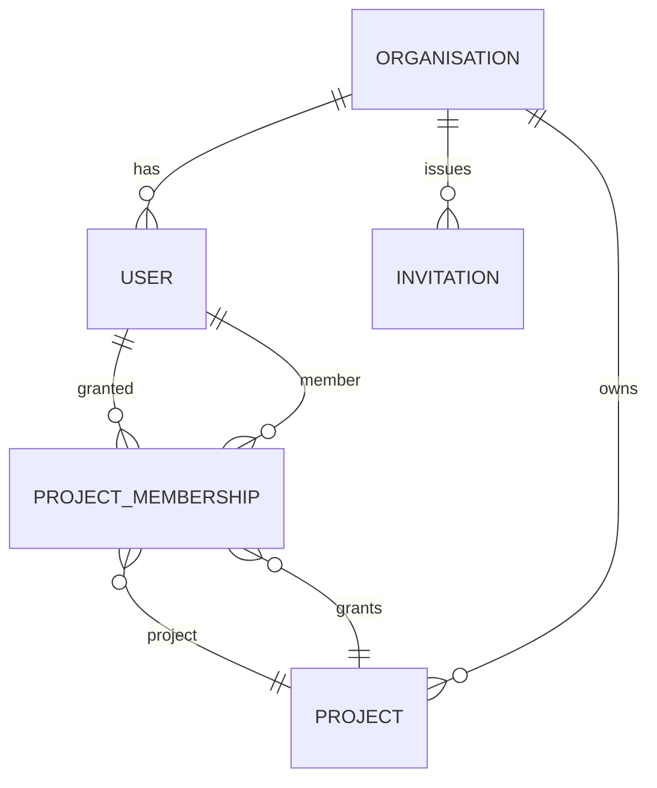
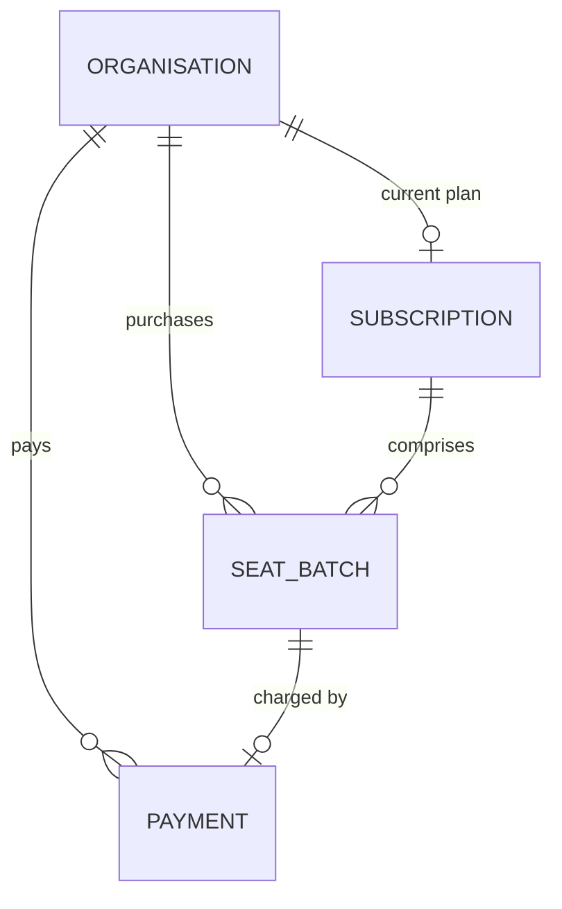
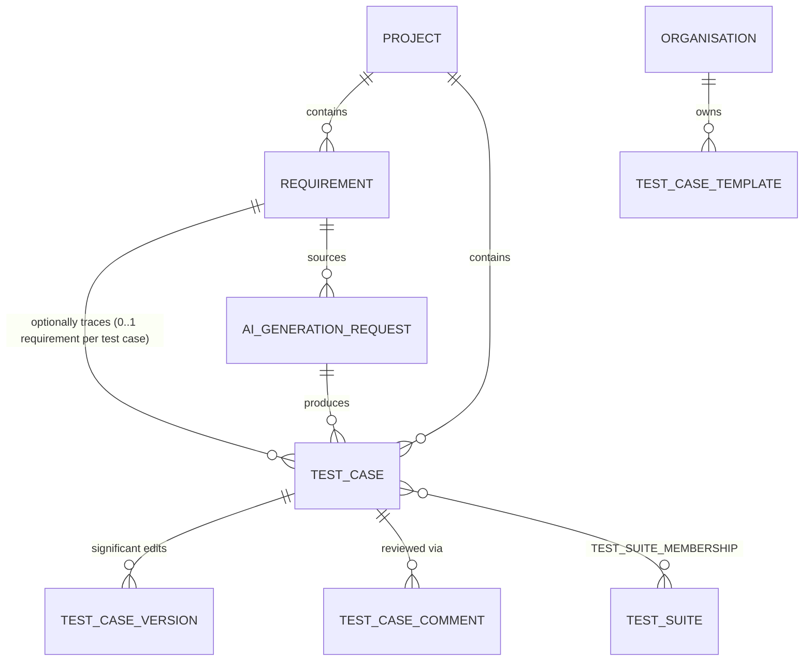
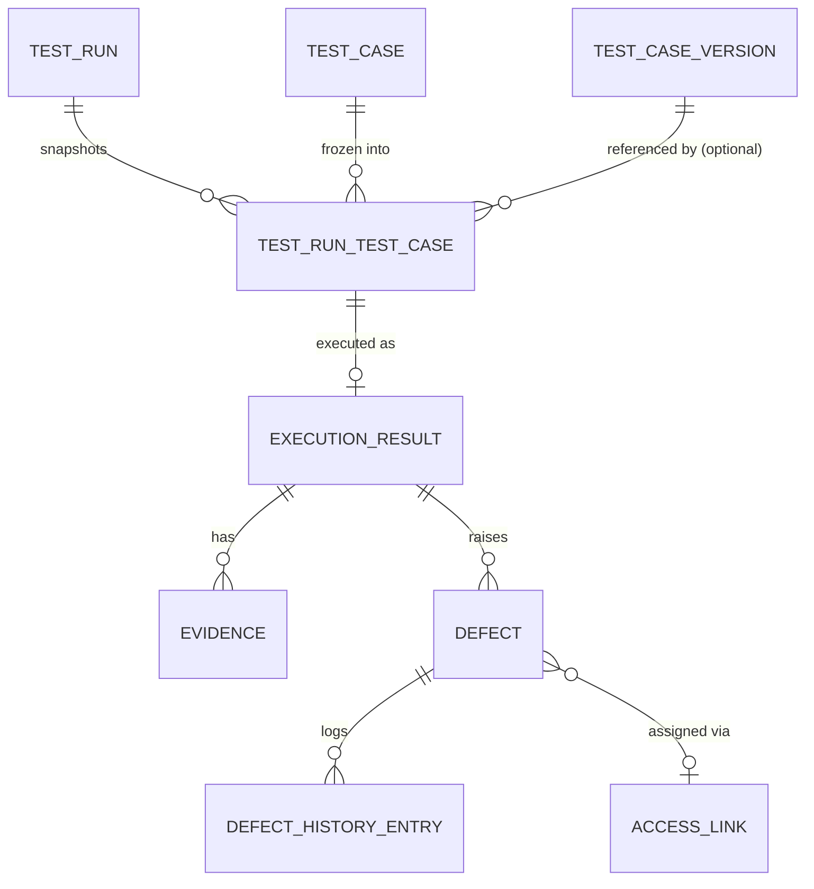
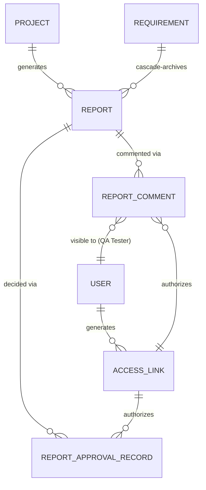

# TestFlow AI — Database (Logical Design)

**Source documents:** vision.md, prd.md, product-decisions.md, functional-requirements.md, non-functional-requirements.md, database-decisions.md (all approved)
**Status:** Logical design — no physical implementation, no ORM, no SQL. This document defines *what* must be stored and how it relates, not *how* it is stored.
**Scope:** This is a conceptual/logical data model. Field types are described in plain conceptual terms (identifier, text, number, boolean, date/time, structured data), not database-specific types.

---

## 1. Design Overview

TestFlow AI's data model is organized around one strict tenancy boundary — the **Organisation** — under which almost everything else lives, directly or indirectly. The model reflects six foundational decisions approved during database discovery (see `database-decisions.md`, DBD-001–006):

- A **User belongs to exactly one Organisation** (DBD-001) — no cross-organisation membership table.
- **Test Case ↔ Test Suite is many-to-many** (DBD-002), requiring a relationship entity.
- **Test Case versioning is selective** — only "significant" edits create a version record (DBD-003); test run snapshots are captured independently and always, regardless of version significance.
- **Requirements do not version** — only current content is stored (DBD-004).
- **Minimum-one-Admin is enforced per organisation** (DBD-005).
- **A single, consistent status/archive pattern** is used across entities, with entity-specific valid values where the real lifecycle demands it — flagged for Test Run specifically (DBD-006).

The model contains **29 entities**, organized into eight modules: Tenancy & Identity, Project Structure, Subscription & Billing, Requirements & Test Authoring, Suites/Runs/Execution, Defects, Reporting, Link-Based Access, AI, and Audit/Notifications.

---

## 2. Entity Catalogue

### 2.1 Tenancy & Identity

#### Organisation

**Purpose:** The top-level tenant — a customer's account. Everything else in the system belongs, directly or indirectly, to one Organisation.

**Attributes:**

| Name | Purpose | Required | Unique | Rules |
|---|---|---|---|---|
| Organisation ID | Uniquely identifies the organisation | Required | Unique | Primary identifier |
| Name | Display name, chosen at sign-up | Required | Not required | Uniqueness policy is an open question (see §12) |
| Created At | When the organisation was created | Required | — | Set at sign-up (FR-ORG-001) |
| Trial Used | Whether this organisation has ever activated a trial | Required (boolean) | — | Once true, can never revert to false (PD-021) |

**Primary Identifier:** Organisation ID.

**Relationships:**
- One Organisation has many Users (one-to-many; each User belongs to exactly one Organisation — DBD-001).
- One Organisation has many Projects (one-to-many).
- One Organisation has one current Subscription record, but many Seat Batches and Payments over time (one-to-many for the latter two).
- One Organisation has many Test Case Templates and Report Templates (one-to-many; templates never cross organisations — PD-009).
- One Organisation has many Invitations, Audit Log Entries.

**Lifecycle:** Created at sign-up (FR-ORG-001). Not deletable in the approved model — no requirement describes organisation deletion; cancellation leads to a blocked-access state (via Subscription), not removal of the record. Data retention after cancellation is an explicit open policy question (NFR-PRIV-002).

---

#### User

**Purpose:** A person with a TestFlow AI account — Admin, QA Manager, or QA Tester. Per DBD-001, a User belongs to exactly one Organisation, so organisation membership and role live directly on this entity rather than a separate join table.

**Attributes:**

| Name | Purpose | Required | Unique | Rules |
|---|---|---|---|---|
| User ID | Uniquely identifies the user | Required | Unique | Primary identifier |
| Organisation ID | The one organisation this user belongs to | Required | — | Fixed at creation (DBD-001); not reassignable between organisations |
| Email | Login identifier, notification address | Required | Unique (platform-wide) | |
| Name | Display name | Required | — | |
| Role | Admin, QA Manager, or QA Tester | Required | — | Exactly one value at a time (PD-017). Changeable only by Admin (PD-031) |
| Password/Credential Reference | Authentication credential | Required | — | Handled at auth layer, not detailed here |
| Status | Active or Removed | Required | — | Removed users lose access (FR-USR-005) but the record is retained for historical attribution |
| Created At | Account creation date | Required | — | |

**Primary Identifier:** User ID.

**Relationships:**
- Many Users belong to one Organisation (many-to-one).
- One User can have access to many Projects, via Project Membership (many-to-many, see §2.2).
- One User authors many Requirements, Test Cases, Comments, Defects, etc. (one-to-many from User to each of those).
- One User can generate many Access Links (one-to-many).

**Lifecycle:** Created on sign-up (Admin/QA Manager, FR-AUTH-001) or on invitation acceptance (QA Tester or additional Admin/QA Manager, FR-ORG-004). Role changes are audited (FR-USR-003). Removal sets Status to Removed rather than deleting the record — historical attribution (who authored what, who approved what) must survive removal (see §5).

---

#### Invitation

**Purpose:** A pending invite to join an Organisation with a specified role, sent to an email address, before the invitee necessarily has an account.

**Attributes:**

| Name | Purpose | Required | Unique | Rules |
|---|---|---|---|---|
| Invitation ID | Uniquely identifies the invitation | Required | Unique | Primary identifier |
| Organisation ID | Which organisation the invite is for | Required | — | |
| Invited Email | Where the invitation was sent | Required | — | |
| Proposed Role | Admin, QA Manager, or QA Tester | Required | — | Set by inviter (FR-ORG-005) |
| Invited By (User ID) | Who sent the invitation | Required | — | Must be Admin or QA Manager (FR-ORG-004) |
| Status | Pending, Accepted, or Expired | Required | — | |
| Created At | When sent | Required | — | |

**Primary Identifier:** Invitation ID.

**Relationships:** Many Invitations belong to one Organisation (many-to-one). One Invitation, on acceptance, results in exactly one new User (or is matched to an existing account — see §12 open question on duplicate email handling).

**Lifecycle:** Created when Admin/QA Manager invites (FR-ORG-004); blocked from creation if no seats available (FR-SUB-007). Transitions to Accepted (creates/links a User) or Expired. Not deleted — retained for audit trail of who invited whom.

---

### 2.2 Project Structure

#### Project

**Purpose:** A body of work within an Organisation — the container for requirements, test cases, suites, runs, and reports.

**Attributes:**

| Name | Purpose | Required | Unique | Rules |
|---|---|---|---|---|
| Project ID | Uniquely identifies the project | Required | Unique | Primary identifier |
| Organisation ID | Owning organisation | Required | — | Never changes (tenant isolation) |
| Name | Display name | Required | — | |
| Created By (User ID) | The project's creator | Required | — | Must be Admin, QA Manager, or QA Tester (FR-PRJ-001) |
| Approval Workflow Enabled | Whether QA-Manager approval is required for test cases | Required (boolean) | — | Drives the Test Case status machine (PD-006, PD-036) |
| Status | Active or Archived | Required | — | Per DBD-006 pattern |
| Created At | Creation date | Required | — | |

**Primary Identifier:** Project ID.

**Relationships:**
- Many Projects belong to one Organisation (many-to-one).
- One Project has many Requirements, Test Cases, Test Suites, Test Runs, Reports (one-to-many, each).
- One Project has many members, via Project Membership (many-to-many with User, see below).

**Lifecycle:** Created by Admin/QA Manager/QA Tester, gated by an active subscription (FR-PRJ-001, FR-SUB-002). Updated freely. Archived, not deleted, preserving history (FR-PRJ-003). The creator's own *access* can later be revoked without affecting the Project record itself (FR-PRJ-007 — see Project Membership below).

---

#### Project Membership

**Purpose:** Records that a specific User has access to a specific Project. This is explicitly an **access grant, not a role assignment** — the user's capabilities on the project come from their `Role` on the User entity itself (PD-017). This is the many-to-many relationship entity between User and Project.

**Attributes:**

| Name | Purpose | Required | Unique | Rules |
|---|---|---|---|---|
| Project Membership ID | Uniquely identifies the grant | Required | Unique | Primary identifier |
| Project ID | The project | Required | — | Unique together with User ID |
| User ID | The member | Required | — | Unique together with Project ID |
| Granted By (User ID) | Who granted access | Required | — | Admin, QA Manager, or a QA Tester already on the project (FR-PRJ-005) |
| Is Creator Grant | Whether this membership originated from the user creating the project | Required (boolean) | — | Used to correctly apply FR-PRJ-007 (removing the creator only revokes *their* access) |
| Granted At | When access was granted | Required | — | |

**Primary Identifier:** Project Membership ID (with a uniqueness rule on the User+Project pair).

**Relationships:** Many Project Memberships link one Project to many Users, and one User to many Projects — this is the many-to-many join. Admin and QA Manager do not strictly need explicit Project Membership rows to *see* all organisation projects (FR-PRJ-004 grants that by role, independent of explicit grants) — see §12 for how this is reconciled.

**Lifecycle:** Created when a user is added to a project (FR-PRJ-005). Removed when access is revoked (FR-PRJ-006) — critically, removing the *creator's* membership must not cascade to remove anyone else's (FR-PRJ-007, PD-032); each Project Membership row is independent.

---

### 2.3 Subscription & Billing

#### Subscription

**Purpose:** An Organisation's current billing state — plan type and status. Represents "what plan is this organisation on right now," while historical purchases live in Seat Batch and Payment.

**Attributes:**

| Name | Purpose | Required | Unique | Rules |
|---|---|---|---|---|
| Subscription ID | Uniquely identifies the subscription record | Required | Unique | Primary identifier |
| Organisation ID | Owning organisation | Required | Unique | One current subscription per organisation |
| Plan Type | Trial, Monthly, or Yearly | Required | — | Trial only selectable if Organisation.Trial Used = false (PD-021) |
| Status | Active, Grace Period, or Blocked | Required | — | Drives platform access gating (FR-SUB-002) |
| Started At | When the current plan began | Required | — | |
| Trial Ends At | Trial expiry timestamp | Required if Plan Type = Trial | — | Exactly 14 days from Started At (PD-021) |
| Grace Period Ends At | When a lapsed paid plan's grace period ends | Required if Status = Grace Period | — | 14 days from lapse (PD-029) |

**Primary Identifier:** Subscription ID.

**Relationships:** One Organisation has exactly one Subscription (one-to-one). One Subscription relates to many Seat Batches and many Payments (one-to-many, each).

**Lifecycle:** Created at first plan selection, immediately after sign-up (FR-SUB-003). Plan Type changes when trial converts to paid. Status transitions: Active → Grace Period (on payment lapse) → Blocked (after 14 days unresolved), or Active (trial) → Blocked immediately at day 14 with no Grace Period (PD-029). Never deleted.

---

#### Seat Batch

**Purpose:** A single purchase of seats. Because yearly seats purchased mid-term renew independently of the original subscription (PD-027), seat capacity cannot be a single number on Subscription — each purchase is its own record with its own terms.

**Attributes:**

| Name | Purpose | Required | Unique | Rules |
|---|---|---|---|---|
| Seat Batch ID | Uniquely identifies the batch | Required | Unique | Primary identifier |
| Organisation ID | Owning organisation | Required | — | |
| Seat Count | Number of seats this batch adds | Required (number) | — | Once created, never reduced (PD-028) |
| Plan Type At Purchase | Trial, Monthly, or Yearly | Required | — | Trial batches are capped at 3 total seats org-wide (PD-021) |
| Purchased At | Purchase date | Required | — | |
| Renews/Expires At | Batch-specific renewal date | Required if Yearly | — | 12 months from Purchased At, independent of other batches (PD-027) |
| Amount Charged | What this batch cost | Required (number) | — | seats × $10 (monthly) or seats × $9 × 12 (yearly) |

**Primary Identifier:** Seat Batch ID.

**Relationships:** Many Seat Batches belong to one Organisation (many-to-one). One Seat Batch relates to one Payment (one-to-one, typically — the charge that purchased it).

**Lifecycle:** Created on trial start, initial paid subscription, or any additional seat purchase (proactive or invitation-triggered) — FR-SUB-001, FR-SUB-004, FR-SUB-005, FR-SUB-008, FR-SUB-011. Never modified downward and never deleted (PD-028) — an organisation's total seat count is always the sum of all its non-superseded Seat Batches' Seat Counts.

---

#### Payment

**Purpose:** A record of a successful (or failed) charge, underlying the confirmation email and billing history view.

**Attributes:**

| Name | Purpose | Required | Unique | Rules |
|---|---|---|---|---|
| Payment ID | Uniquely identifies the payment | Required | Unique | Primary identifier |
| Organisation ID | Owning organisation | Required | — | |
| Seat Batch ID | The seat purchase this payment covers | Required | — | |
| Amount | Amount charged | Required (number) | — | USD (PD-023) |
| Plan Type | Monthly or Yearly | Required | — | Trial has no payment |
| Status | Succeeded or Failed | Required | — | Supports NFR-REL-003 (all-or-nothing activation) |
| Charged At | Timestamp | Required | — | |

**Primary Identifier:** Payment ID.

**Relationships:** Many Payments belong to one Organisation (many-to-one); typically one Payment per Seat Batch (one-to-one).

**Lifecycle:** Created at the moment of a subscription/seat purchase attempt. Immutable once Succeeded (drives the confirmation email, FR-SUB-006). Never deleted — billing history must be retained and is visible only to Admin/QA Manager (PD-047, FR-SUB-012).

---

### 2.4 Requirements & Test Authoring

#### Requirement

**Purpose:** A natively authored requirement (e.g., sourced from an external ticket) that test cases can optionally trace to.

**Attributes:**

| Name | Purpose | Required | Unique | Rules |
|---|---|---|---|---|
| Requirement ID | Uniquely identifies the requirement | Required | Unique | Primary identifier |
| Project ID | Owning project | Required | — | |
| Title | Short label | Required | — | |
| Description | Full requirement content | Required | — | |
| Source Reference | External origin (e.g., ticket ID/URL) | Optional | — | FR-REQ-001 — "typically sourced from" implies optional, not mandatory |
| Author (User ID) | Who created it | Required | — | Must be QA Tester, QA Manager, or Admin (PD-015) — not BA/PO |
| Status | Active or Archived | Required | — | Per DBD-006 pattern; cascades on archive (PD-016, PD-034) |
| Created At | Creation date | Required | — | |
| Last Edited At | Timestamp of most recent content change | Required | — | Used to trigger re-review of linked Approved test cases (PD-033); this is the mechanism that substitutes for full versioning per DBD-004 |

**Primary Identifier:** Requirement ID.

**Relationships:**
- Many Requirements belong to one Project (many-to-one).
- One Requirement can be linked to many Test Cases; one Test Case links to at most one Requirement (one-to-many, Requirement → Test Case — not many-to-many, since linkage is single-valued per DBD/FR-REQ-003 and confirmed no reverse multiplicity was ever approved).
- One Requirement relates to many Reports it appears in (indirectly, through the test cases/executions the report summarizes).

**Lifecycle:** Created by QA Tester/QA Manager/Admin. Edited freely — per DBD-004, edits overwrite current content with no history retained, but **do** update Last Edited At, which is compared against linked test cases' approval timestamps to trigger the "Needs Review" cascade (PD-033, FR-REQ-002). Archived, cascading to linked Test Cases, Reports, and any active unclosed Test Run those test cases belong to (PD-016, PD-034) — see §4.

---

#### Test Case

**Purpose:** A single test — steps, expected results, and an approval status — the core unit of test authoring.

**Attributes:**

| Name | Purpose | Required | Unique | Rules |
|---|---|---|---|---|
| Test Case ID | Uniquely identifies the test case | Required | Unique | Primary identifier |
| Project ID | Owning project | Required | — | |
| Requirement ID | Optional link to a requirement | Optional | — | PD-005 — linkage is optional |
| Title | Short label | Required | — | |
| Steps | Structured step content | Required (structured data) | — | |
| Expected Results | Structured expected-outcome content | Required (structured data) | — | |
| Status | Draft, Pending Approval, Approved, or Needs Review | Required | — | State machine per PD-006, PD-035, PD-036 (see §4) |
| Is AI-Generated | Whether this originated from AI generation | Required (boolean) | — | Set once at creation, persists through edits (FR-TC-010) |
| Created By (User ID) | Author/creator | Required | — | The "creator" referenced by self-approval rules (PD-036) |
| Current Version Number | Which version's content is currently live | Required (number) | — | Increments only on "significant" edits (DBD-003) |
| Created At | Creation date | Required | — | |
| Status | Active or Archived | Required | — | Per DBD-006; cascades from Requirement archive |

**Primary Identifier:** Test Case ID.

**Relationships:**
- Many Test Cases belong to one Project (many-to-one).
- Many Test Cases optionally link to one Requirement (many-to-one, optional).
- Many Test Cases relate to many Test Suites, via Test Suite Membership (many-to-many, DBD-002).
- One Test Case has many Test Case Versions (one-to-many, sparse per DBD-003) and many Test Case Comments (one-to-many).
- One Test Case appears in many Test Runs, via Test Run Test Case snapshot rows (one-to-many from Test Case to those join rows — see §4).
- One Test Case may have been produced by one AI Generation Request (many-to-one, optional — many test cases can result from one generation request).

**Lifecycle:** Created manually or via AI generation (post-review, FR-AI-002). Status transitions per the approved state machine (§4). Editing an Approved test case reverts it to Pending Approval (PD-007) or Needs Review if the edit follows a requirement change (PD-033); "significant" edits also create a new Test Case Version (DBD-003). Archived via direct project archiving or cascade from Requirement archive (PD-016).

---

#### Test Case Version

**Purpose:** A preserved historical snapshot of a Test Case's content, created only for "significant" edits (DBD-003) — the record that lets an approval decision be tied to specific, unambiguous content.

**Attributes:**

| Name | Purpose | Required | Unique | Rules |
|---|---|---|---|---|
| Test Case Version ID | Uniquely identifies the version | Required | Unique | Primary identifier |
| Test Case ID | The test case this version belongs to | Required | — | |
| Version Number | Sequential version number | Required (number) | Unique per Test Case | |
| Steps (at this version) | Frozen step content | Required (structured data) | — | Never modified after creation |
| Expected Results (at this version) | Frozen expected-outcome content | Required (structured data) | — | Never modified after creation |
| Created At | When this version was recorded | Required | — | |

**Primary Identifier:** Test Case Version ID.

**Relationships:** Many Test Case Versions belong to one Test Case (many-to-one). A Test Run Test Case snapshot (§2.5) may reference a Test Case Version where one exists at the time of run creation, but always carries its own frozen copy independently (see §4 for why this matters under DBD-003).

**Lifecycle:** Created only on a "significant" edit (definition open — see §12). Immutable once created (NFR-DI-001). Never deleted.

---

#### Test Case Comment

**Purpose:** QA Manager feedback on a test case during review.

**Attributes:**

| Name | Purpose | Required | Unique | Rules |
|---|---|---|---|---|
| Comment ID | Uniquely identifies the comment | Required | Unique | Primary identifier |
| Test Case ID | The test case commented on | Required | — | |
| Author (User ID) | Who wrote it | Required | — | Typically QA Manager (FR-TC-007) |
| Text | Comment content | Required | — | |
| Created At | Timestamp | Required | — | |

**Primary Identifier:** Comment ID.

**Relationships:** Many Comments belong to one Test Case (many-to-one).

**Lifecycle:** Created during review. Not editable/deletable per any approved requirement — treated as append-only.

---

#### Test Case Template

**Purpose:** An organisation-scoped, reusable structure for creating test cases consistently.

**Attributes:**

| Name | Purpose | Required | Unique | Rules |
|---|---|---|---|---|
| Template ID | Uniquely identifies the template | Required | Unique | Primary identifier |
| Organisation ID | Owning organisation | Required | — | Templates are organisation-scoped, never project-scoped or cross-organisation (PD-009) |
| Name | Display name | Required | — | |
| Default Structure | Default fields/content for new test cases | Required (structured data) | — | No custom-field system is approved — see §6 |
| Created By (User ID) | Creator | Required | — | Typically QA Manager |
| Created At | Creation date | Required | — | |

**Primary Identifier:** Template ID.

**Relationships:** Many Templates belong to one Organisation (many-to-one). Test Cases created "from" a template do not maintain an ongoing link to it (no approved requirement calls for that) — the template only pre-populates content at creation time.

**Lifecycle:** Created by QA Manager (or Admin). No approved versioning behaviour — see §6 open item.

---

#### Report Template

**Purpose:** The report-side equivalent of Test Case Template — an organisation-scoped structure for generated reports.

**Attributes:** Same shape as Test Case Template (Template ID, Organisation ID, Name, Default Structure, Created By, Created At).

**Primary Identifier:** Template ID.

**Relationships:** Many Report Templates belong to one Organisation (many-to-one).

**Lifecycle:** Same pattern as Test Case Template.

---

### 2.5 Test Suites, Runs & Execution

#### Test Suite

**Purpose:** A named grouping of test cases within a project.

**Attributes:**

| Name | Purpose | Required | Unique | Rules |
|---|---|---|---|---|
| Test Suite ID | Uniquely identifies the suite | Required | Unique | Primary identifier |
| Project ID | Owning project | Required | — | |
| Name | Display name | Required | — | |
| Created By (User ID) | Creator | Required | — | |
| Created At | Creation date | Required | — | |

**Primary Identifier:** Test Suite ID.

**Relationships:** Many Test Suites belong to one Project (many-to-one). Many Test Suites relate to many Test Cases via Test Suite Membership (many-to-many, DBD-002).

**Lifecycle:** Created by QA Tester/QA Manager/Admin. No archive behaviour explicitly approved beyond the project-level cascade.

---

#### Test Suite Membership

**Purpose:** The relationship entity implementing the many-to-many between Test Case and Test Suite (DBD-002) — records that a given test case is part of a given suite.

**Attributes:**

| Name | Purpose | Required | Unique | Rules |
|---|---|---|---|---|
| Test Suite Membership ID | Uniquely identifies the row | Required | Unique | Primary identifier |
| Test Suite ID | The suite | Required | — | Unique together with Test Case ID |
| Test Case ID | The test case | Required | — | Unique together with Test Suite ID |
| Added At | When the test case was added to the suite | Required | — | |

**Primary Identifier:** Test Suite Membership ID (with a uniqueness rule on the Suite+Test Case pair).

**Relationships:** Many Test Suite Memberships link one Test Suite to many Test Cases, and one Test Case to many Test Suites.

**Lifecycle:** Created when a test case is assigned to a suite (FR-TC-009). Removed when unassigned; removing a test case from one suite has no effect on its membership in others.

---

#### Test Run

**Purpose:** An execution session — a defined set of test cases (via frozen snapshots) being executed together, with a lifecycle from open to closed (or cancelled via cascade).

**Attributes:**

| Name | Purpose | Required | Unique | Rules |
|---|---|---|---|---|
| Test Run ID | Uniquely identifies the run | Required | Unique | Primary identifier |
| Project ID | Owning project | Required | — | |
| Name | Display label | Required | — | |
| Status | Open, Closed, or Cancelled-Archived | Required | — | See DBD-006 tension — this entity needs 3 states, not a binary (flagged) |
| Created By (User ID) | Who created the run | Required | — | |
| Created At | Creation date | Required | — | |
| Closed At | When the run was closed (manually or via cascade) | Optional | — | Set once, then immutable (PD-037) |

**Primary Identifier:** Test Run ID.

**Relationships:** Many Test Runs belong to one Project (many-to-one). One Test Run has many Test Run Test Case snapshot rows (one-to-many, §below) and, through them, many Execution Results.

**Lifecycle:** Created from selected test cases or a suite (FR-TR-001), which triggers a snapshot of each included test case's content (see Test Run Test Case below). Closed manually once execution is complete, or Cancelled-Archived automatically if a linked requirement is archived while the run is still open and unclosed (PD-034). Once Closed or Cancelled-Archived, its Execution Results become permanently immutable (PD-037) — this is a hard rule enforced regardless of role.

---

#### Test Run Test Case (Snapshot)

**Purpose:** The frozen, point-in-time copy of a test case's content as included in a specific test run. This is the mechanism that guarantees historical execution accuracy independent of later edits to the live test case — and, per DBD-003, independent of whether a formal Test Case Version happened to exist at that moment.

**Attributes:**

| Name | Purpose | Required | Unique | Rules |
|---|---|---|---|---|
| Snapshot ID | Uniquely identifies the snapshot row | Required | Unique | Primary identifier |
| Test Run ID | The run this snapshot belongs to | Required | — | |
| Test Case ID | The originating test case | Required | — | For traceability back to the live/current test case |
| Test Case Version ID | The formal version referenced, if one existed at snapshot time | Optional | — | May be absent if the live content at run-creation time hadn't yet reached a "significant" version boundary (DBD-003) |
| Steps (frozen) | Content copy of steps at run creation | Required (structured data) | — | Never modified after creation |
| Expected Results (frozen) | Content copy of expected results at run creation | Required (structured data) | — | Never modified after creation |
| Captured At | When the snapshot was taken | Required | — | Always at Test Run creation (FR-TC-004) |

**Primary Identifier:** Snapshot ID.

**Relationships:** Many Snapshots belong to one Test Run (many-to-one); many Snapshots reference one Test Case over its lifetime (many-to-one). One Snapshot has at most one Execution Result (one-to-one — one test case is executed once per run).

**Lifecycle:** Created automatically at Test Run creation, for every included test case. Immutable from creation onward (NFR-DI-001). Never deleted, even if the originating Test Case is later archived.

---

#### Execution Result

**Purpose:** The recorded outcome (Pass/Fail/Blocked/Skipped) for one test case snapshot within one test run.

**Attributes:**

| Name | Purpose | Required | Unique | Rules |
|---|---|---|---|---|
| Execution Result ID | Uniquely identifies the result | Required | Unique | Primary identifier |
| Snapshot ID | The test case snapshot this result is for | Required | Unique | One result per snapshot |
| Status | Pass, Fail, Blocked, or Skipped | Required | — | Fixed set (FR-EXEC-001) |
| Executed By (User ID) | Who recorded the result | Required | — | |
| Executed At | Timestamp | Required | — | |

**Primary Identifier:** Execution Result ID.

**Relationships:** One Execution Result belongs to exactly one Snapshot (one-to-one). One Execution Result has many Evidence attachments (one-to-many) and may relate to many Defects (one-to-many — nothing restricts multiple defects from one failure).

**Lifecycle:** Created/updated while the parent Test Run is Open. **Permanently locked once the run is Closed or Cancelled-Archived** (PD-037, FR-EXEC-003) — no update, insert, or delete path may exist against a result whose run is not Open, for any role.

---

#### Evidence

**Purpose:** A file or note attached to a recorded execution result.

**Attributes:**

| Name | Purpose | Required | Unique | Rules |
|---|---|---|---|---|
| Evidence ID | Uniquely identifies the attachment | Required | Unique | Primary identifier |
| Execution Result ID | The result it's attached to | Required | — | |
| File Reference | Pointer to stored file content | Required | — | Storage mechanism is an infrastructure decision, out of scope here |
| File Type | MIME/type classification | Required | — | Must match approved allowlist (NFR-FILE-002) |
| Uploaded By (User ID) | Who attached it | Required | — | |
| Uploaded At | Timestamp | Required | — | |

**Primary Identifier:** Evidence ID.

**Relationships:** Many Evidence rows belong to one Execution Result (many-to-one).

**Lifecycle:** Created while the parent run is Open. Locked once the run closes, same as Execution Result (evidence cannot be added/removed post-closure).

---

### 2.6 Defect Management

#### Defect

**Purpose:** An issue logged from a failed execution result.

**Attributes:**

| Name | Purpose | Required | Unique | Rules |
|---|---|---|---|---|
| Defect ID | Uniquely identifies the defect | Required | Unique | Primary identifier |
| Execution Result ID | The failed result it originated from | Required | — | FR-DEF-001 |
| Title | Short label | Required | — | |
| Description | Details/reproduction steps | Required | — | |
| Status | Open, In Progress, Resolved (exact set: open — see §12) | Required | — | Updated via link by Developer (FR-DEF-003) |
| Logged By (User ID) | Who logged it | Required | — | QA Tester, QA Manager, or Admin |
| Assigned Via (Access Link ID) | The link generated to notify/assign the Developer | Optional | — | Set on assignment (FR-DEF-002) |
| Created At | Timestamp | Required | — | |

**Primary Identifier:** Defect ID.

**Relationships:** Many Defects relate to one Execution Result (many-to-one). One Defect relates to one Access Link (the assignment mechanism, many-to-one/optional). One Defect has many Defect History Entries (one-to-many).

**Lifecycle:** Created from a Fail result. Status updated by the assigned Developer via their access link, with no identity verification beyond link possession (FR-LNK-002). Never deleted — defect history must be preserved (FR-DEF-005).

---

#### Defect History Entry

**Purpose:** A record of each status change or action on a defect, for accountability.

**Attributes:**

| Name | Purpose | Required | Unique | Rules |
|---|---|---|---|---|
| History Entry ID | Uniquely identifies the entry | Required | Unique | Primary identifier |
| Defect ID | The defect this entry belongs to | Required | — | |
| Change Description | What changed (e.g., status old→new) | Required | — | |
| Performed Via (Access Link ID or User ID) | Who/what performed it | Required | — | Link-based actions record the link/role, not a verified identity (FR-AUD-002) |
| Timestamp | When it happened | Required | — | |

**Primary Identifier:** History Entry ID.

**Relationships:** Many History Entries belong to one Defect (many-to-one).

**Lifecycle:** Append-only; created on every status change. Never edited or deleted.

---

### 2.7 Reporting

#### Report

**Purpose:** The single report type (PD-038) generated on demand for a project, including its Post-Deployment section covering production testing.

**Attributes:**

| Name | Purpose | Required | Unique | Rules |
|---|---|---|---|---|
| Report ID | Uniquely identifies the report | Required | Unique | Primary identifier |
| Project ID | Owning project | Required | — | |
| Generated By (User ID) | Who triggered generation | Required | — | QA Manager or Admin (FR-RPT-001) |
| Generated At | Timestamp | Required | — | |
| Content Snapshot | The compiled report data at generation time, including the Post-Deployment section | Required (structured data) | — | On-demand generation implies a frozen snapshot at generation time (see §12 open item on this) |
| Status | Active or Archived | Required | — | Cascades from Requirement archive (PD-016) |

**Primary Identifier:** Report ID.

**Relationships:** Many Reports belong to one Project (many-to-one). One Report has many Report Approval Records and many Report Comments (one-to-many, each).

**Lifecycle:** Created on demand (not scheduled — postponed per PRD Non-Goals). Immutable content once generated (it's a point-in-time snapshot; regenerating produces a new Report record, not an edit to the old one). Archived via cascade from a linked Requirement's archiving (PD-016).

---

#### Report Approval Record

**Purpose:** A BA/PO's approve/reject decision on a report via their access link — explicitly record-keeping only, with no downstream effect (PD-039).

**Attributes:**

| Name | Purpose | Required | Unique | Rules |
|---|---|---|---|---|
| Approval Record ID | Uniquely identifies the decision | Required | Unique | Primary identifier |
| Report ID | The report decided on | Required | — | |
| Decision | Approved or Rejected | Required | — | |
| Decided Via (Access Link ID) | The link used | Required | — | |
| Decided At | Timestamp | Required | — | |

**Primary Identifier:** Approval Record ID.

**Relationships:** Many Approval Records relate to one Report (many-to-one — nothing prevents multiple approve/reject actions over the report's life, since links are multi-use, PD-045).

**Lifecycle:** Created each time BA/PO records a decision. Never triggers any other system action (PD-039) — no code path may treat this record as a workflow gate.

---

#### Report Comment

**Purpose:** A private BA/PO comment on a report, visible only to the QA Tester and excluded from the report content itself (PD-040).

**Attributes:**

| Name | Purpose | Required | Unique | Rules |
|---|---|---|---|---|
| Comment ID | Uniquely identifies the comment | Required | Unique | Primary identifier |
| Report ID | The report commented on | Required | — | |
| Text | Comment content | Required | — | |
| Commented Via (Access Link ID) | The link used | Required | — | |
| Visible To (User ID) | The QA Tester this comment is scoped to | Required | — | Enforced visibility restriction (PD-040) — not visible to QA Manager, Admin, Developer, or Stakeholder |
| Created At | Timestamp | Required | — | |

**Primary Identifier:** Comment ID.

**Relationships:** Many Comments relate to one Report (many-to-one). Each Comment relates to exactly one QA Tester (the visibility target).

**Lifecycle:** Created via a valid, unexpired link. Never surfaced in Report.Content Snapshot — kept in a fully separate entity to make the visibility rule structurally enforceable, not just a UI filter.

---

### 2.8 Link-Based Access

#### Access Link

**Purpose:** A temporary, scoped credential generated for BA/PO, Developer, or Stakeholder — the entire security boundary for these non-account roles (PD-018).

**Attributes:**

| Name | Purpose | Required | Unique | Rules |
|---|---|---|---|---|
| Access Link ID | Uniquely identifies the link | Required | Unique | Primary identifier; effectively the "credential" itself |
| Scope Type | What kind of action it grants (report approval/comment, defect status update, dashboard viewing) | Required | — | FR-LNK-001 |
| Scoped Entity Reference | The specific item it applies to (a Report, a Defect, a Project/Dashboard) | Required | — | Scope is to one action/item only (NFR-SEC-005) |
| Intended Role | BA/PO, Developer, or Stakeholder | Required | — | |
| Named Recipient | Optional name/identifier of the intended person | Optional | — | Link can be generic instead (PD-044) |
| Generated By (User ID) | Who created the link | Required | — | QA Tester, QA Manager, or Admin with project access |
| Expires At | Expiry timestamp | Required | — | Configurable, defaults to 24h after creation (PD-042) |
| Revoked | Whether the link has been manually revoked | Required (boolean) | — | PD-018, FR-LNK-005 |
| Created At | Creation timestamp | Required | — | |

**Primary Identifier:** Access Link ID.

**Relationships:** One Access Link relates to one scoped entity (a Report, a Defect, or a Project for dashboard access). Many Access Links can be generated by one User (many-to-one). One Access Link can be referenced by many Defect History Entries, Report Approval Records, and Report Comments (one-to-many, each) — since links are multi-use (PD-045).

**Lifecycle:** Created scoped to one action. Usable repeatedly by anyone holding the URL until Expires At passes or Revoked becomes true (PD-045, PD-046) — no identity check is ever performed (PD-043). Never deleted — retained for audit purposes even after expiry/revocation.

---

### 2.9 AI

#### AI Generation Request

**Purpose:** A record of one AI test-case-generation event — traceability from a requirement to the test cases it produced, and the basis for AI usage monitoring.

**Attributes:**

| Name | Purpose | Required | Unique | Rules |
|---|---|---|---|---|
| Generation Request ID | Uniquely identifies the request | Required | Unique | Primary identifier |
| Requirement ID | The source requirement | Required | — | AI generation is requirement-scoped only for MVP (FR-AI-005) |
| Project ID | Owning project | Required | — | |
| Triggered By (User ID) | Who initiated generation | Required | — | |
| Provider Used | Platform-provided or project-configured key | Required | — | FR-AI-003, FR-AI-004 |
| Status | Succeeded, Failed, or Timed Out | Required | — | NFR-AI-002, NFR-OBS-002 |
| Requested At | Timestamp | Required | — | |
| Completed At | Timestamp of completion/failure | Optional | — | |

**Primary Identifier:** Generation Request ID.

**Relationships:** Many Generation Requests relate to one Requirement (many-to-one). One Generation Request produces many Test Cases (one-to-many) — reflecting "a full set of test cases generated per requirement" (FR-AI-001).

**Lifecycle:** Created when generation is triggered. Its resulting Test Cases start as unsaved candidates and only become persisted Test Case records once a human completes the mandatory review step (FR-AI-002, NFR-AI-004) — meaning Test Case rows produced by a Generation Request should not exist at all until that review/save action occurs; there is no "draft AI output" stored as a real Test Case. The link from Test Case back to its originating Generation Request (via Test Case.Is AI-Generated plus an implicit reference) persists permanently for traceability (NFR-AI-006), even after the test case is later edited.

---

### 2.10 Audit & Notifications

#### Audit Log Entry

**Purpose:** An immutable record of a key action — role changes, removals, archiving, approvals/rejections, defect status changes — including actions performed via access links.

**Attributes:**

| Name | Purpose | Required | Unique | Rules |
|---|---|---|---|---|
| Audit Entry ID | Uniquely identifies the entry | Required | Unique | Primary identifier |
| Action Type | What kind of action occurred | Required | — | |
| Affected Entity Type / ID | What the action was performed on | Required | — | Generic reference (polymorphic) — see §12 |
| Performed By (User ID or Access Link ID) | Who/what performed the action | Required | — | Link-based actions record the link/role, not a verified identity (FR-AUD-002) |
| Organisation ID | Owning organisation, for isolation/visibility filtering | Required | — | Ensures audit visibility restriction (PD-041) stays organisation-scoped |
| Timestamp | When it occurred | Required | — | |

**Primary Identifier:** Audit Entry ID.

**Relationships:** Many Audit Entries relate to one Organisation (many-to-one), and, generically, to whatever entity/action they describe.

**Lifecycle:** Created automatically alongside the action it records. **Never editable or deletable by any role, including Admin** (NFR-DI-002). Retained for a minimum of 1 year (NFR-AUD-002). Visible only to QA Manager and Admin (PD-041, FR-AUD-003).

---

#### Notification

**Purpose:** An in-app notification for an organisation member.

**Attributes:**

| Name | Purpose | Required | Unique | Rules |
|---|---|---|---|---|
| Notification ID | Uniquely identifies the notification | Required | Unique | Primary identifier |
| Recipient (User ID) | Who it's for | Required | — | |
| Type | What kind of event triggered it | Required | — | |
| Related Entity Reference | What it's about | Required | — | Generic reference |
| Read | Whether the recipient has seen it | Required (boolean) | — | |
| Created At | Timestamp | Required | — | |

**Primary Identifier:** Notification ID.

**Relationships:** Many Notifications belong to one User (many-to-one). Link-based roles have no Notification rows — email is their sole delivery mechanism (FR-NOT-003), not modeled as an in-app entity.

**Lifecycle:** Created alongside the triggering event (FR-NOT-001). Marked read/unread by the recipient. No deletion requirement approved.

---

## 3. Relationship Entities (Many-to-Many Summary)

Three genuine many-to-many relationships exist in the approved model, each requiring its own relationship entity:

| Relationship | Entity | Why it exists |
|---|---|---|
| User ↔ Project | **Project Membership** | PD-017 explicitly separates *role* (on User) from *project access* (a grant); a user can access many projects, and a project has many members, so a simple foreign key on either side can't represent it. |
| Test Case ↔ Test Suite | **Test Suite Membership** | DBD-002 approved test-case reuse across multiple suites; neither entity can hold a single foreign key to the other without losing that reuse. |
| Test Case ↔ Test Run | **Test Run Test Case (Snapshot)** | Not a pure many-to-many join — it also carries frozen content — but structurally, one test case appears in many runs over time, and one run includes many test cases, so it plays the same relationship role while additionally serving as the historical-snapshot mechanism (§4). |

**Not modeled as many-to-many** (confirmed by approved requirements, not assumed): Requirement ↔ Test Case is **one-to-many** (a test case links to at most one requirement — PD-005, FR-REQ-003); nothing in the approved requirements allows a test case to trace to multiple requirements simultaneously.

---

## 4. Historical Data Strategy

TestFlow AI's historical-accuracy guarantees rest on four distinct mechanisms, each protecting a different kind of history:

1. **Test execution history (the strongest guarantee):** Test Run Test Case snapshot rows freeze test case content at run-creation time, entirely independent of the Test Case Version mechanism. Execution Results reference the snapshot, not the live Test Case. Once a Test Run is Closed or Cancelled-Archived, its Execution Results and Evidence become permanently locked (PD-037) — no role, including Admin, can alter them. This satisfies FR-TC-004, FR-TR-002, NFR-DI-001, and NFR-DI-003 fully, and is unaffected by DBD-003's selective versioning, because the snapshot is taken regardless of whether it coincides with a "significant" edit.

2. **Test case approval history (a lighter guarantee, per DBD-003):** Only "significant" edits produce a Test Case Version. This means the *general* edit history of a test case is incomplete by design — a minor edit that reverts Approved → Pending Approval (per PD-007, which applies to any edit) leaves no record of exactly what changed, only that the current live content is what's now pending re-approval. This is an accepted, approved trade-off, not an oversight — but it does mean a QA Manager reviewing "why is this back in Pending Approval" cannot always see a diff, only the current state.

3. **Requirement history (no guarantee, per DBD-004):** Requirements do not version at all. The re-review cascade (PD-033) fires off a Last Edited At timestamp comparison, not a content diff. A QA Manager cannot see what a requirement said when a test case was originally approved against it — this is an explicit, approved limitation.

4. **Audit and defect history (append-only logs):** Audit Log Entries and Defect History Entries are never edited or deleted once created — they are pure append-only logs, distinct from the versioning mechanisms above, and exist specifically to answer "who did what, when," not "what did the content used to look like."

**A later change to a test case cannot rewrite historical execution information:** by construction, Execution Result always points to a Test Run Test Case snapshot row, never directly to the live Test Case — so editing (or even archiving) a Test Case has zero effect on any snapshot already taken.

---

## 5. Custom Templates and Fields

- **Test Case Template and Report Template** are modeled as organisation-scoped entities (PD-009) with a `Default Structure` field holding whatever default content a template pre-populates. No approved requirement describes a **custom-field system** (user-definable fields beyond a fixed schema) — PRD's Non-Goals explicitly postpones "fully custom/configurable roles and permissions," and nothing elsewhere approves custom fields on test cases, requirements, or reports. **This model does not include a custom-field entity, because none was requested** — inventing one would violate CLAUDE.md rule 3. If custom fields become a real requirement later, `Default Structure`'s "structured data" typing is flexible enough to extend without a full redesign, but that extension is explicitly out of scope now.
- **Template versioning:** No approved requirement describes template version history (should editing a template retroactively affect test cases already created from it, or only future ones?). The model treats templates as pre-population sources only, with no persistent link from a created Test Case back to the template it came from — meaning template edits never retroactively affect existing test cases, by construction, regardless of versioning. This resolves the practical risk but the underlying question ("do templates need version history at all") remains open — see §12.
- **Template scope** is enforced structurally: Template.Organisation ID ties every template to exactly one organisation, and there is no relationship allowing a Project or Test Case in a *different* organisation to reference it.

---

## 6. Multi-Tenant / Organisation Isolation

Every entity in this model traces back to exactly one Organisation, either directly or through its parent chain:

| Direct Organisation ownership | Indirect (via Project → Organisation) | Indirect (via User → Organisation) |
|---|---|---|
| User, Invitation, Project, Subscription, Seat Batch, Payment, Test Case Template, Report Template, Audit Log Entry | Requirement, Test Case, Test Case Version, Test Case Comment, Test Suite, Test Suite Membership, Test Run, Test Run Test Case, Execution Result, Evidence, Defect, Defect History Entry, Report, Report Approval Record, Report Comment, AI Generation Request | Project Membership, Access Link, Notification |

No entity in this catalogue has a path to more than one Organisation. This structural property is what NFR-SEC-003 (multi-tenant data isolation) depends on: every query that starts from a User or a Project can be scoped to one Organisation ID and never cross that boundary, because nothing in the model links two organisations' data together. The technical mechanism for *enforcing* this at the implementation layer (row-level security, application-layer filtering, or schema-per-tenant) is explicitly **not decided here** — that's an architecture-phase decision.

---

## 7. AI Data Considerations

The AI Generation Request entity captures exactly what the approved requirements call for and nothing more:

- **Generation request:** captured (Generation Request ID, Requested At, Triggered By).
- **Source requirement:** captured (Requirement ID) — generation is requirement-scoped only, matching FR-AI-005's MVP boundary (no free-text generation).
- **Generated content:** the resulting Test Cases themselves — but per FR-AI-002/NFR-AI-004, these must not exist as persisted Test Case rows until a human completes review and saves; there is deliberately no "draft AI output" table, because storing unsaved AI candidates as real data would blur the mandatory-review boundary the product treats as non-negotiable.
- **Generation status:** captured (Succeeded/Failed/Timed Out), supporting NFR-AI-002 and NFR-OBS-002.
- **Human review:** enforced structurally by the above (no Test Case exists pre-review), not by a separate "reviewed" flag — the act of saving *is* the review confirmation.
- **Accepted/rejected output:** only accepted output is modeled (a saved Test Case). No approved requirement describes persisting *rejected* AI candidates (ones a human reviewed and discarded) — nothing calls for that history, so it's not modeled. Flagged in §12 as worth confirming, since "reduce manual authoring effort" reporting might eventually want to know rejection rates, but this would be new scope today.
- **Traceability:** Test Case retains its Is AI-Generated flag and (via the Generation Request relationship) its source Requirement permanently, surviving edits (NFR-AI-006).
- **Usage information:** Generation Request's Provider Used, Requested At, and Status fields are the basis for future usage/cost monitoring (NFR-AI-008, NFR-SEC-013), though the specific rate-limit mechanism is unspecified (open, per NFR-AI-008).

Not modeled, and correctly so: which AI provider/model was used technically (an architecture decision), prompt content, or token counts — none of these are called for by an approved functional or non-functional requirement at the logical-design level.

---

## 8. ER Diagrams

### 8.1 High-Level Overview

### 8.2 Tenancy & Access Module

### 8.3 Subscription & Billing Module

### 8.4 Requirements & Test Authoring Module

### 8.5 Test Run & Execution Module

### 8.6 Reporting & Link-Based Access Module

---

## 9. Requirement Traceability Check

| Entity | Key Functional Requirements Supported |
|---|---|
| Organisation | FR-ORG-001–006, NFR-SEC-003 |
| User | FR-AUTH-001–006, FR-USR-001–007 |
| Invitation | FR-ORG-004, FR-ORG-005 |
| Project | FR-PRJ-001–007 |
| Project Membership | FR-PRJ-004–007, FR-USR-004, FR-USR-007 |
| Subscription | FR-SUB-001–003, FR-SUB-010 |
| Seat Batch | FR-SUB-004, FR-SUB-005, FR-SUB-008, FR-SUB-011 |
| Payment | FR-SUB-006, FR-SUB-012, NFR-REL-003 |
| Requirement | FR-REQ-001–004 |
| Test Case | FR-TC-001–010 |
| Test Case Version | FR-TC-003, NFR-DI-001 |
| Test Case Comment | FR-TC-007 |
| Test Case Template | FR-TC-008, PD-009 |
| Report Template | PRD §13, PD-009 |
| Test Suite | FR-TS-001 |
| Test Suite Membership | FR-TC-009, DBD-002 |
| Test Run | FR-TR-001–004 |
| Test Run Test Case | FR-TC-004, FR-TR-002, NFR-DI-001 |
| Execution Result | FR-EXEC-001–003, NFR-DI-003 |
| Evidence | FR-EXEC-002, NFR-FILE-001/002 |
| Defect | FR-DEF-001–006 |
| Defect History Entry | FR-DEF-005 |
| Report | FR-RPT-001, FR-RPT-002 |
| Report Approval Record | FR-RPT-003 |
| Report Comment | FR-RPT-004 |
| Access Link | FR-LNK-001–006, NFR-SEC-005/006 |
| AI Generation Request | FR-AI-001–005, NFR-AI-006 |
| Audit Log Entry | FR-AUD-001–004, NFR-DI-002 |
| Notification | FR-NOT-001–005 |

### Requirements flagged as difficult or unclear to fully support with this model

- **FR-TR-003 / FR-REQ-004 (Test Run cancellation status label):** The model uses a 3-value `Status` on Test Run (Open/Closed/Cancelled-Archived), but this is a direct extension beyond DBD-006's literal "single consistent pattern," flagged explicitly in `database-decisions.md` (DBD-006) for your review — not silently resolved.
- **FR-TC-005 / FR-REQ-002 interaction (Needs Review + disabled approval workflow):** The model's Test Case.Status enum supports the states, but the *legal transition* from Needs Review when a project's Approval Workflow Enabled flag is later turned off is not fully specified by any approved decision — this was already flagged as an open product question in `functional-requirements.md` and remains unresolved at the data layer too (the schema can store any status value; it cannot determine which transitions are valid without that product answer).
- **FR-ORG-003 (Organisation Settings Management):** No entity beyond Organisation itself is proposed, because no specific "settings" beyond membership/subscription have been approved. If organisation settings turn out to need their own structured data, this is a gap to revisit once that scope is defined — not filled here to avoid inventing behaviour.
- **NFR-PRIV-002 (data retention after cancellation):** No entity models a retention/deletion timer or scheduled purge — because no retention policy has been approved yet (explicitly still open). The model as designed defaults to "never delete," which may not be the eventual policy.

No functional requirement was found to be **impossible** to support with this model — the items above are open *product* questions the schema is structurally ready to accommodate once answered, not structural blockers.

---

## 10. Design Review (Self-Critique)

Reviewing the model as a senior database architect would, before finalizing:

- **Duplicated data:** Test Run Test Case stores frozen Steps/Expected Results even when a Test Case Version with identical content already exists at that moment. This is intentional duplication, not an oversight — it's required precisely because DBD-003 means a Test Case Version doesn't always exist at run-creation time, so the snapshot can't reliably delegate to it. Flagging this as *accepted* duplication, not a defect.
- **Unnecessary entities:** None identified — every entity traces to at least one approved functional requirement (§9). Report Approval Record and Report Comment were considered for merging into one "Report Interaction" entity, but their visibility rules are opposite (Approval is presumably broadly visible per FR-RPT-003's framing vs. Comment being QA-Tester-only per PD-040) — keeping them separate makes the visibility rule structurally enforced rather than a conditional filter on a shared table, which is safer given PD-040's privacy requirement.
- **Missing entities:** Considered and deliberately excluded: a "Session" entity (likely infrastructure, not domain data), a "Custom Field Definition" entity (no approved requirement — see §5), a "Rejected AI Candidate" entity (no approved requirement — see §7). None added, per CLAUDE.md rule 3.
- **Problematic relationships:** Project Membership's interaction with FR-PRJ-004 (Admin/QA Manager see *all* organisation projects by default, without needing an explicit grant) creates a subtlety: if Project Membership rows are only created for QA Testers (who need explicit grants) while Admin/QA Manager access all projects by role alone, then a query for "who has access to Project X" must union explicit Project Membership rows with "every Admin/QA Manager in the organisation" — these are two different access mechanisms layered together. This is not a flaw in the requirements (PD-017/FR-PRJ-004 clearly intend it this way), but it is a real modeling subtlety worth calling out before implementation, so query logic doesn't accidentally treat Project Membership as the *only* source of truth for access.
- **Historical-data problems:** Addressed at length in §4. The one residual risk: DBD-003's "significant edit" threshold is undefined, so until that's resolved, it's not possible to fully specify *when* Test Case Version rows get created — this is a genuine implementation blocker, not just a nice-to-have clarification, and is called out again in §12.
- **Tenant-isolation problems:** None identified — §6 confirms every entity resolves to exactly one Organisation with no cross-tenant paths.
- **Reporting limitations:** Report.Content Snapshot as a single "structured data" blob is a reasonable MVP choice, but it means historical reports can't be easily re-aggregated or queried across projects/time without parsing that structure — acceptable for on-demand, per-project reporting (current scope) but worth flagging if cross-project analytics become a future requirement (currently explicitly out of scope — "Advanced dashboards — postponed").
- **Auditability problems:** None identified — Audit Log Entry's append-only, immutable design directly satisfies NFR-DI-002, and the Organisation ID field ensures visibility restriction (PD-041) stays properly scoped.
- **Scalability concerns:** Test Run Test Case duplicating content per run is a genuine storage-growth vector for large projects with many runs over time — flagged in `non-functional-requirements.md` already (NFR-SCALE-002) as an open volume-threshold question; the logical model doesn't need to change for this, but it's worth the architecture phase being aware the growth is linear in (test cases × runs), not just test cases.
- **Custom-field limitations:** Addressed in §5 — none supported, matching approved scope exactly.
- **Future maintainability:** The "generic reference" fields on Audit Log Entry and Notification (referencing "whatever entity the action concerns") are a known modeling trade-off — flexible, but not as strictly enforceable at the logical-design level as a proper foreign key would be. This is called out rather than silently resolved, since choosing a specific polymorphic-reference technique is more of an implementation decision than a logical one.

**No correction required changing an approved product decision** — the one tension that came closest (Test Run's 3-state status vs. DBD-006's "single pattern") is flagged for your review in `database-decisions.md` rather than resolved unilaterally, per your instruction.

---

## 11. Open Items Requiring Your Input

1. **What counts as a "significant" edit** for Test Case Version creation (DBD-003) — this blocks precise implementation of that decision.
2. **Test Run's status values** — literal two-value active/archived (per a strict reading of DBD-006) vs. the three-value Open/Closed/Cancelled-Archived this document uses. See DBD-006 in `database-decisions.md`.
3. **Organisation name uniqueness policy** at sign-up (carried over from `functional-requirements.md`).
4. **Whether Test Case Templates/Report Templates need version history** (§5) — not currently modeled, since no requirement calls for it.
5. **Whether rejected (reviewed-and-discarded) AI candidates should be retained** for reporting on AI acceptance/rejection rates (§7) — currently not modeled, as no requirement calls for it.
6. **Data retention/deletion policy after cancellation** (NFR-PRIV-002) — the model currently assumes "never delete," which may not be the intended final policy.
7. **Exact Defect status vocabulary** — modeled generically (Open/In Progress/Resolved) as a placeholder since no approved requirement enumerates the exact set.
8. **Duplicate email handling at sign-up/invitation** — not specified by any approved requirement.

---

# Physical Database Design

**Technology:** PostgreSQL (approved via AD-005). **Identifier strategy:** UUID for every primary key, generated via `gen_random_uuid()` (approved via DBD-007). Full DRAFT DDL is maintained in `docs/technical/schema.sql` — this section summarizes and explains it; it does not repeat every column definition verbatim.

## Physical Schema Overview

Every logical entity from §2 maps to exactly one physical table — **29 tables**, no splitting or merging beyond that already reflected in the logical design. Table and column names use `snake_case`; tables are plural (`test_cases`, `organisations`).

## Naming Conventions

| Element | Convention | Example |
|---|---|---|
| Table | snake_case, plural | `test_cases`, `access_links` |
| Column | snake_case | `created_at`, `organisation_id` |
| Primary key | `id` (uuid) | `id` |
| Foreign key | `<singular_referenced_table>_id` | `project_id`, `requirement_id` |
| Primary key constraint | implicit via `PRIMARY KEY` | — |
| Foreign key constraint | `fk_<table>_<column_or_role>` | `fk_test_cases_project` |
| Unique constraint | `uq_<table>_<column(s)>` | `uq_users_email` |
| Check constraint | `ck_<table>_<description>` | `ck_test_cases_approval_status` |
| Index | `idx_<table>_<column(s)>` | `idx_test_cases_project_id` |

## Identifiers

**UUID, via `gen_random_uuid()`, for every table (DBD-007).** This was not previously approved at the logical design stage; it was presented as a three-way choice (UUID / bigserial integer / hybrid) during physical design and approved as UUID-everywhere. Rationale: avoids leaking sequential business information (e.g., total organisation count), and is directly relevant to the Access Link mechanism, where the identifier itself is effectively the credential (PD-043) — an enumerable integer would be a meaningful weakness there.

## Data Types

| Kind of data | PostgreSQL type | Reasoning |
|---|---|---|
| Identifiers | `uuid` | Per DBD-007. |
| Short/long text | `text` | PostgreSQL's `text` has no performance penalty versus `varchar(n)`; a length cap (e.g., on names) is treated as an application/validation concern, not a physical-schema one, since no approved requirement specifies exact character limits. |
| Timestamps | `timestamptz` | Always timezone-aware; avoids ambiguity for a product with no approved single-timezone assumption. |
| Money amounts | `numeric(10,2)` | Exact decimal arithmetic — required for billing amounts (PD-022/023 dollar-and-cents math); floating-point types are unsuitable for money. |
| Booleans | `boolean` | Native type, e.g. `trial_used`, `is_ai_generated`, `revoked`, `read`. |
| Statuses/enums | `text` + `CHECK` constraint | Chosen over native PostgreSQL `ENUM` types deliberately: several status vocabularies are still open (Defect status, and the flagged Test Run status tension per DBD-006) — alter a `CHECK` constraint's allowed values is a simpler, lower-risk operation than `ALTER TYPE ... ADD VALUE` on a native enum, which has its own transactional restrictions. This can be revisited once all status vocabularies are finalized. |
| Structured/custom-field-like data | `jsonb` | Used only for the specific fields the logical design already called "structured data": Test Case `steps`/`expected_results`, Template `default_structure`, Report `content_snapshot`. **Not** used as a catch-all — every other attribute has an explicit, typed column. See Custom Fields section below for why `jsonb` is not stretched further than this. |
| Long text | `text` | Requirement descriptions, defect descriptions, comments — no separate "large text" type needed in PostgreSQL. |
| Attachment metadata | `text` (filename, MIME type, storage reference), `bigint` (file size in bytes) | The file itself is never stored in the database (per the approved File and Attachment Architecture) — only metadata and a pointer. |

## Index Strategy

Indexes are added for concrete, approved query patterns — not on every column. Key ones, with rationale where non-obvious:

| Index | Query it supports | Why needed |
|---|---|---|
| `idx_<table>_organisation_id` (on `users`, `projects`, `requirements`, `test_cases`, `test_suites`, `test_runs`, `reports`) | "Show everything belonging to my organisation" / tenant-scoped queries generally | Direct organisation-level filtering without a join through `project_id`, and the foundation for future Row-Level Security policies (NFR-SEC-003). |
| `idx_<table>_project_id` (on `requirements`, `test_cases`, `test_suites`, `test_runs`, `reports`) | Project-scoped list views and dashboards | The most common filtering pattern in the product (everything is viewed "within a project"). |
| `idx_test_cases_requirement_id` | Requirement-to-test-case traceability (FR-TRACE-001/002) | Supports "show test cases linked to this requirement" directly; the reverse "show untraced test cases" query (`requirement_id IS NULL`) is expected to be an infrequent reporting query, not a hot path, so no special partial index is added for it. |
| `idx_test_cases_approval_status` (composite `project_id, approval_status`) | "Show all Pending Approval test cases in this project" (QA Manager's review queue) | Composite, not single-column, because the query always filters by project first. |
| `idx_test_runs_status` (composite `project_id, status`) | Run-status dashboards, "show open runs in this project" | Same reasoning as above. |
| `idx_execution_results_status` | Test run progress aggregation (FR-TR-004) | Supports counting Pass/Fail/Blocked/Skipped quickly. |
| `idx_defects_status`, `idx_defects_execution_result_id` | Defect boards; "show the defect(s) raised from this failure" | Standard lookup patterns. |
| `idx_test_run_test_cases_test_case_id` | "Which test runs has this test case appeared in historically" | The unique constraint on `(test_run_id, test_case_id)` indexes test_run_id-first; this reverse index is needed for test-case-history views. |
| `idx_test_suite_memberships_test_case_id` | "Which suites is this test case in" (DBD-002 many-to-many) | Same reasoning — the natural unique constraint doesn't serve reverse lookups. |
| `idx_project_memberships_user_id` | "Which projects does this user have access to" | Same reverse-lookup reasoning. |
| `idx_ai_generation_requirement_id`, `idx_ai_generation_status` | AI generation history per requirement (NFR-AI-006); failure/usage monitoring (NFR-OBS-002) | Direct support for approved traceability and monitoring requirements. |
| `idx_audit_log_organisation_occurred` (composite `organisation_id, occurred_at DESC`) | "Show audit history for this organisation, most recent first" (PD-041 restricted view) | Composite and ordered, matching the actual approved access pattern (QA Manager/Admin browsing recent history). |
| `idx_notifications_recipient_unread` (composite `recipient_user_id, read`) | "Show my unread notifications" | Direct support for the most common notification query. |
| `idx_access_links_expires_at` (partial, `WHERE revoked = false`) | Validity checks on link use; any future expired-link cleanup | Partial index avoids indexing already-revoked links, which don't need this lookup. |

**Deliberately not indexed:** free-text fields (requirement/test case descriptions, comments) — no full-text search requirement is approved; rarely-queried audit/notification generic-reference columns beyond what's listed above.

## Multi-Tenant / Organisation Isolation

Every table in the physical schema resolves to exactly one organisation, matching the logical design's guarantee (§6). **Physical-design addition, flagged for your confirmation, not yet an approved decision:** project-scoped tables (`requirements`, `test_cases`, `test_suites`, `test_runs`, `reports`) carry a **denormalized `organisation_id` column**, redundant with `project_id → projects.organisation_id`, specifically so that:
1. Tenant-scoped queries and indexes can filter directly on `organisation_id` without a join.
2. A future Row-Level Security (RLS) policy — enforcing tenant isolation at the database level, not only in application code, per the instruction to prefer database-level protection where appropriate — can be written directly against this column.

This value must be set once at insert (copied from the parent project) and never updated, since a project's organisation never changes. This is a schema-design recommendation, not a change to any approved product or database decision — please confirm before it's treated as final (see Final Report).

**Risk identified:** without this denormalization (or without RLS/equivalent enforcement), tenant isolation would depend entirely on every application query correctly joining through `project_id` — a single missed join anywhere in the codebase would be a cross-tenant data leak. The denormalized column doesn't eliminate this risk by itself; it makes database-level enforcement (RLS) practical to add, which is the actual mitigation.

## Historical and Versioned Data

- **Test case versions:** `test_case_versions` rows are immutable once inserted (created only for "significant" edits, per DBD-003 — threshold still undefined, flagged as an open item).
- **Test run snapshots:** `test_run_test_cases` freezes `steps`/`expected_results` at run creation, independent of whether a `test_case_versions` row exists at that moment — this is the mechanism that actually guarantees execution history can never be altered by a later test case edit (NFR-DI-001).
- **Execution results:** immutable once the parent `test_runs.status` leaves `'open'` (PD-037). This cannot be expressed as a single-table `CHECK` constraint (it depends on a joined table's value) — it requires a trigger or application-layer enforcement, explicitly flagged as such in `schema.sql`.
- **Requirements:** do not version (DBD-004) — only `last_edited_at` is tracked, sufficient to trigger the re-review cascade (PD-033) without preserving prior content.
- **Templates:** no version history — no approved requirement calls for it (flagged as an open item in the logical design, carried forward unchanged here).
- **AI generations:** `ai_generation_requests` rows are never updated to reflect a later test case edit — they remain a fixed historical record of the generation event itself.
- **Audit records:** `audit_log_entries` and `defect_history_entries` are append-only; no UPDATE/DELETE path should be exposed at any layer, including for Admin.

## Custom Fields and Templates

`test_case_templates.default_structure` and `report_templates.default_structure` use `jsonb` to hold whatever default content a template pre-populates. This is **not** a general-purpose custom-field system — no approved requirement describes user-definable fields beyond a fixed schema, so none is built. `jsonb` is used narrowly, only where the logical design already identified "structured data," and is not used as a shortcut in place of proper typed columns elsewhere in the schema (e.g., statuses, dates, and identifiers all have explicit, validated column types, not JSON blobs). No template versioning is modeled, consistent with the logical design's flagged open item — a created test case's `steps`/`expected_results` are copied from the template at creation time and have no ongoing link back to it, so template edits never retroactively affect existing test cases.

## Attachments and Files

`evidence` stores only metadata and a reference: `file_reference` (pointer into object storage), `file_type` (MIME type), `original_filename`, `file_size_bytes`, `uploaded_by_user_id`, `uploaded_at`. The file content itself is never stored in PostgreSQL, consistent with the approved File and Attachment Architecture (cloud object storage, AD-008). A `CHECK` constraint enforces the approved 10 MB cap (NFR-FILE-001) directly at the database level; the MIME-type allowlist (NFR-FILE-002) is validated at the application layer, since an evolving allowlist is easier to manage there than in a database constraint.

## AI-Related Tables

`ai_generation_requests` stores only: the source requirement, the triggering user, which provider was used (`platform` vs. `project_key` — not a specific vendor/model name, since none is selected), status, and timestamps. **Deliberately not stored:** prompt text, full requirement content transmitted to the provider, or any other customer data beyond what's needed for traceability and monitoring — consistent with NFR-AI-007 (minimal data transmission) and NFR-PRIV-001 (customer data protection). Human review is enforced structurally, not by a column on this table: a generated test case only becomes a real `test_cases` row after explicit save, so there is no "pending AI output" state to track here at all.

## Audit Data

`audit_log_entries` records: what happened (`action_type`), what it happened to (`affected_entity_type`/`affected_entity_id` — a generic reference, since a real foreign key can't point at "many possible tables" in a single column; this is a known, accepted trade-off), who did it (`performed_by_user_id` or `performed_via_access_link_id` — exactly one, enforced by a `CHECK` constraint), which organisation it belongs to (for the PD-041 visibility restriction to stay correctly scoped), and when. Rows are immutable and append-only (NFR-DI-002) — no retention period is encoded in the schema, since none has been approved (NFR-AUD-002 states a 1-year minimum, but the physical design does not invent a deletion/archival mechanism beyond that unapproved minimum).

## Reporting Considerations

The schema supports the approved on-demand, single-project reporting model efficiently: `reports.content_snapshot` is compiled once at generation time from indexed, project-scoped tables (`idx_<table>_project_id` throughout supports this). The composite indexes on `test_cases`/`test_runs`/`execution_results` status columns directly support the dashboard/progress-aggregation queries called for by FR-DASH and FR-TR-004. **Likely most expensive query:** compiling a report for a project with a very large execution history (many test runs × many test cases), since `content_snapshot` generation must traverse `test_run_test_cases` and `execution_results` for the relevant scope — this is the same volume-growth concern already flagged as an open NFR item (NFR-SCALE-002), not a new one introduced by the physical design. No separate analytics/reporting database or pipeline is proposed, consistent with reporting being on-demand only and scheduled/bulk reporting being postponed.

## Schema Review Findings

- **Normalization:** the schema is in a consistent normal form; the one deliberate denormalization (organisation_id on project-scoped tables) is explicitly called out above as a flagged addition, not a silent one.
- **Duplicated data:** `test_run_test_cases` duplicating content already present in a corresponding `test_case_versions` row is intentional (required by DBD-003's selective versioning — a version doesn't always exist at snapshot time), not an oversight.
- **Missing constraints avoided:** every status column has a `CHECK` constraint against its known valid set; every "exactly one of several optional references must be set" case (`access_links` scope, `defect_history_entries`/`audit_log_entries` performer) has an explicit `CHECK` constraint rather than being left to application discipline alone.
- **Dangerous cascade deletes:** none — every foreign key uses `ON DELETE RESTRICT`, consistent with there being no approved hard-delete path for any tenant-owning entity.
- **Tenant isolation:** addressed via the flagged denormalized `organisation_id` columns; the residual risk (application code must still use them correctly, or RLS must be layered on top) is called out explicitly above, not hidden.
- **Historical-data problems:** none identified beyond the already-flagged open items (DBD-003's "significant edit" threshold; the requirement-versioning trade-off already accepted in DBD-004).
- **Weak/excessive indexing:** indexes are tied to specific, named query patterns above; no index was added "just in case," and no column was left without an index where a concrete approved query pattern needed one.
- **Excessive JSON usage:** avoided — `jsonb` is used only for the four fields the logical design already identified as structured data; every status, date, identifier, and boolean has a proper typed column.
- **Reporting limitations:** addressed above; no gap requiring a separate analytics architecture at this stage.
- **Unnecessary complexity:** none identified; the schema does not introduce partitioning, sharding, materialized views, or other advanced features not justified by approved requirements or volume.

**Nothing found in this review required changing an approved product or database decision.** The one genuine addition proposed (denormalized `organisation_id` for tenant-isolation/RLS support) is a physical-design recommendation, explicitly flagged for confirmation rather than silently adopted as final.
